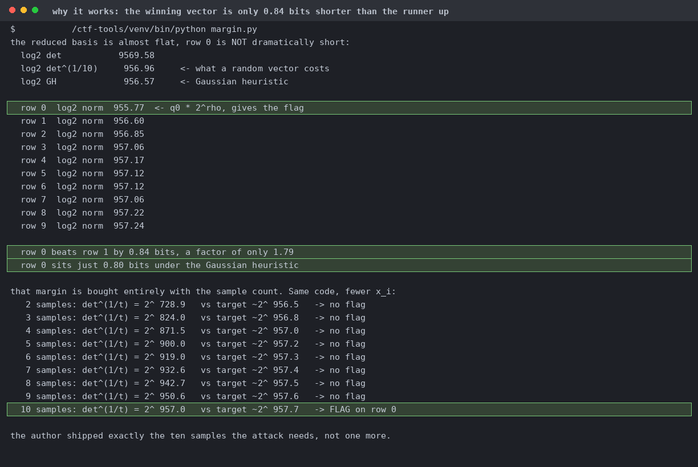

# 1+1

| | |
|---|---|
| Event | The Few Chosen CTF 2026 |
| Category | crypto |
| Difficulty | baby |
| Author | minipif |
| Points at close | 50 |
| Solves | 365 |
| Status | solved |

> should be easy

Files: [`challenge.zip`](handout/challenge.zip)

<details>
<summary><b>My Solution</b></summary>

This is an approximate common divisor problem. The flag is a 502-bit `p` and you get ten samples of it, each times a fresh 512-bit prime, plus noise under `2^444`:
```python
xs = [p * getPrime(512) + randint(1, 2^444) for _ in range(10)]
```

The noise kills the obvious gcd. `gcd(x0, x1)` is 1 and the biggest gcd among the first four samples is 6, nowhere near a 502-bit divisor. So we try a lattice.

Standard SDA lattice ([van Dijk et al. 2009](https://eprint.iacr.org/2009/616)): `2^444` and `x1..x9` across row 0, `-x0` down the diagonal. LLL it, then `q0 = |row0[0]| // 2^444` and `p = x0 // q0`. Plain fpylll at dimension 10, no BKZ. Only row 0 gives printable output (the rest decode to garbage).

Note that the margin is quite thin. Row 0 is only 0.84 bits shorter than row 1 and it actually sits *under* the Gaussian heuristic. If you run the identical code on the first 2, 3, ... 9 samples it'll actually find nothing at all. 10 is exactly the minimum where `det^(1/t)` reduces far enough (so there's no slack in the problem). Screenshots and flavortext courtesy of Claude:



Flag: `TFCCTF{nice_crypto_skillz_kid_you_will_be_great_one_day_af56c3}`
</details>
