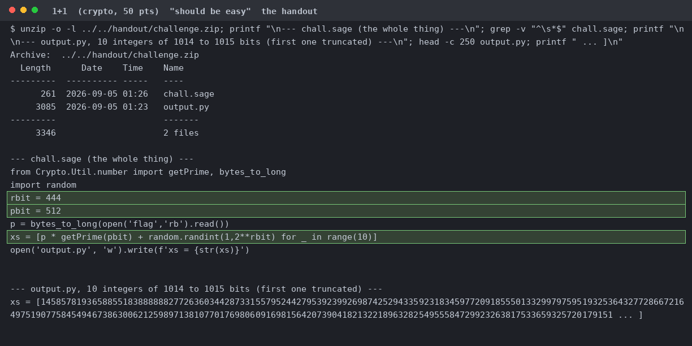
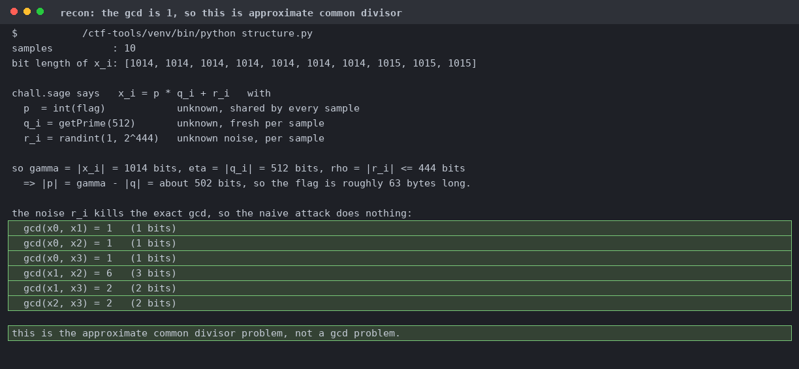
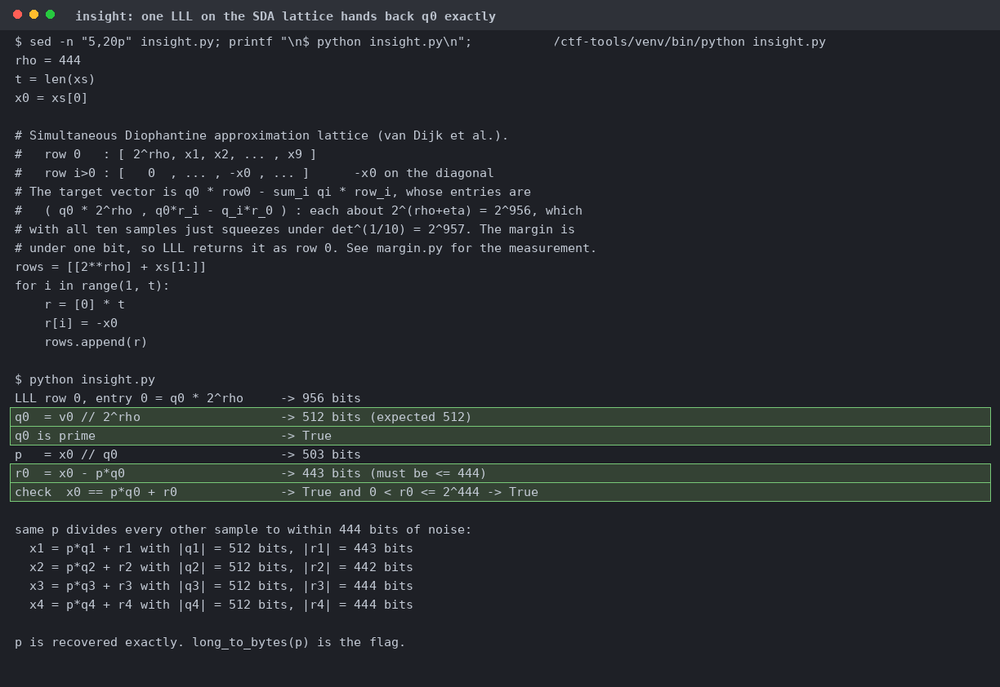
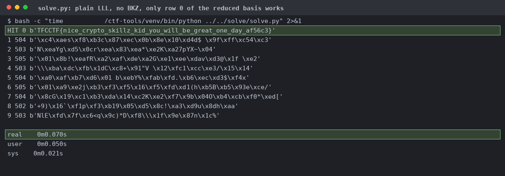

# 1+1

`rbit = 444` and `pbit = 512` are the only numbers that matter.

`gcd(x0, x1)` is 1 and the largest gcd among the first four samples is 6, so the exact attack is dead and we need a lattice.

`p = x0 // q0` is 503 bits, `r0` is 443, `x0 == p*q0 + r0` holds, and the same `p` divides every other sample. Rows 1 to 9 decode to garbage.

Row 0 has log2 norm 955.77 against 956.60 for row 1, and sits 0.80 bits under the Gaussian heuristic. The same code on 2 to 9 samples finds nothing, so 10 is the minimum.

Offline, from the handout, matching the flag in meta.json.
