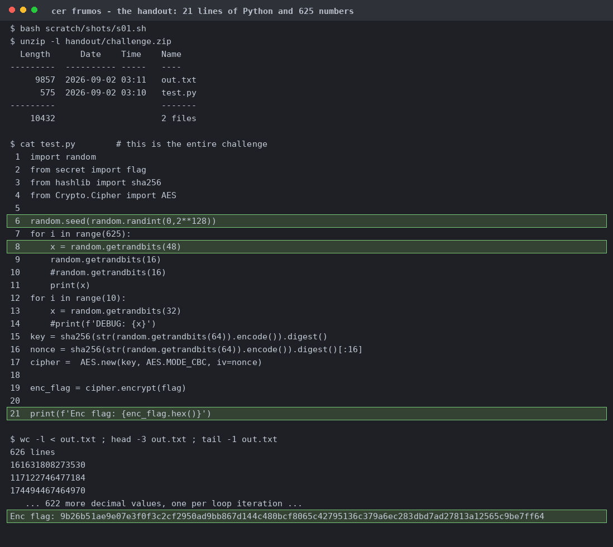
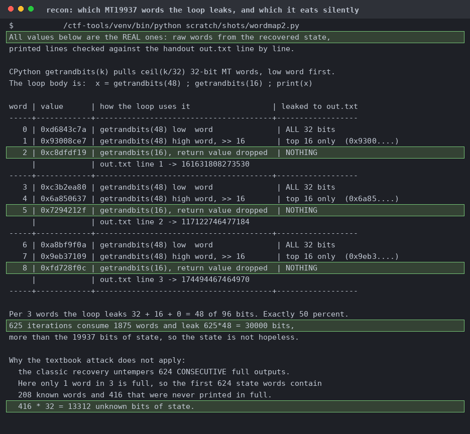
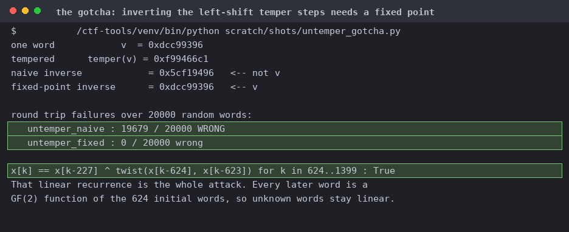
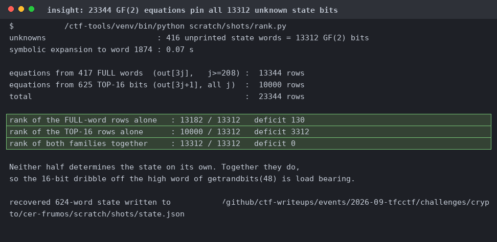
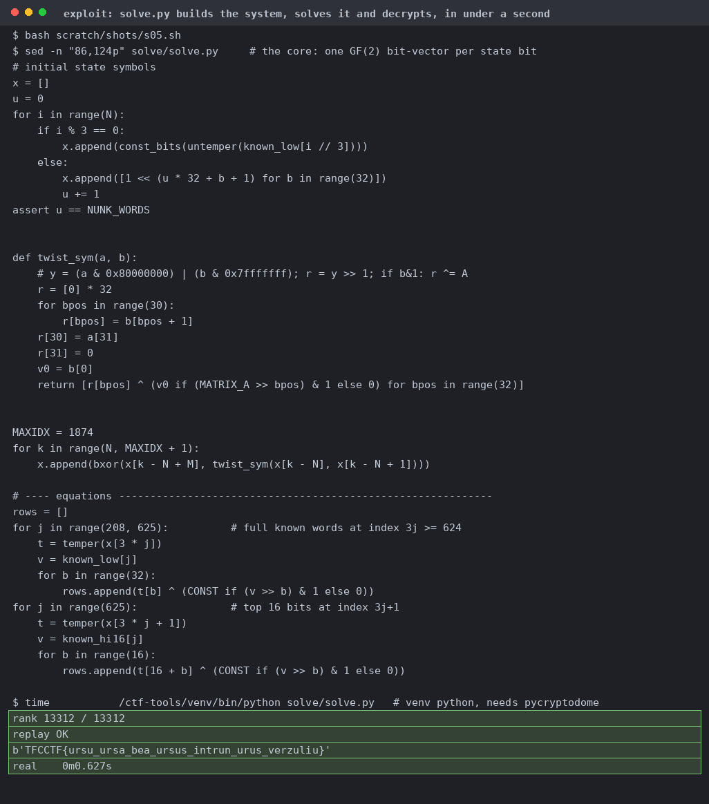
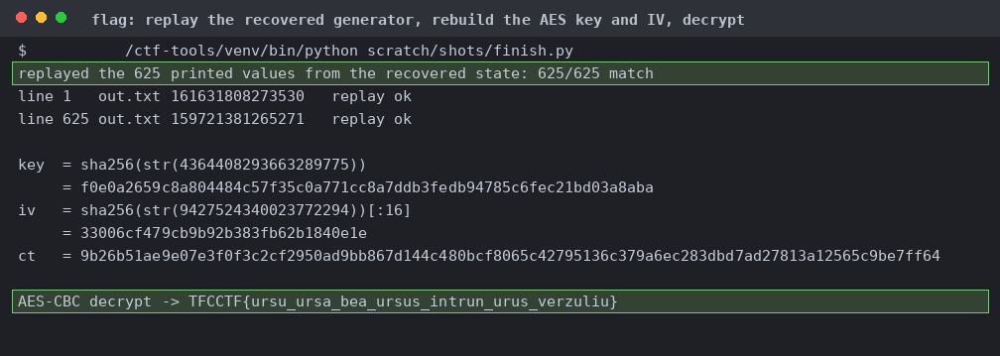

# cer frumos

It seeds `random`, prints 625 draws of `getrandbits(48)` while burning a `getrandbits(16)` next to each, then encrypts the flag under a key derived from later draws.

Read back out of the state I recovered and asserted equal to the real `out.txt`. 1/3 words is printed in full, so 416 of the first 624 never appear.

Inverting a left shift means taking a fixed point of `y = z ^ ((y << s) & m)`, not re-applying the forward step. The naive version is wrong on 19,679 of 20,000 words. Test this on local words and not challenge data.

The 417 full words alone leave it rank deficient by 130, and the 625 fragments alone are hopeless. You need both.

Rank 13,312 of 13,312, exact replay of all 625 values. Runs under the toolkit venv, the system python has no pycryptodome.

`random.setstate` reproduces every printed line, then the next two 64-bit draws rebuild the sha256 key and IV.
