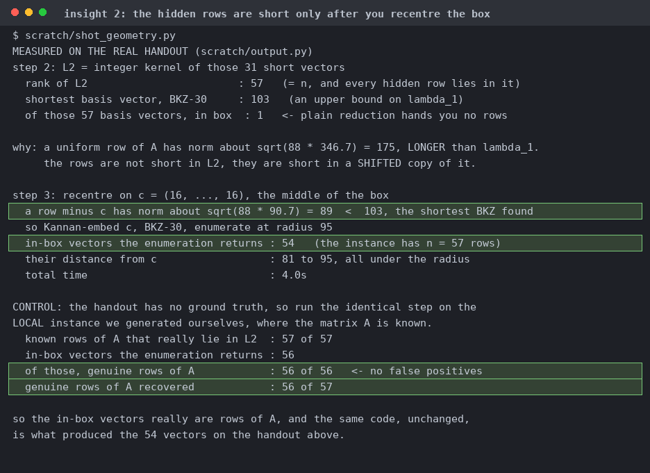

# math or meth?

| | |
|---|---|
| Event | The Few Chosen CTF 2026 |
| Category | crypto |
| Difficulty | grandpa |
| Author | minipif |
| Points at close | 50 |
| Solves | 215 |
| Status | solved |

> Br Ba

Files: [`chall.zip`](handout/chall.zip)

<b>My Solution</b>

This is a hidden lattice problem, so we'll try [Nguyen-Stern (1999)](https://link.springer.com/chapter/10.1007/3-540-48405-1_3).

The generator picks 57 secret weights `a`, fills a 57x88 matrix `A` with base-33 digits, overwrites one random row with the flag, and publishes only a 1084-bit `p` and

    h[j] = sum_i a[i] * A[i][j] mod p

Neither `a` nor `A` gets printed. Everything looks uniform mod `p` and there's no algebra for it. The only structure you get is that every entry of `A` is a single base-33 digit. So in order we do:
1. LLL the mod-`p` orthogonal lattice `{u : <u,h> = 0 mod p}` at dimension 88. You get 31 vectors of norm ~5000 then a jump to 19000, and 31 is exactly `m - n`. All 31 are orthogonal to every hidden row over Z, not just mod `p`, because `|<u, A[k]>|` maxes out around `2^21` while the relation vanishes mod a `2^1084` prime.
2. Take the integer kernel of those 31. It's a rank-57 lattice containing every hidden row.
3. You can run into a trap here. A row has norm ~175 and BKZ-30 already finds a vector at 103, so the rows are *not* short and plain reduction only gets you a single in-box vector. Subtract the box centre `(16,...,16)` and a row drops to ~89, under that 103. Instead, Kannan-embed the shift, enumerate at radius 95, and 54 in-box vectors come back. One decodes to ASCII. Screenshots and flavortext courtesy of Claude:

Note that the handout doesn't have a ground truth, so run the same code on a local instance where you know `A`. All 57 known rows are in the kernel lattice, and the enumeration returns 56 in-box vectors (no false positives). That's why you end up with 54 rows that you actually want (rather than simply candidate rows).

Flag: `TFCCTF{this_is_a_very_very_long_flag_for_a_short_ctf_chall_ggs}`

