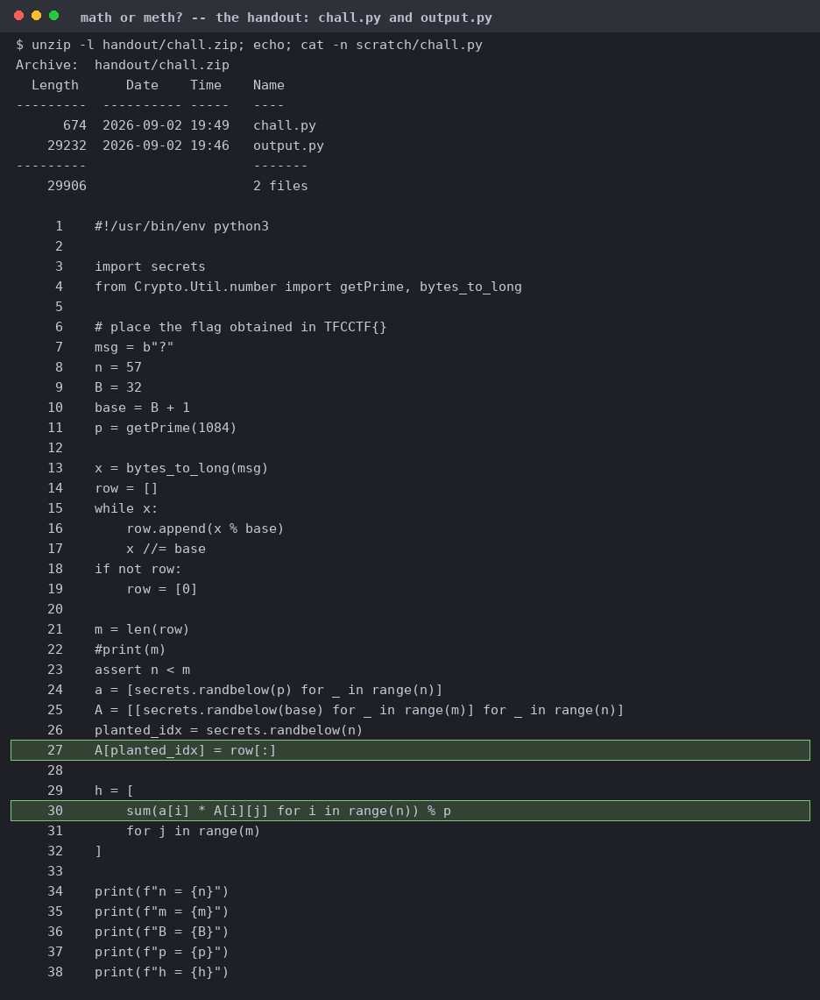
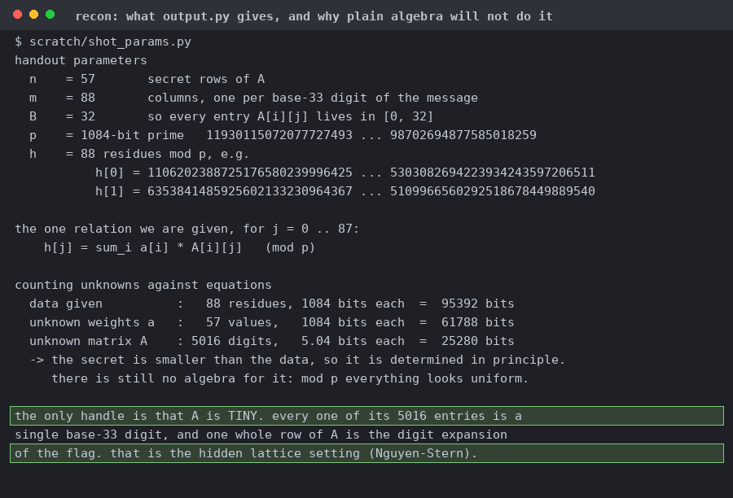
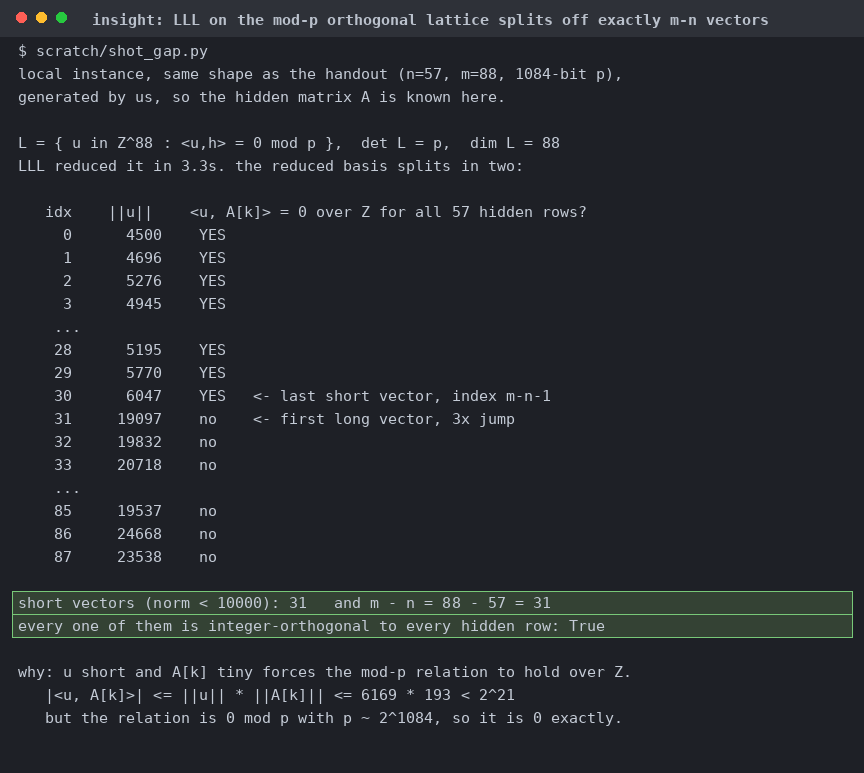
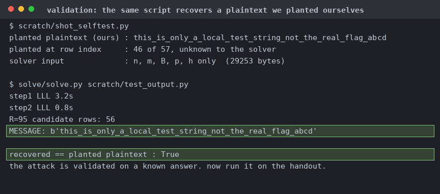
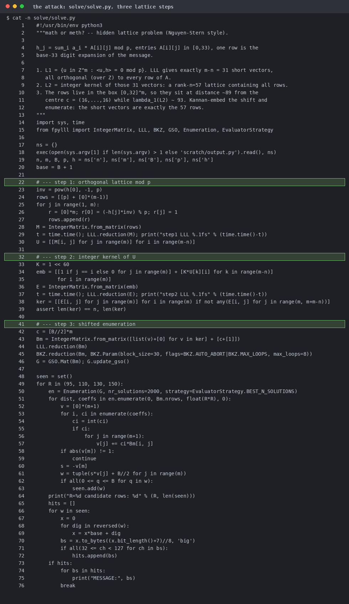
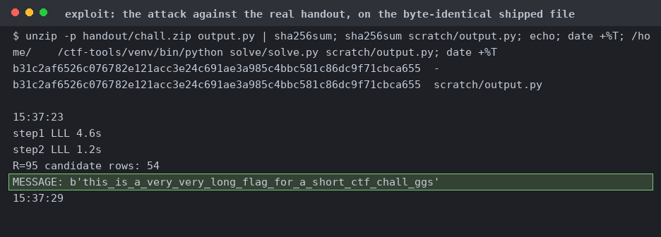
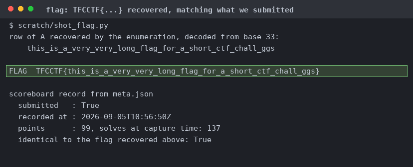

# math or meth?

38 lines. It picks 57 secret weights, fills a 57x88 matrix with base-33 digits, overwrites one row with the flag, and publishes only `p` and the 88 residues.

n=57, m=88, a 1084-bit prime. 87,068 unknown bits against 95,392 bits of data, so it's determined, but mod `p` everything looks uniform. The digits are the whole attack surface.

31 vectors of norm ~5000, then a jump to 19000, and all 31 are orthogonal to every hidden row over Z. Confirmed on a local instance where `A` is known.

A row has norm ~175 while BKZ-30 already finds one at 103, so plain reduction returns 1 in-box vector. Subtract the box centre and a row drops to ~89.

Fed a local instance carrying a string planted at a row index it isn't told, handed only `n, m, B, p, h` (it returns the exact string).

Orthogonal lattice, integer kernel, Kannan embedding, enumerate, keep candidates whose digits land in [0,32] and decode to ASCII.

The two matching sha256 lines show it reads the byte-identical `output.py` from `chall.zip`.

Reading that row back as base-33 digits.
