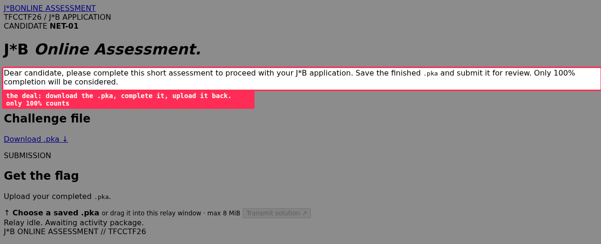
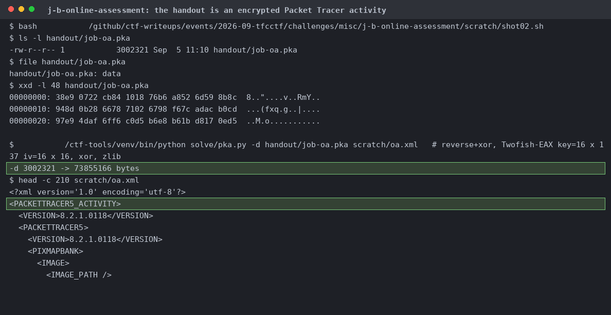
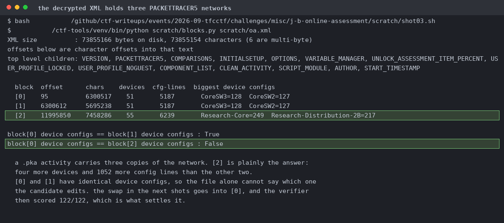
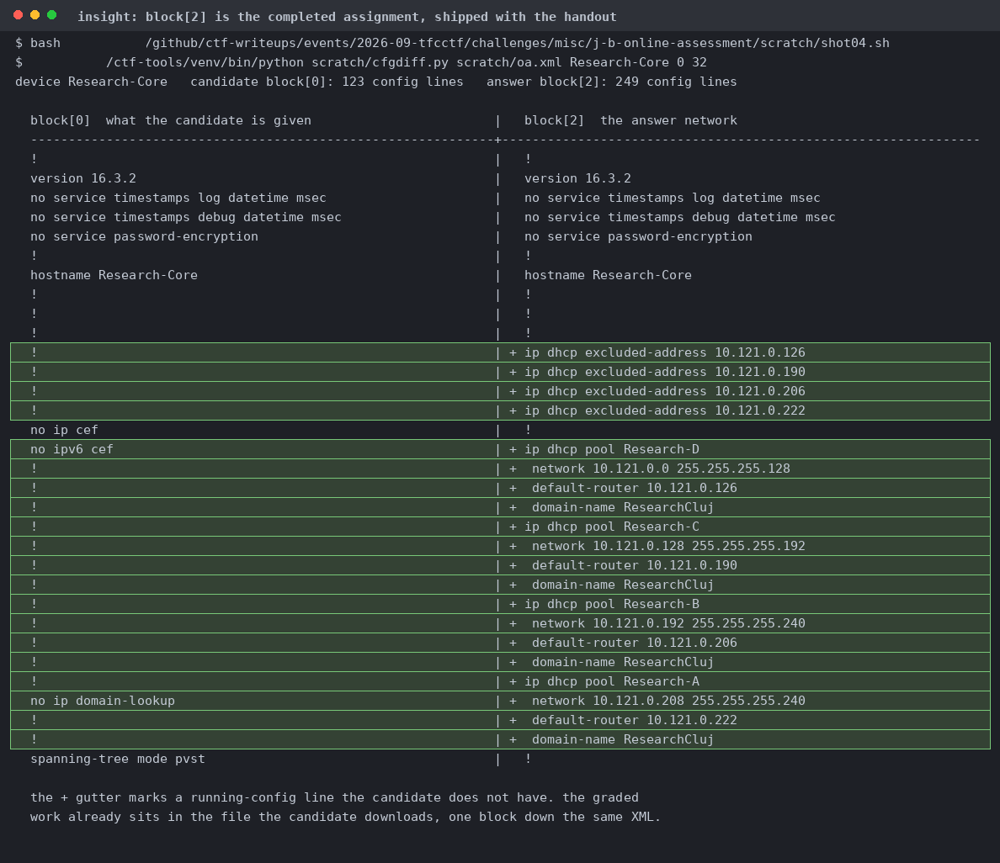
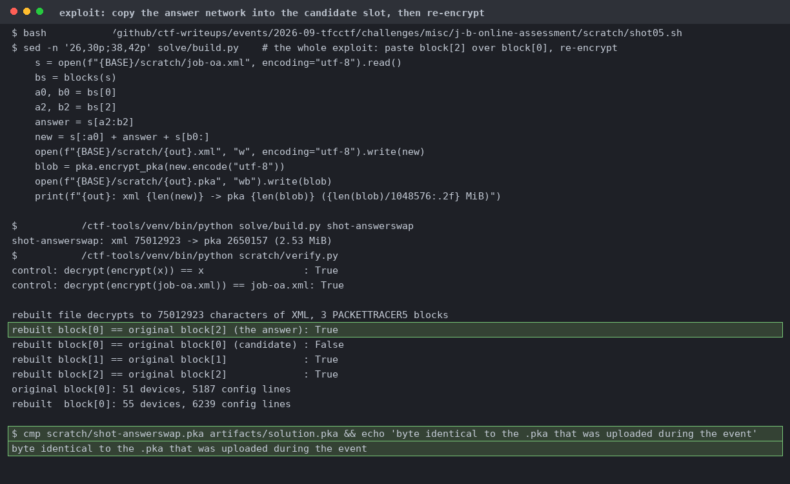
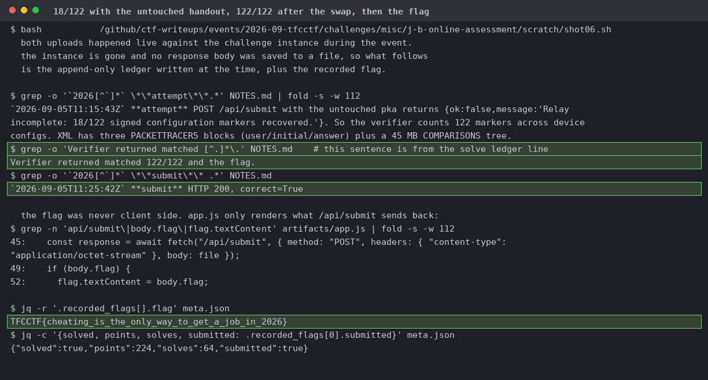

# J*B Online Assessment

Download the .pka, complete the Packet Tracer activity, upload it back, 100 percent or nothing. Rendered from the archived HTML (unstyled here).

 `file` calls it `data`. `solve/pka.py` inverts the pka2xml chain and turns 3,002,321 bytes into 73,855,166 bytes of XML.

Block 2 is the answer, 55 devices and 6,239 config lines against 51 and 5,187. Blocks 0 and 1 are identical, so the file alone can't say which one the candidate edits.

Router `Research-Core`, 123 config lines in the candidate block against 249 in the answer block. The `+` gutter marks lines that appear nowhere in the candidate config.

String slicing, then the encryptor round-trips the untouched XML byte for byte, the rebuilt file has block 0 replaced and 1 and 2 untouched, and `cmp` matches the file that was actually uploaded.

The lines written at the time, plus the `app.js` path proving the flag came from the server response.
