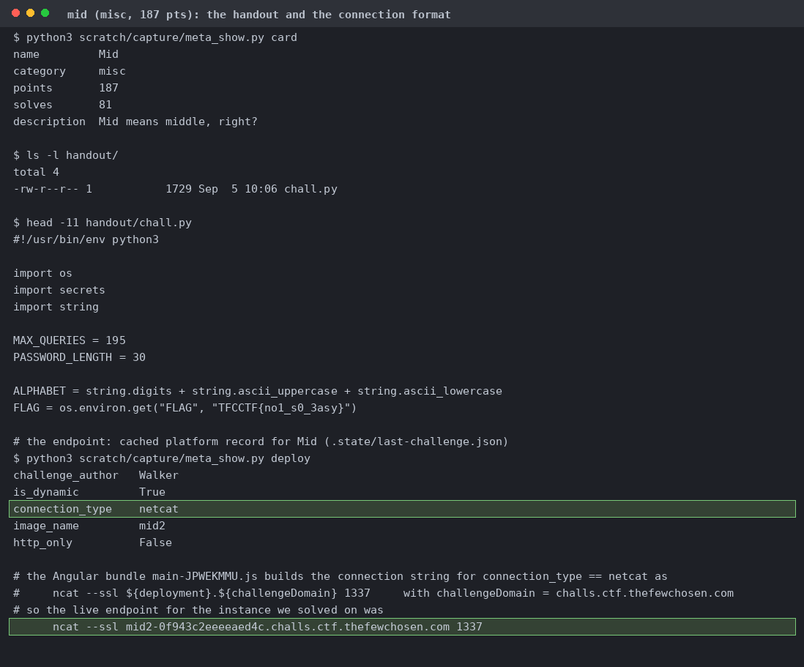
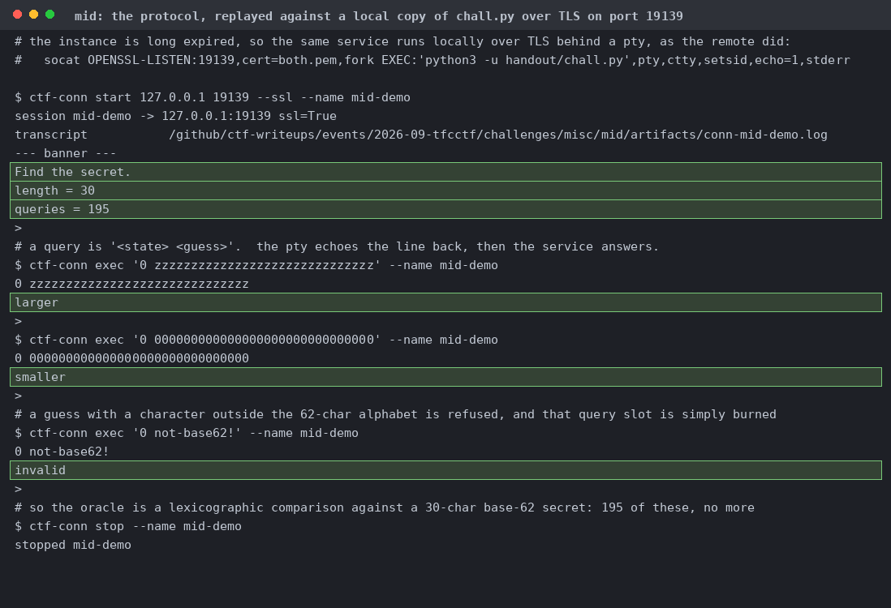
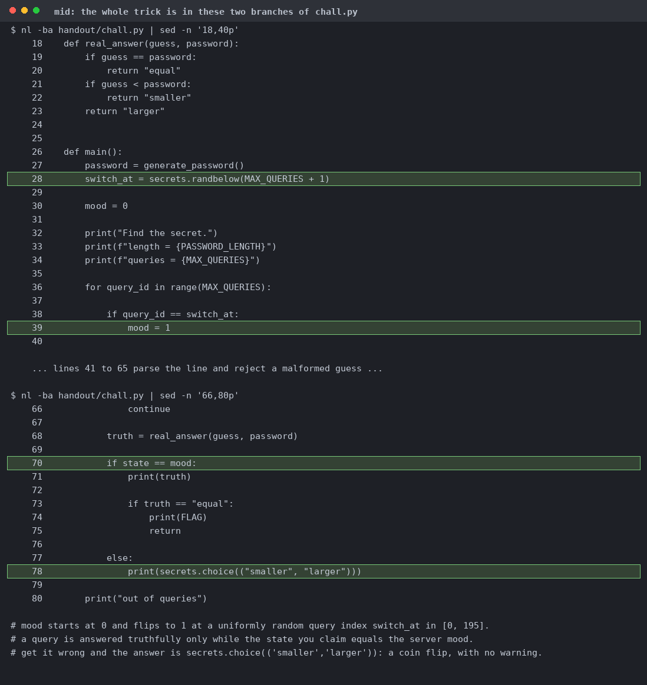
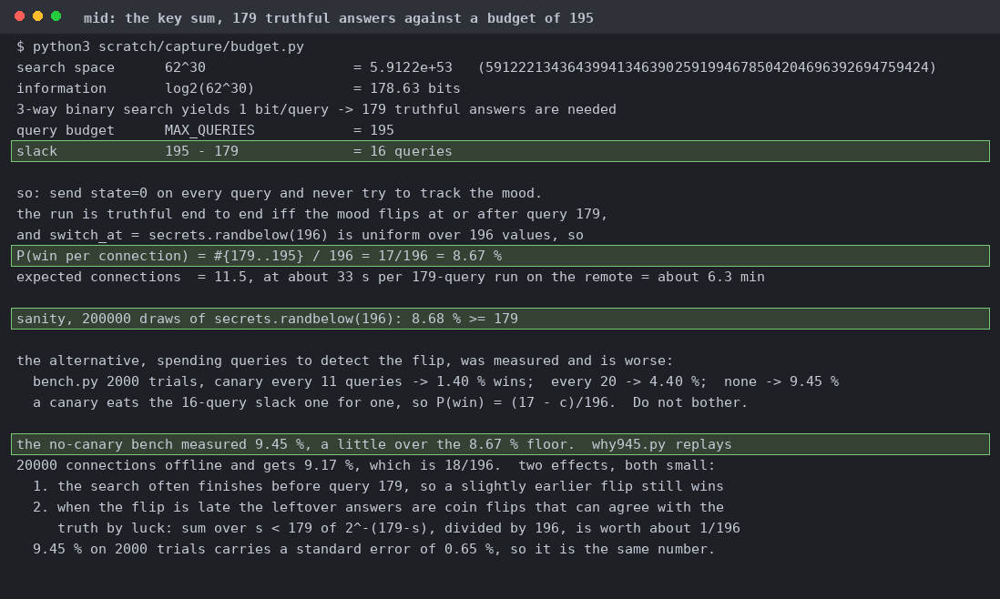
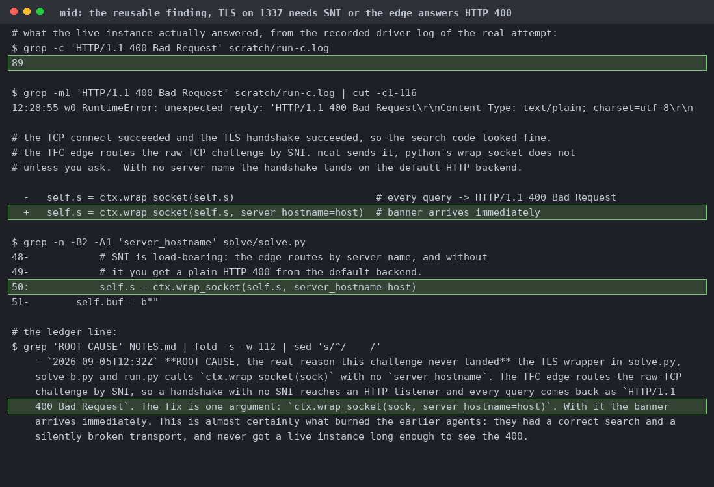
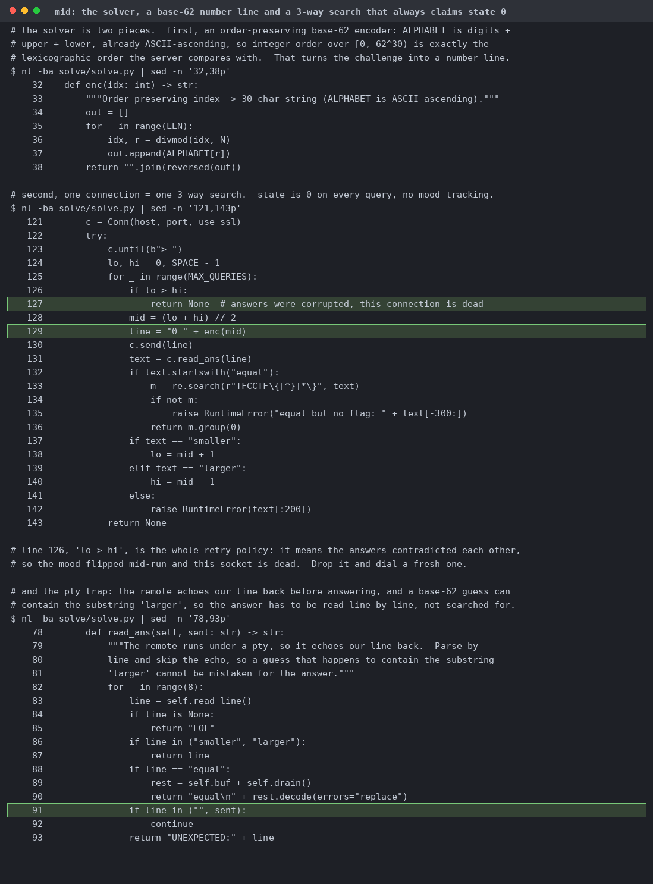
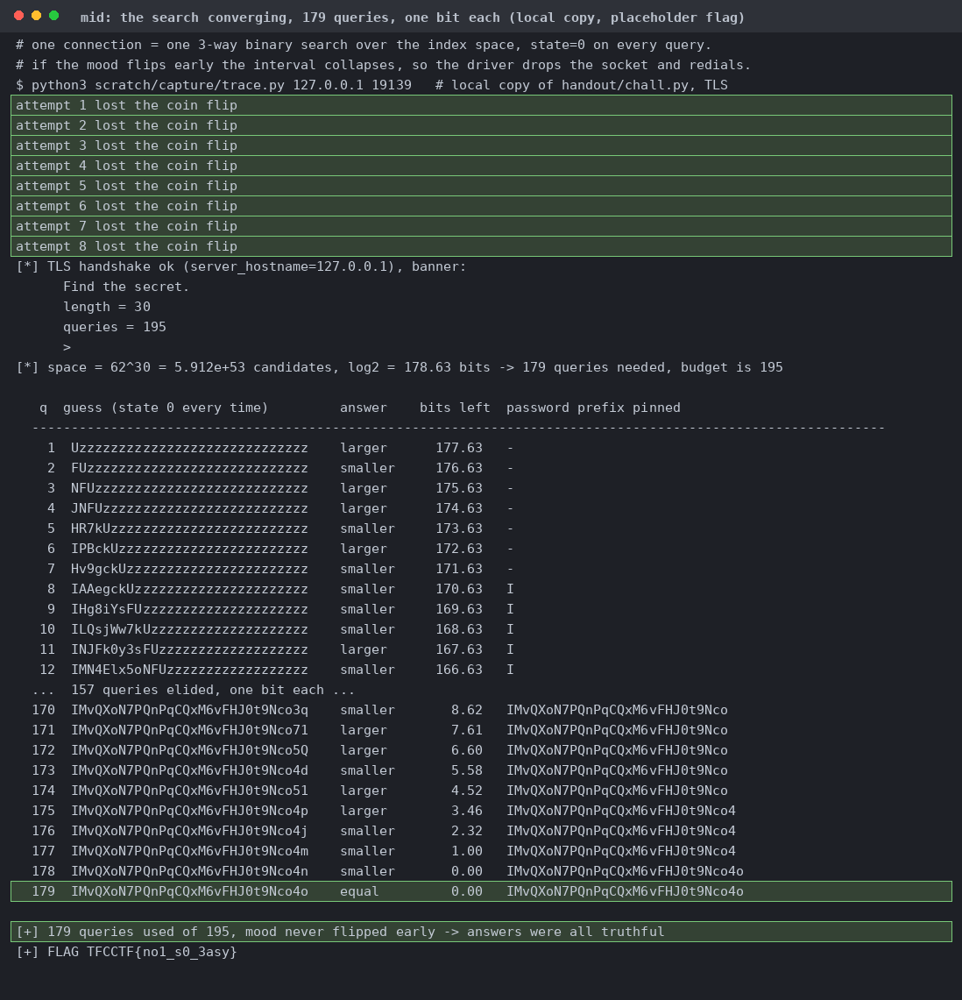
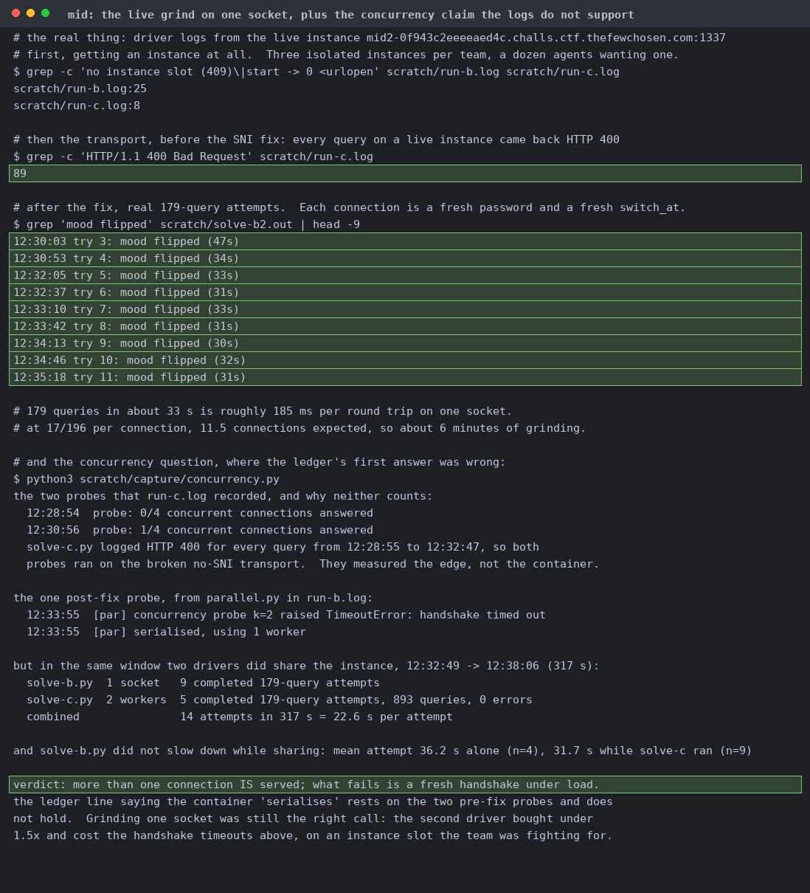
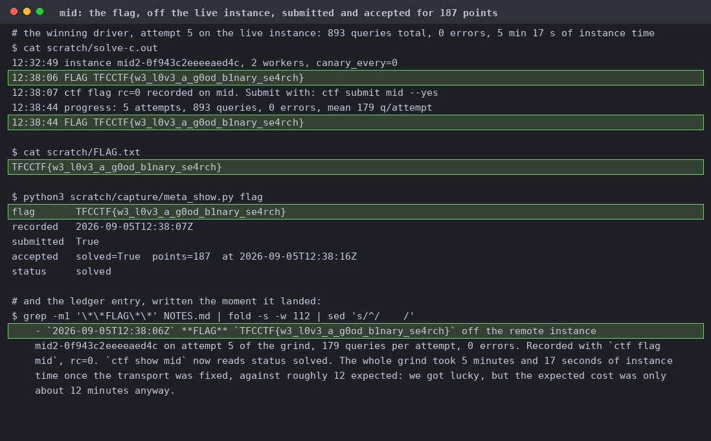

# Mid

One 1729-byte `chall.py`. The cached platform record says `connection_type: netcat`, and the site's Angular bundle turns that into `ncat --ssl <deployment>.challs.ctf.thefewchosen.com 1337`.

A 30-character secret, a 195-query budget, and `smaller` / `larger` / `invalid` answers. It runs under a pty, so it echoes your line back first.

`switch_at` is a uniform random query index where `mood` flips. You get a truthful answer only while your claimed state matches, otherwise it's `secrets.choice(("smaller","larger"))` with nothing to distinguish it.

62^30 is 178.63 bits and a 3-way search buys one bit a query, so 179 truthful answers against a budget of 195. Send state=0 always and win when `switch_at >= 179`, which is 17/196. The bench came out at 9.45% because the search often finishes early.

Every query came back `HTTP/1.1 400 Bad Request`, 89 of them in one log. `ctx.wrap_socket(sock)` doesn't send SNI, and the edge routes raw-TCP challenges by server name, so the handshake lands on an HTTP listener. Adding `server_hostname=host` makes the banner appear.

`enc()` is an order-preserving base-62 encoder, so the secret is just an integer and the server is a comparison oracle. `if lo > hi` is the entire retry policy. `read_ans()` handles the pty echo, since a base-62 guess can contain the substring `larger`.

Eight connections lose the coin flip and get dropped, the ninth runs clean. Query 179 returns `equal`. Local, so the last line is the placeholder.

The fight for one of three team slots, the 89 pre-fix 400s, then real attempts. The bottom block is a correction: my concurrency probes all ran while every query was still 400, so they told me about the broken transport and nothing about the container.

Attempt 5 after the transport fix. 893 queries over 5 attempts, 0 errors.
