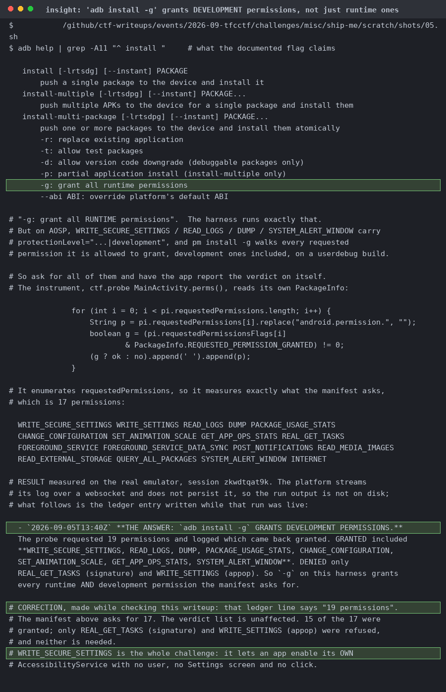

# Ship Me

| | |
|---|---|
| Event | The Few Chosen CTF 2026 |
| Category | misc |
| Difficulty | grandpa |
| Author | Hiumee |
| Points at close | 217 |
| Solves | 67 |
| Status | solved |

> They can throw away your package! Be careful
>
> ---
>
> Challenge detail: You app will be installed using `adb install -g path` and the flag will be a shipment `am start -n me.ship/.MainActivity --eu package 'shipme://cargo/?name=FAKE_FLAG_HERE&origin=challenge`
>
> https://android.koth.pro/

Files: [`shipme-release.apk`](handout/shipme-release.apk)

<b>My Solution</b>

`adb install -g` grants development permissions (not just runtime ones) so our APK comes up already holding `WRITE_SECURE_SETTINGS`, and that lets it enable its own AccessibilityService with no user and no click. The `-g` in the challenge description is the bug. The victim has exactly one component, `MainActivity`, MAIN/LAUNCHER, with no provider, receiver or service. Exporting it with only MAIN/LAUNCHER still lets any app `startActivity` with an explicit ComponentName and arbitrary extras, so that must be the way in. It stores the shipment AES-256-GCM under an AndroidKeyStore alias and never sends anything back out.

You can get stuck on some decoys. `MoveToShipped` and `GetShippingLabel` both extend `Throwable` with a fixed `serialVersionUID` and a transient field set in the constructor, and `getMessage()` recomputes when it's null. That route would work on a deserialise-then-`getMessage` path, but it's a dead end on API 33+. `acceptPackage` uses the typed `getParcelableExtra("package", Uri.class)`, which reaches `Parcel.readSerializableInternal` and compares the serialized class name before any `readObject`. That throws `BadParcelableException`, and `Bundle.getParcelable` catches it and hands back null. This is basically the main point of this challenge (the Parcelable path does `Class.forName` an attacker-named class before the `isAssignableFrom` check, which gives you arbitrary static initialiser execution, but that's useless here since both gadgets do their work in an instance constructor).

`FLAG_SECURE`, `setHideOverlayWindows`, `setRecentsScreenshotEnabled(false)`, and `setFilterTouchesWhenObscured` between them kill screenshots, MediaProjection, overlays, and tapjacking. But `createPackageCard` puts the decrypted flag straight into a plain `TextView` and an `ImageView` contentDescription, and none of those defences touch the accessibility node tree. Screenshots and flavortext courtesy of Claude:

So I checked what `-g` actually gives you next. Of 17 permissions in the probe's manifest, 15 came back granted, including `WRITE_SECURE_SETTINGS`, `READ_LOGS`, `DUMP` and `PACKAGE_USAGE_STATS`. Only `REAL_GET_TASKS` (signature) and `WRITE_SETTINGS` (appop) were refused. The exploit declares its own `Grab` accessibility service and starts a foreground service so the cached-app freezer can't suspend it. Then it writes `enabled_accessibility_services` via `Settings.Secure.putString`, launches the victim, and walks `getRootInActiveWindow()` into logcat tag `TFCCTF`, which is the channel the platform streams back.

Writing that setting is only half of the solution though. Your service can only read another app if its own `res/xml/a11y.xml` says `canRetrieveWindowContent="true"`, otherwise `getRootInActiveWindow()` returns null and you get nothing. `flagRetrieveInteractiveWindows` adds the `getWindows()` fallback, `notificationTimeout="0"` stops event coalescing, and `SVC` has to be in `pkg/class` component form. From there it's `A11Y CONNECTED` and you've got the flag. I didn't actually need to click or use `MoveToShipped` or use the MediaStore label though, so not sure if this was the intended route tbh, but if it works it works!

Flag: `TFCCTF{parcelables_are_safer_not_safe}`

