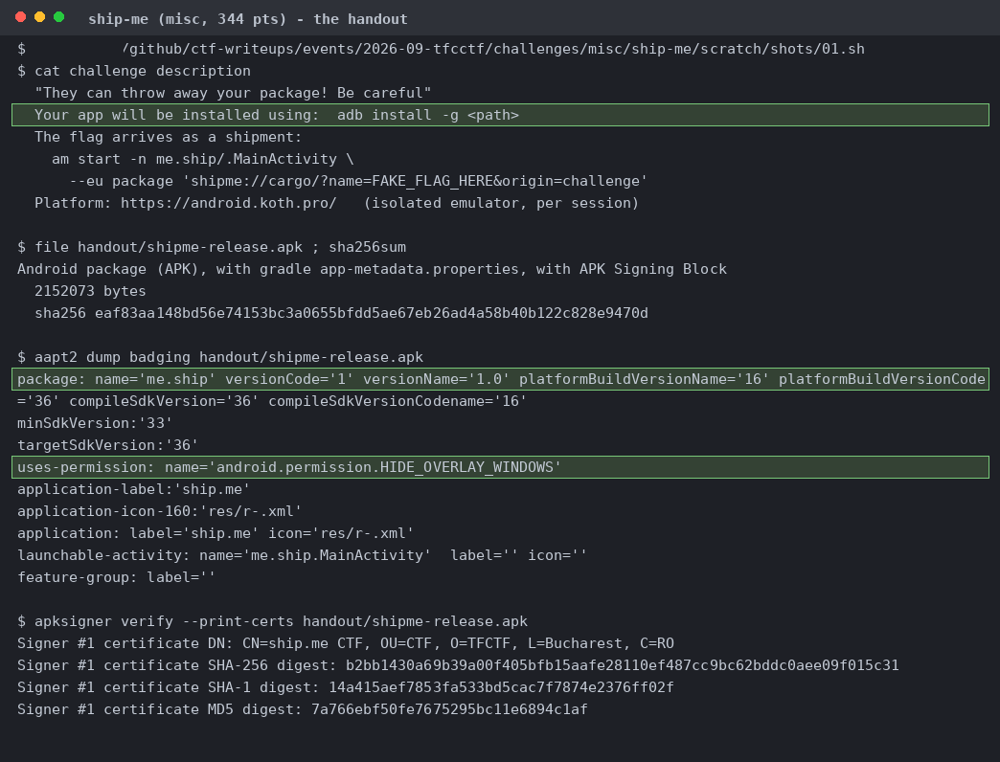
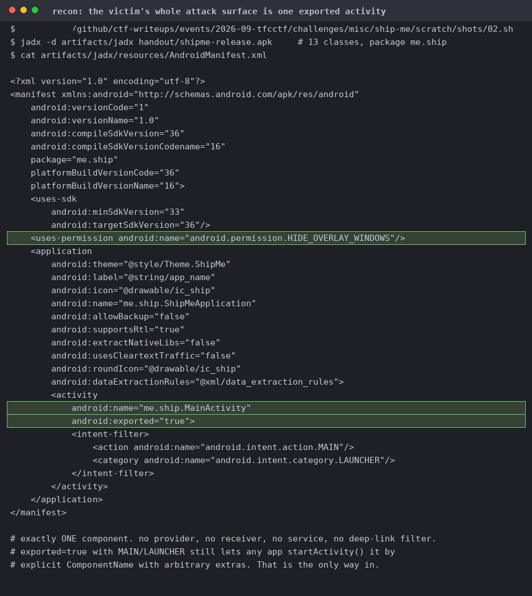
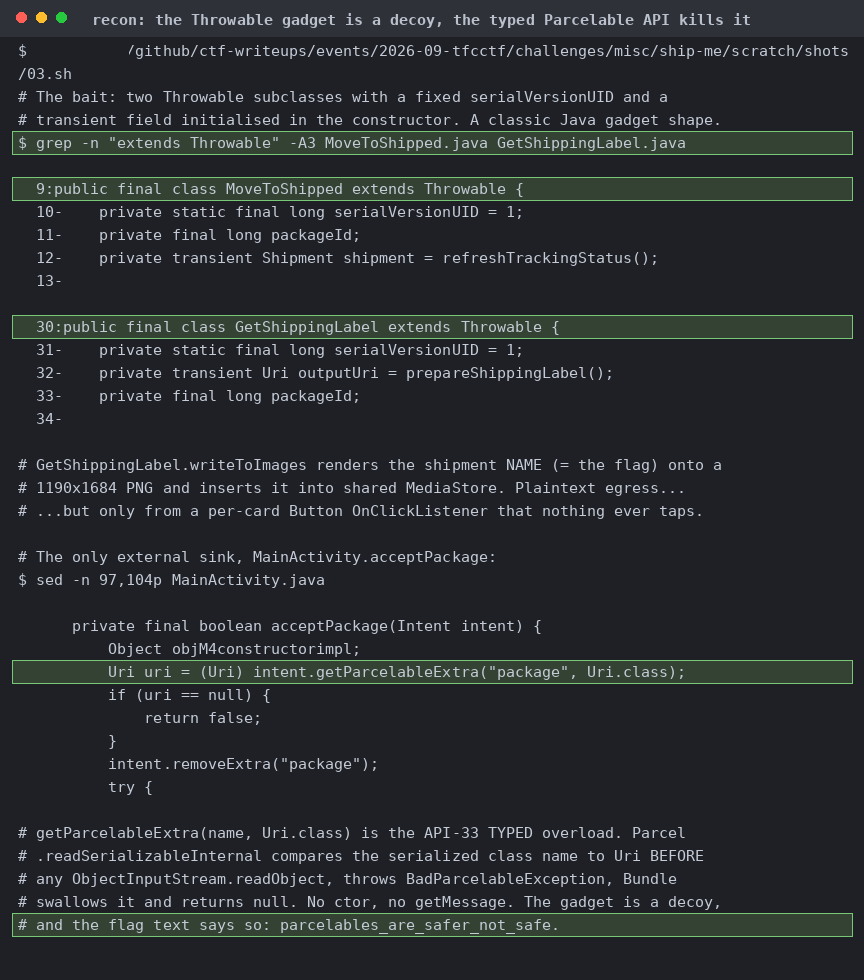
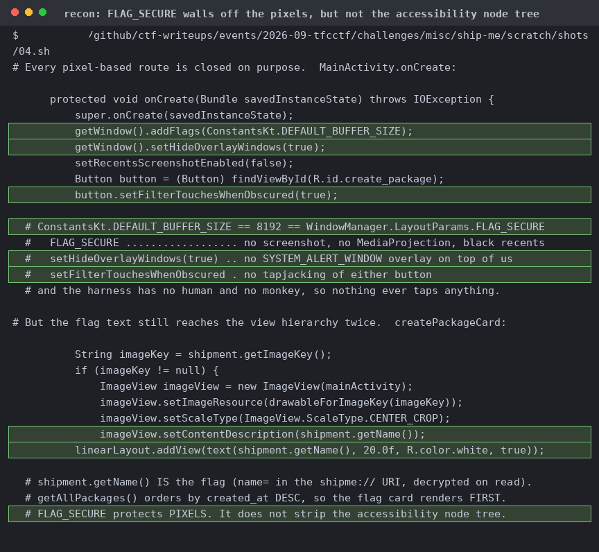
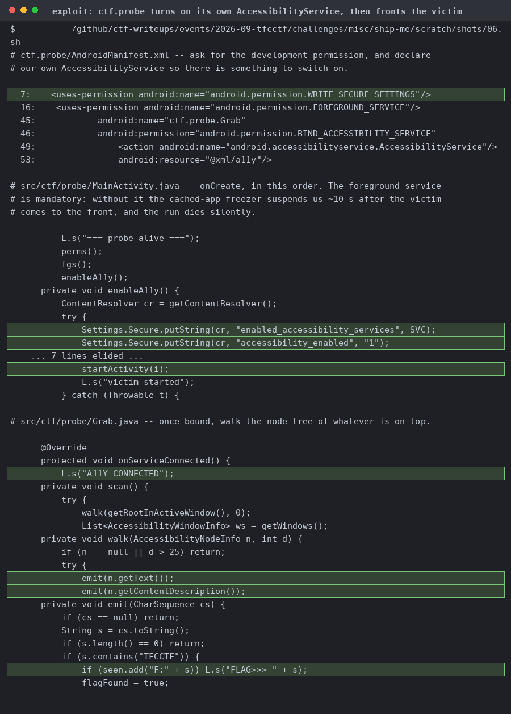
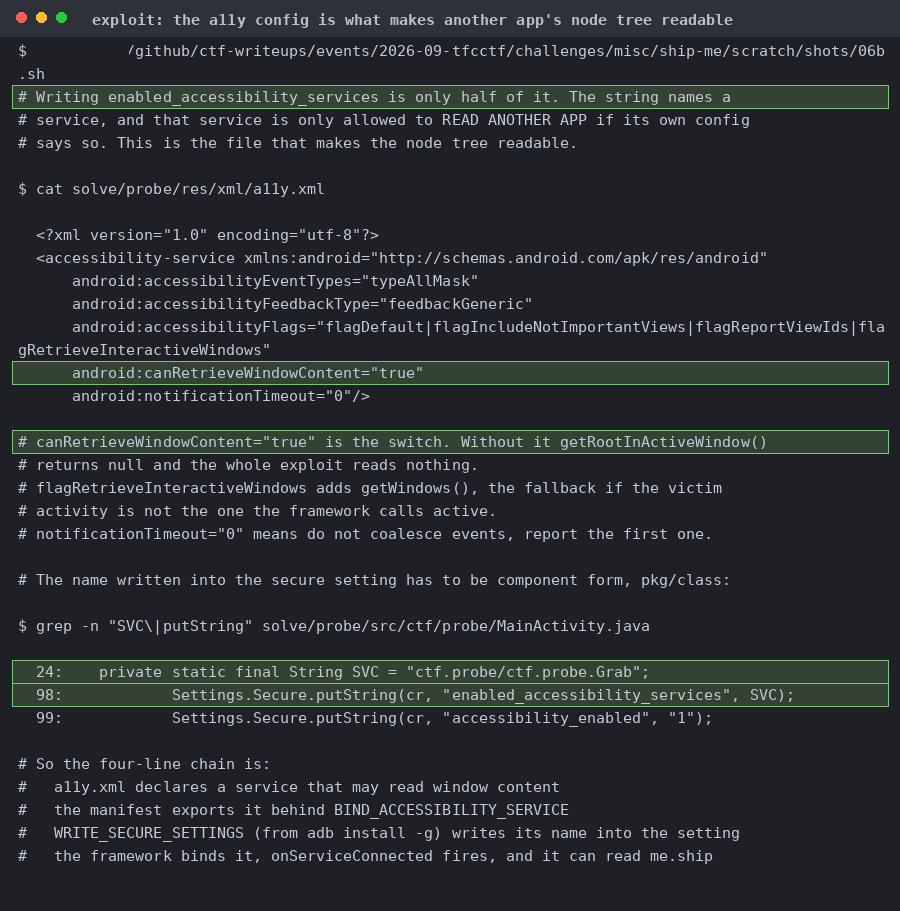
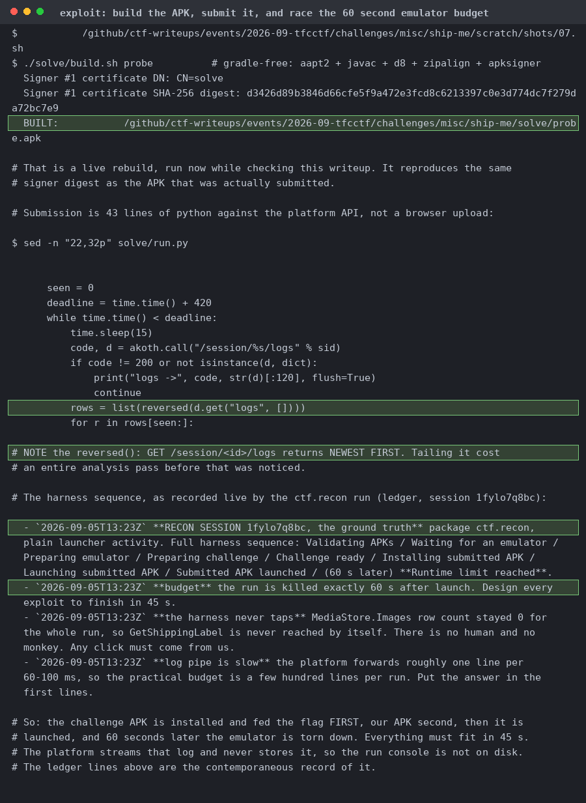
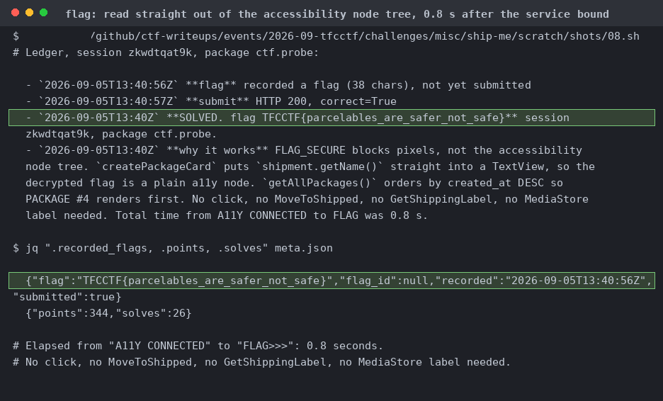

# Ship Me

One release APK, and the harness contract: your app is installed with `adb install -g`, and the flag arrives as a `shipme://cargo/?name=<FLAG>` shipment, and that `-g` is where the whole thing comes apart.

`me.ship.MainActivity`, MAIN/LAUNCHER, nothing else. No provider, no receiver, no service, so the only way in is `startActivity` by explicit ComponentName.

Fixed `serialVersionUID` and a transient field set in the constructor, which looks like an intended deserialisation gadget. It's dead though; the API 33 typed `getParcelableExtra` compares the serialized class name before any `readObject`. 

`FLAG_SECURE`, `setHideOverlayWindows`, `setRecentsScreenshotEnabled(false)`, and `setFilterTouchesWhenObscured` kill screenshots, MediaProjection, overlays, and tapjacking. But `createPackageCard` puts the decrypted flag into a plain TextView and an ImageView contentDescription.

The probe walks its own `requestedPermissions` and prints a verdict for each. 15 of 17 came back granted, including `WRITE_SECURE_SETTINGS`, `READ_LOGS` and `DUMP`. Only `REAL_GET_TASKS` and `WRITE_SETTINGS` were refused.

Requests `WRITE_SECURE_SETTINGS`, starts a foreground service so the freezer can't suspend it, writes `enabled_accessibility_services`, launches the victim, walks `getRootInActiveWindow()` into logcat tag TFCCTF.

Writing the setting is only half of the solution. Without `canRetrieveWindowContent="true"` in the service's own XML, `getRootInActiveWindow()` returns null. `SVC` has to be in `pkg/class` form.

The gradle-free chain rebuilds `probe.apk` and reproduces the same signer digest as the one submitted. The harness installs the challenge APK first, ours second, then tears down at 60 seconds.

The flag comes back the moment the service binds, well inside the 60 s teardown. No click, no `MoveToShipped`, no `GetShippingLabel`, no MediaStore label.
