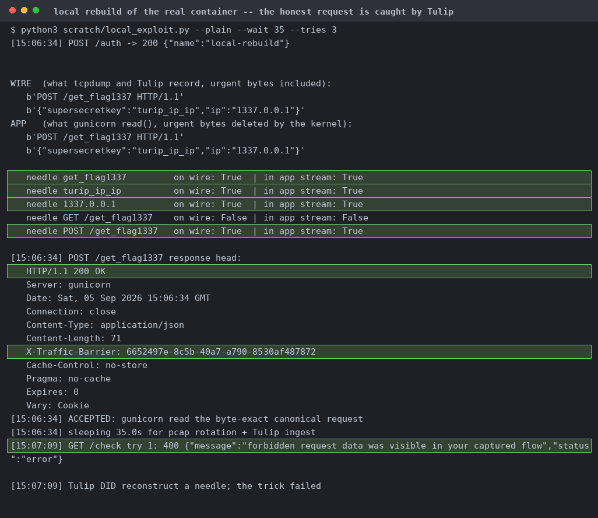
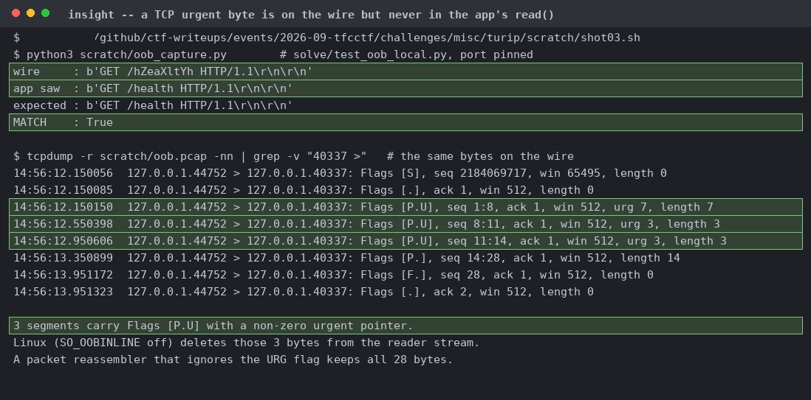
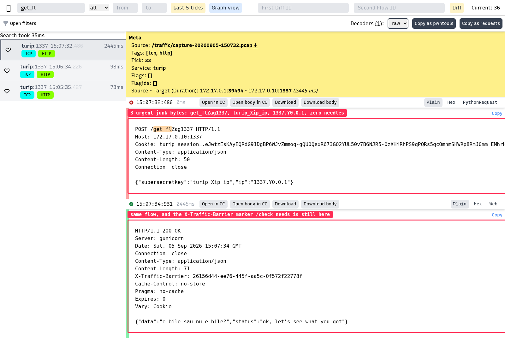

# turip

| | |
|---|---|
| Event | The Few Chosen CTF 2026 |
| Category | misc |
| Difficulty | grandpa |
| Author | mcsky23 |
| Points at close | 170 |
| Solves | 90 |
| Status | solved |

> https://youtu.be/145Qd0aVTEk
>                                                             http://2.29.39.4:1337

Files: [`turip.zip`](handout/turip.zip), unpacked at [`chall/`](handout/chall) so you can read `app.py` without downloading it

<b>My Solution</b>

You need one TCP connection to be both byte-exact for gunicorn and unreadable for the packet capture watching the same wire. The handout gives you Flask behind gunicorn on 1337, plus a [Tulip](https://github.com/OpenAttackDefenseTools/tulip) capture pipeline (tcpdump with `-G 15` and BPF `port 1337`) feeding gopacket into TimescaleDB. `POST /get_flag1337` wants an exact RAW_URI and a body byte-equal to a 50-byte canonical string. Then `GET /check` wants a flow whose server half carries an `X-Traffic-Barrier` marker and whose client half contains none of five needles. Screenshots and flavortext courtesy of Claude:

If you send it honestly then gunicorn will answer 200 with the marker, but 35 seconds later `/check` returns 400. So we focus our attention on the TCP urgent pointer ([RFC 6093, 2011](https://www.rfc-editor.org/rfc/rfc6093)). On Linux with `SO_OOBINLINE` off, the kernel strips the urgent byte out of the receiver's byte stream (gunicorn's default). gopacket keeps every payload byte though! Screenshots and flavortext courtesy of Claude:

So send `GET /hZeaXltYh`, with Z, X and Y each as the last byte of a `send(..., MSG_OOB)`. tcpdump shows three segments with `[P.U]` and a nonzero urgent pointer. The socket reads `GET /health`. The real request will work the same way. We send five chunks where three of them are `MSG_OOB`, each ending in one junk byte placed inside a needle. The wire reads `POST /get_flZag1337` with `turip_Xip_ip` and `1337.Y0.0.1`, matching zero needles, while the app stream is byte-exact. You do need a 0.6 s pause between sends though, otherwise a second `MSG_OOB` overwrites the kernel's `urg_seq` before the reader has consumed the first. Screenshots and flavortext courtesy of Claude:

There's some other routes that might also work. Tulip's assembler runs `ip4defrag` and a first fragment alone returns nil, and BPF `port 1337` doesn't match non-first IP fragments at all since they carry no TCP header. So fragmenting makes the request invisible while the kernel reassembles it for gunicorn. It would work in Docker too, because `ip_do_fragment` refragments using `IPCB(skb)->frag_max_size` rather than the veth MTU. I didn't confirm this route though since it needs `CAP_NET_RAW` plus an iptables RST drop. Another way I can think of is `-skipchecksum`, which makes Tulip ingest bad-checksum segments that Linux drops, so a bad-checksum decoy at the same sequence number might win the overlap in gopacket.

Flag: `TFCCTF{this_was_discovered_in_the_good_old_days_when_people_still_played_ctf}`

