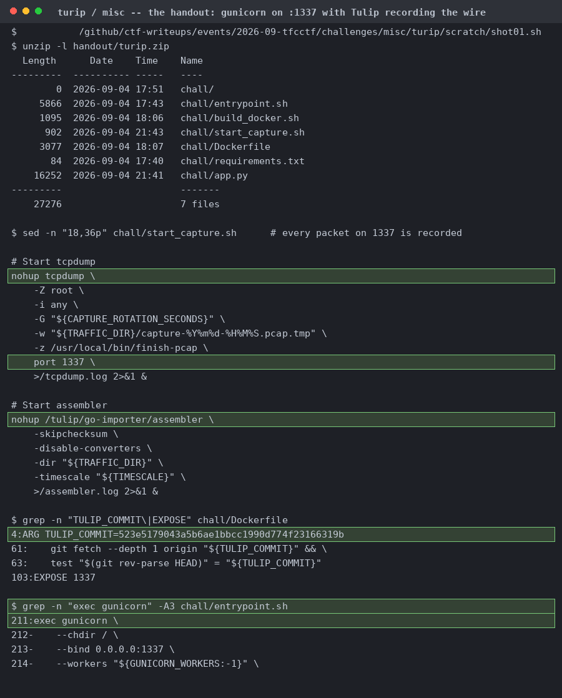
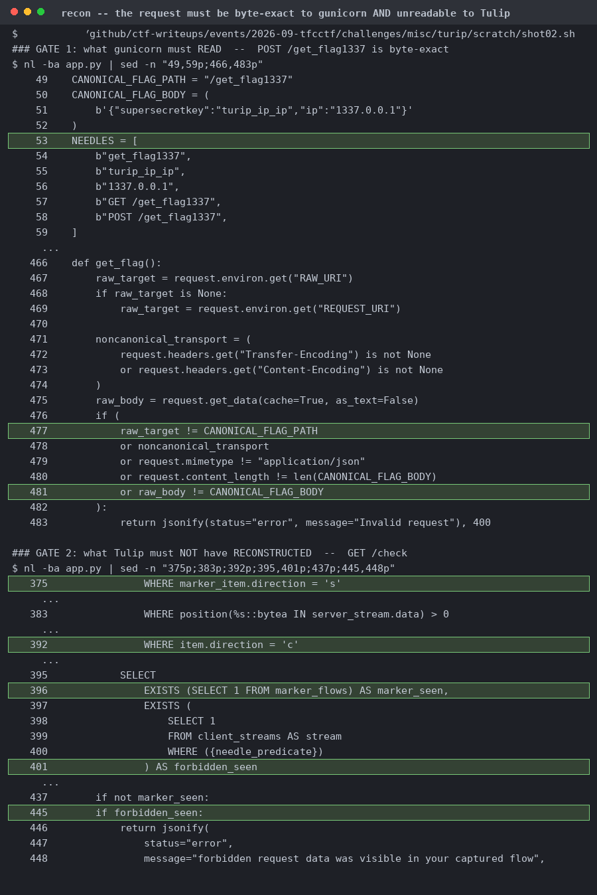
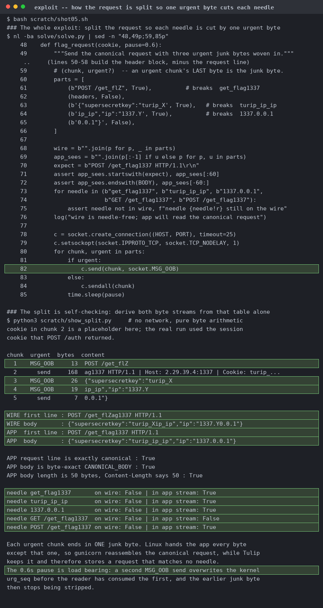
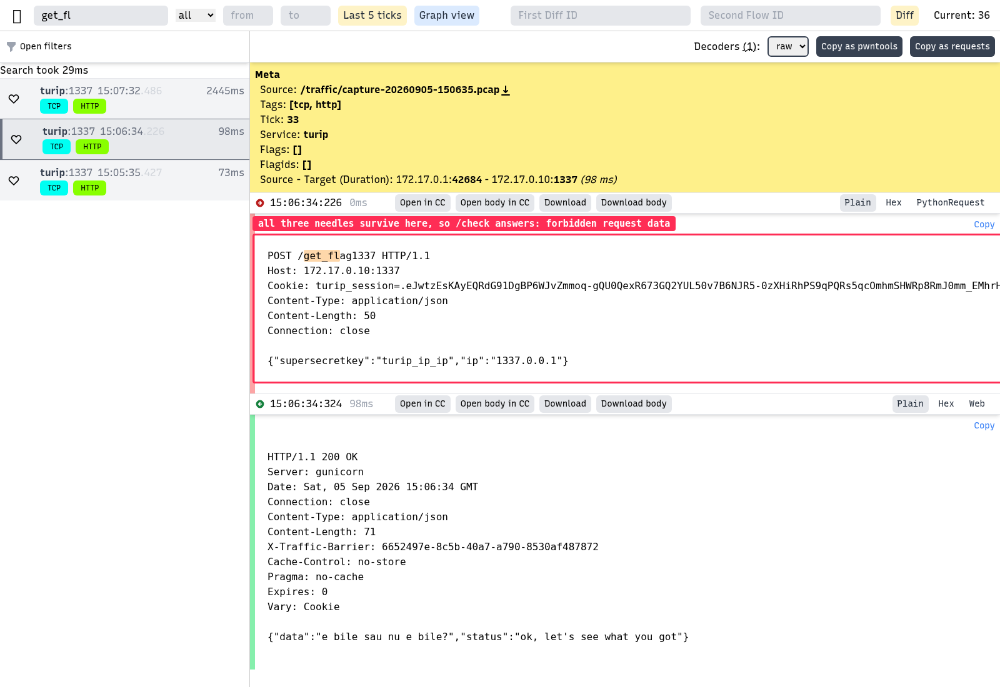
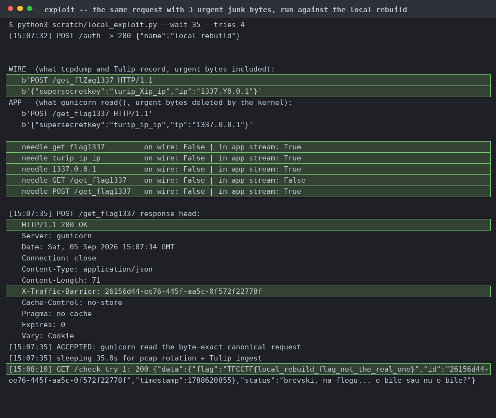
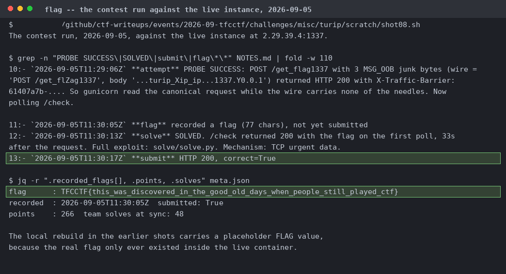

# turip

Flask behind gunicorn on 1337, plus tcpdump with `-G 15` and BPF `port 1337` feeding Tulip's gopacket assembler. The wire and the app are two readers of the same bytes.

`POST /get_flag1337` wants an exact RAW_URI and a byte-equal 50-byte body. `GET /check` wants a flow whose server half carries the marker and whose client half contains none of the five needles. One connection has to be two things at once.

Local rebuild, plain canonical request. All three needles are on the wire and in the app stream, gunicorn answers 200 with the marker, and 35 s later `/check` returns 400.

`GET /hZeaXltYh` with Z, X and Y each the last byte of a `send(..., MSG_OOB)`. tcpdump shows three segments with `[P.U]`, and the socket reads `GET /health`, because `SO_OOBINLINE` is off by default.

`MSG_OOB` rides three chunks, each ending in one junk byte inside a needle. The lower half derives both byte streams from the table with no network. You need the 0.6 s pause, otherwise a second `MSG_OOB` overwrites `urg_seq` before the reader has consumed the first.

The real Tulip UI against the local rebuild's database, showing the run from shot 03.

Same UI, same flow, zero needles matched, and the server half still carries the marker. Compare line by line against shot 06. Tulip stored two different requests while gunicorn read the same bytes both times.

Every needle False on the wire and True in gunicorn's read stream, 200 with the marker, then `/check` returns the flag on the first poll. This flag is the local rebuild's placeholder.

The live run at 11:29 to 11:30 UTC, and the recorded flag, submitted correct=True.
