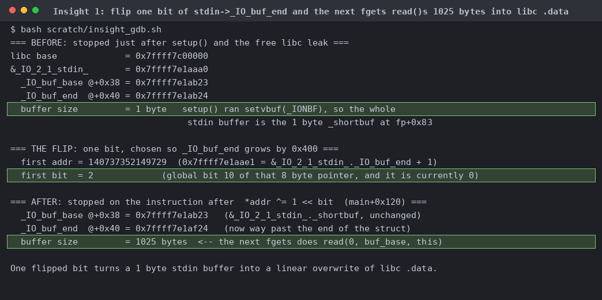
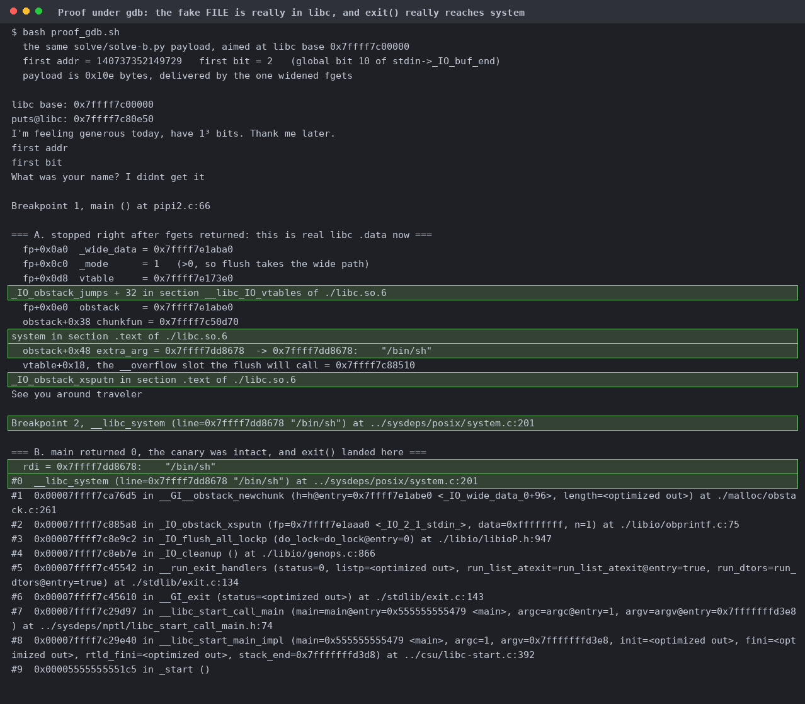

# bitdebit³

| | |
|---|---|
| Event | The Few Chosen CTF 2026 |
| Category | pwn |
| Difficulty | grandpa |
| Author | minipif |
| Points at close | 141 |
| Solves | 107 |
| Status | solved |

> a bit flipped me off

Files: [`bitdebit3.zip`](handout/bitdebit3.zip)

<details>
<summary><b>My Solution</b></summary>

You get one arbitrary bit flip, so point it at stdin's buffer-end pointer and the next `fgets` turns into an unbounded write over libc `.data`.
```c
setup();                       // setvbuf(..., _IONBF) on all three streams
leak_libc_base();              // prints "libc base: %p", free
addr = strtoull(read_line());  // arbitrary pointer
bit  = strtoul(read_line());   // must be < 8
*addr ^= 1 << bit;             // one flip, that's it
puts(...); fgets(final_buf, 0x100, stdin); puts(...);
return 0;                      // canary checked
```

`final_buf` is `char[256]` so there's no overflow. Full RELRO, canary, NX, PIE, and libc is your only leak, so the flip has to land in libc writable data. With no PIE leak the binary's GOT is unreachable, and with no stack leak the stack is too. `setup()` set `_IONBF`, so the entire stdin buffer is the 1-byte `_shortbuf` and `_IO_buf_end` is `buf_base + 1`. Flip a high bit of that pointer (the field lives at libc+0x21aae0) and the buffer grows by `2^p`. The next `fgets` calls `_IO_new_file_underflow`, which does `read(0, libc+0x21ab23, 2^p+1)`. Screenshots and flavortext courtesy of Claude:



Pick the smallest `p >= 9` where the value has a zero bit, so the flip only grows it. Note also that `getline` bails immediately if the first payload byte is `\n`, which lands harmlessly in `_shortbuf`. So the `0x100` fgets limit doesn't constrain your payload length at all, it just has to arrive in one `read()`. Then rebuild the tail of `_IO_2_1_stdin_`: `_mode=1`, a fake `_wide_data` with `write_ptr > write_base`, a shifted vtable, and a fake obstack whose `chunkfun` is `system` and `extra_arg` is `/bin/sh`. End it before you get to `main_arena` so malloc survives. At exit, `_IO_cleanup` walks the chain and calls `_IO_OVERFLOW`. That tells us the vtable has to be deliberately misaligned! `_IO_obstack_jumps` aborts, because `_IO_obstack_overflow` asserts `c != EOF` while `_IO_flush_all_lockp` always passes EOF. Shift the vtable up `0x20` and `vtable+0x18` lands on `_IO_obstack_xsputn` instead, which reaches `obstack_grow`, then `_obstack_newchunk`, then `CALL_CHUNKFUN`. `IO_validate_vtable` has no alignment check, only a range check, and the shifted pointer is still inside `__libc_IO_vtables`. Screenshots and flavortext courtesy of Claude:



Don't bother diffing `bitdebit3` against `bitdebit3_patched`. They have the same BuildID and the only difference is patchelf (I wasted some time on this). The other time sink is that plain TCP on 1337 connects and then never sends a banner, because it's actually TLS with SNI and the cert is invalid for the name. Use `ctx.wrap_socket(sock, server_hostname=host)` with verification off.

Flag: `TFCCTF{this_is_probably_getting_solved_by_AI_but_so_be_it_i_thought_it_was_cool}`
</details>
