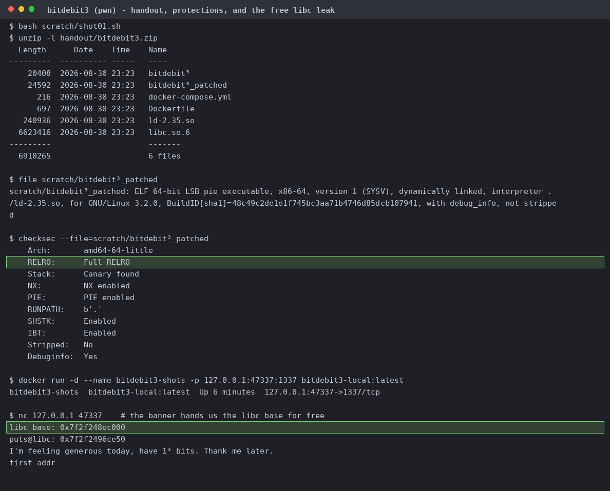
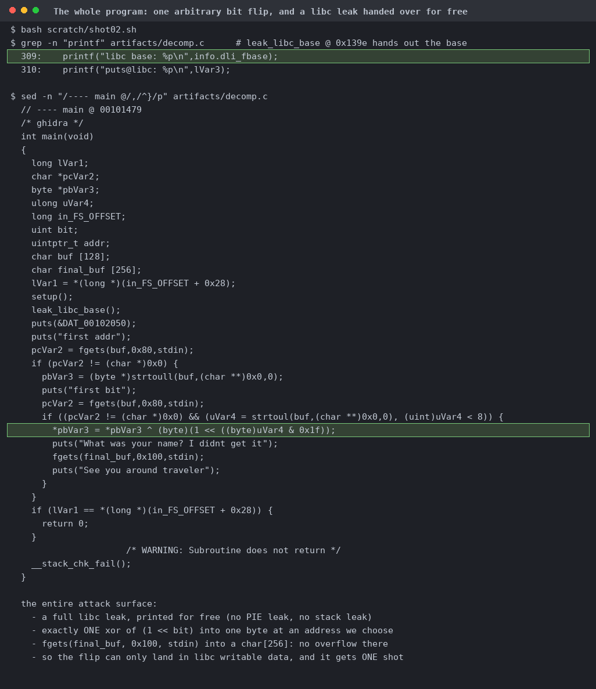
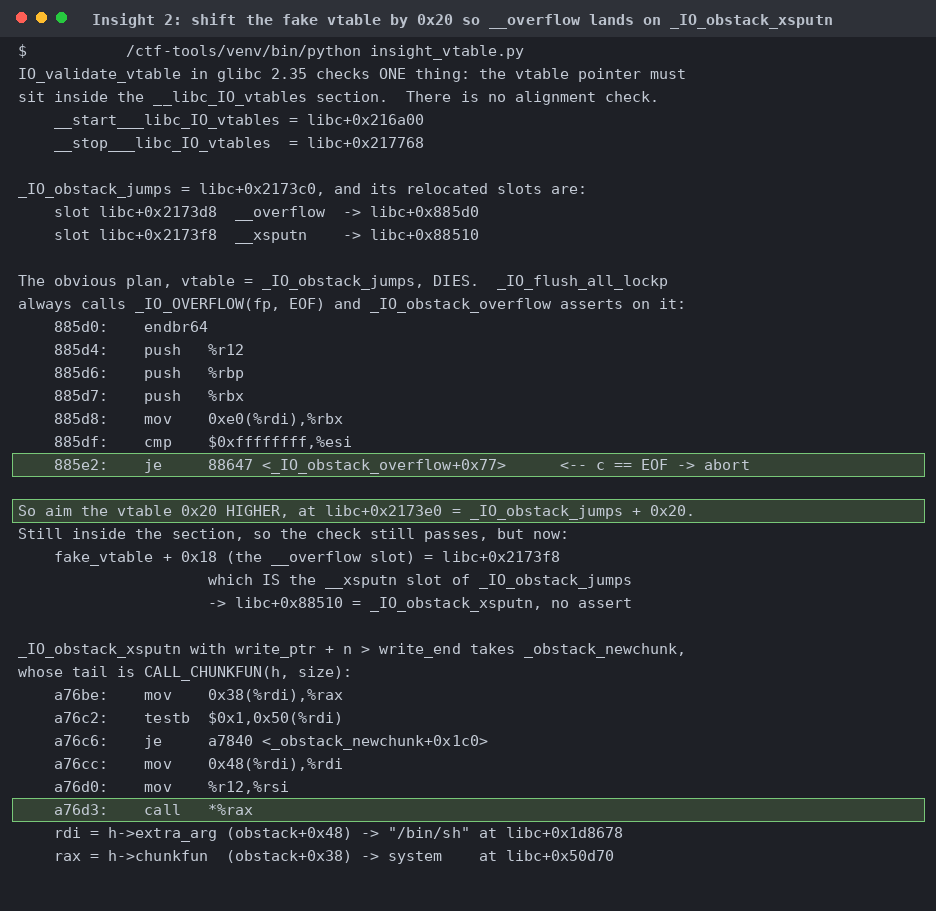
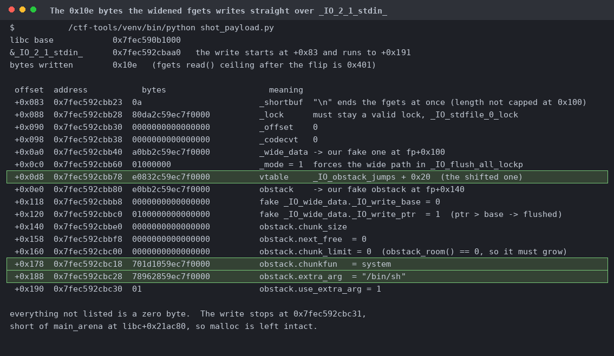
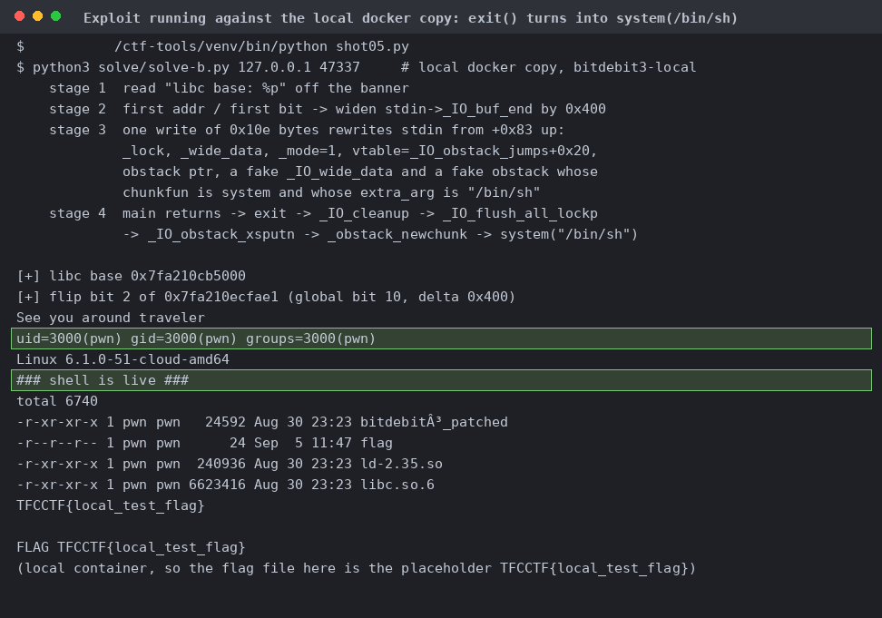
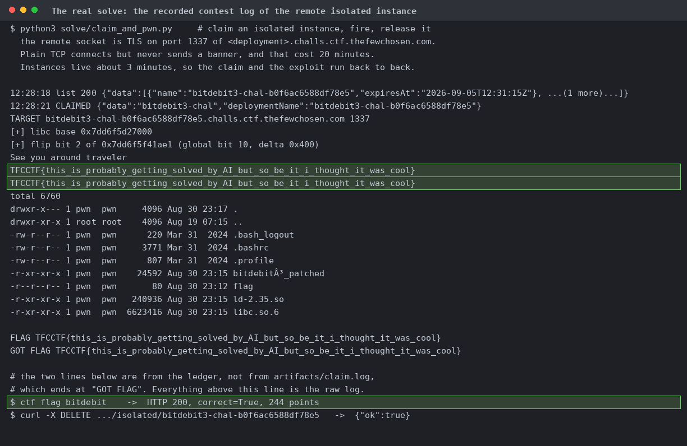

# bitdebit3

Full RELRO, canary, NX, PIE, and the very first line the service prints is its own libc base. The address here comes from the local container rather than the contest one.

Reads an address and a bit index, does `*p ^= 1 << bit` once, then fgets 0x100 into a char[256] and returns. No overflow, no second flip, and libc is the only leak.

`setvbuf(_IONBF)` left the whole stdin buffer as the 1-byte `_shortbuf`. Flipping global bit 10 makes it 1025, so the next fgets read()s that much over libc `.data`. ASLR off so the addresses line up.

`_IO_obstack_overflow` aborts on EOF, visible in the `cmp $0xffffffff,%esi` at libc+0x885df. Shifting 0x20 keeps it inside `__libc_IO_vtables`, which is all `IO_validate_vtable` checks, and puts `_IO_obstack_xsputn` in the `__overflow` slot.

The 0x10e-byte write, dumped from `build_payload()` against a live local libc base. `_mode=1`, a fake wide_data, the shifted vtable, and an obstack whose chunkfun is `system`. Stops short of `main_arena` so malloc survives.

gdb resolves the fields itself: vtable is `_IO_obstack_jumps + 32`, chunkfun is `system`, extra_arg is "/bin/sh". Panel B breaks on `system` after main returned with the canary intact.

`exit()` becomes `system("/bin/sh")` and `id` answers uid=3000(pwn). The flag in this container is the placeholder `TFCCTF{local_test_flag}`.

From `artifacts/claim.log`: an isolated instance over TLS on 1337, shell first try, `/home/pwn/flag` read out.
