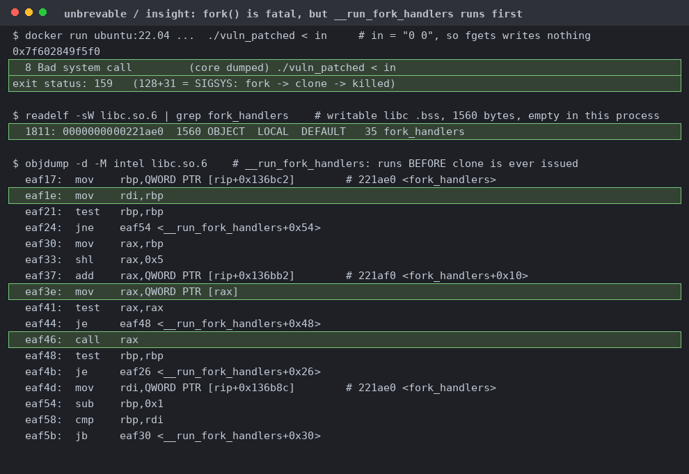

# unbrevable

| | |
|---|---|
| Event | The Few Chosen CTF 2026 |
| Category | pwn |
| Difficulty | baby |
| Author | minipif |
| Points at close | 119 |
| Solves | 122 |
| Status | solved |

> should be easy? now in pwn

Files: [`unbrevable.zip`](handout/unbrevable.zip)

<b>My Solution</b>

`fork()` dies on seccomp, but `__run_fork_handlers` runs before `clone` does. `main` is five statements and no loop. printf leaks the resolved `setvbuf` GOT entry, scanf takes a pointer and a length, fgets does one arbitrary write of arbitrary length, then `fork()`, then return. We have full RELRO, canary, NX, PIE, and pinned glibc 2.35. The seccomp filter goes up before anything prints. It allows read, write, open, openat, rt_sigprocmask, rt_sigreturn, exit, exit_group and execveat. There's no `clone`, so later we get SIGSYSes with status 159. There's no `mmap` and no `execve` either, so your only way out is open/read/write on the flag. Screenshots and flavortext courtesy of Claude:

`__run_fork_handlers` reads `fork_handlers` from libc `.bss` at libc+0x221ae0, puts `used` straight into `rdi`, loads a pointer from `array + (used-1)*32`, and calls it. So one write gets you an arbitrary call with an arbitrary first argument, before `clone` ever issues. Forging `.array` is annoying. You have to set it to `H - (used-1)*32`, which wraps mod `2^64` so glibc's own index arithmetic lands on the handler slot at `+0x30`. The first gadget needs to get you a stack or else you'll be left with just one call and one register:

| gadget | what |
|---|---|
| libc+0x167420 | `mov rdx,[rdi+8]; call [rdx+0x20]` |
| libc+0x5a120 | `mov rsp,rdx; ret` |
| libc+0x45f25 | `add rsp,0x28; ret`, steps over the pivot slot |
| libc+0x90088 | `mov rdi,rax; call [rbx+0x360]` |

The first one lets your single controlled register pick both the next gadget and the new stack. After the pivot it's an ordinary open/read/write chain on `flag`. Note that socat forks per connection and leaks fds 3 to 5 into the child, so fd 3 is already a socket and a hardcoded `read(3)` blocks forever. The first fd `open("flag")` can return is 6, so you need the `mov rdi,rax` gadget. Separately, `fgets` stops at `0x0a`, so your payload can't contain a newline. I got Claude to sample over 20,000 ASLR bases and 11.2% produced one with a newline, so my script just rerolls them.

Flag: `TFCCTF{well_known_technique_brudda}`

