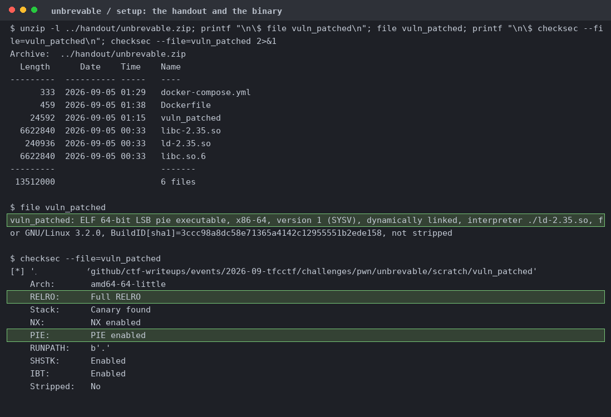
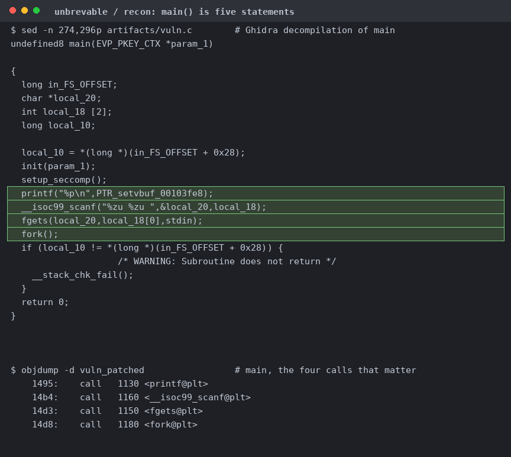
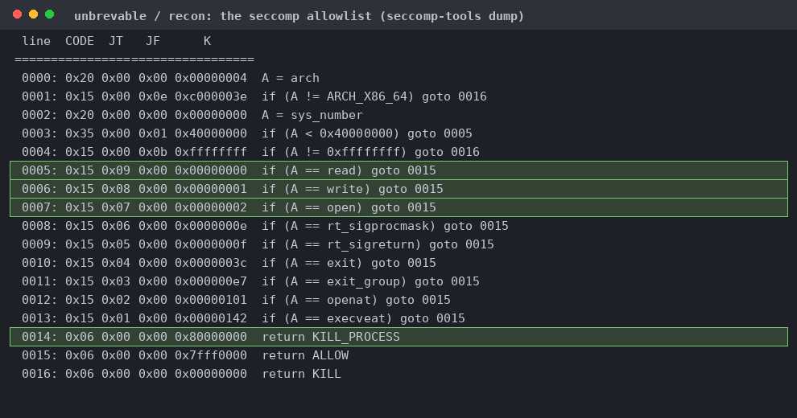
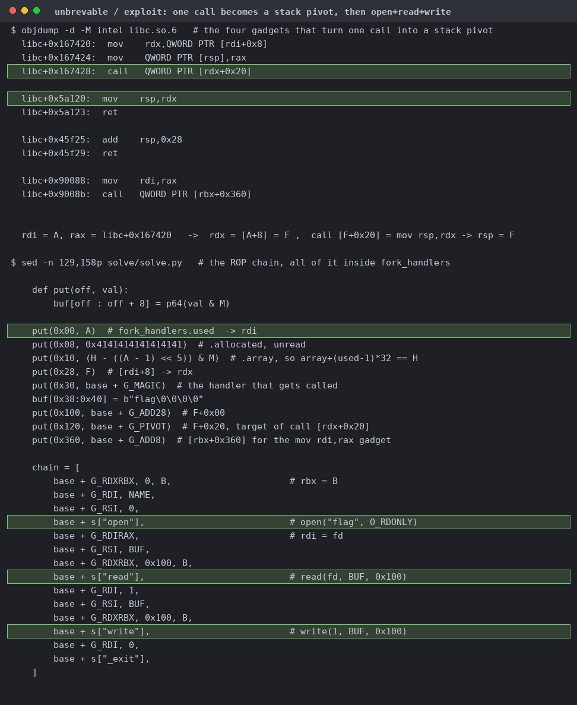
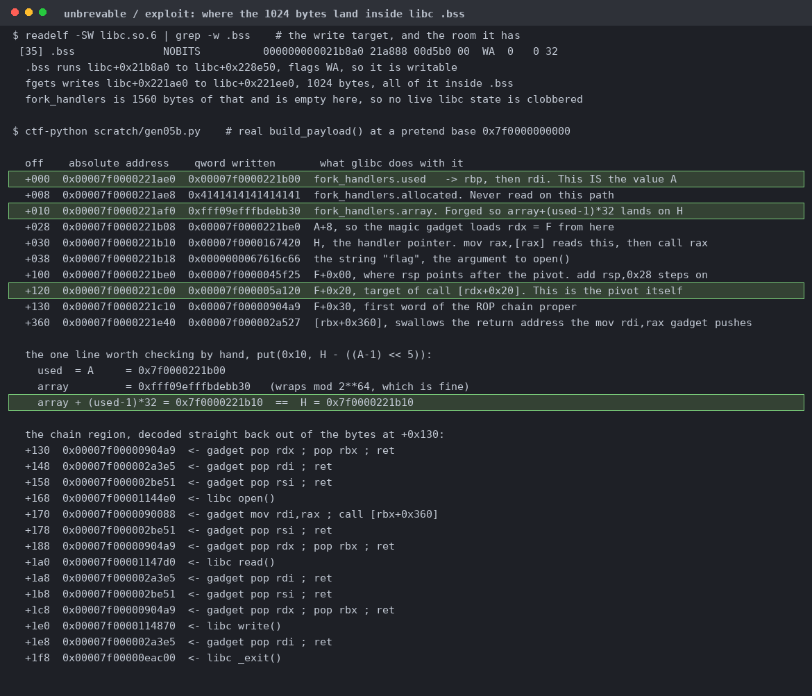
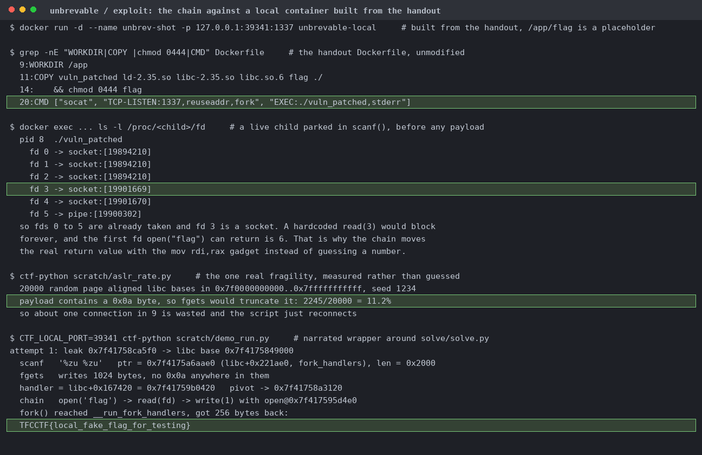
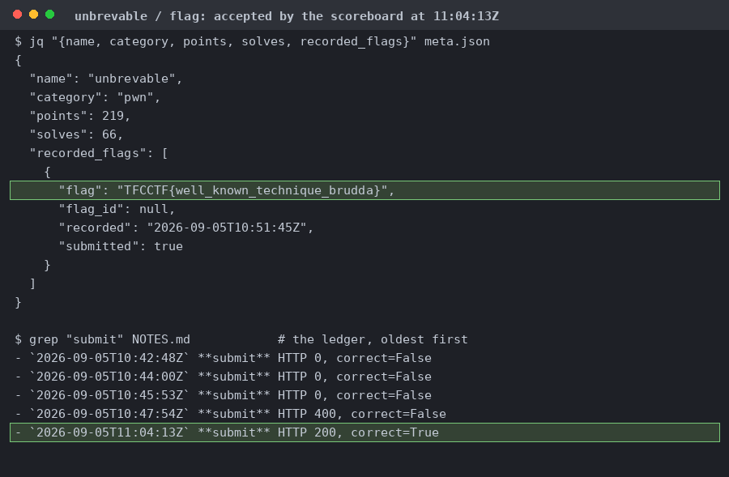

# unbrevable

A 24 KB PIE plus a pinned glibc 2.35. Full RELRO, canary, NX, PIE, so the GOT is read only and every address comes off the leak.

printf leaks the resolved `setvbuf` GOT entry, scanf takes a pointer and a length, fgets does one arbitrary write, then fork() runs and main returns. No loop, no second chance.

read, write, open, openat, rt_sigprocmask, rt_sigreturn, exit, exit_group, execveat. Everything else is KILL_PROCESS, so no clone, no mmap, no execve.

It reads `fork_handlers` from libc `.bss` at libc+0x221ae0, puts `used` straight into `rdi`, loads a pointer from `array + (used-1)*32` and calls it. One write buys an arbitrary call with an arbitrary `rdi`.

libc+0x167420 loads `rdx` from `[rdi+8]` then calls `[rdx+0x20]`, so the one controlled register picks both the next gadget and the new stack. After the pivot it's a plain open/read/write chain.

Read back out of the real `build_payload()` at a fixed pretend base. The forged `.array` is `H - (used-1)*32`, which wraps mod 2^64 so glibc's own arithmetic lands on the handler slot at +0x30.

socat leaks fds 0 to 5 into the child and fd 3 is a socket, so a hardcoded `read(3)` blocks forever and the first fd `open` can return is 6. That's what the `mov rdi,rax` gadget is for. Over 20,000 ASLR bases, 11.2% give a payload containing 0x0a, which fgets would truncate. The flag here is the local placeholder.

The four earlier rejects were the local placeholder. The refusal left a rejected marker keyed by slug rather than by flag value, which then suppressed the genuine flag until it was deleted.
