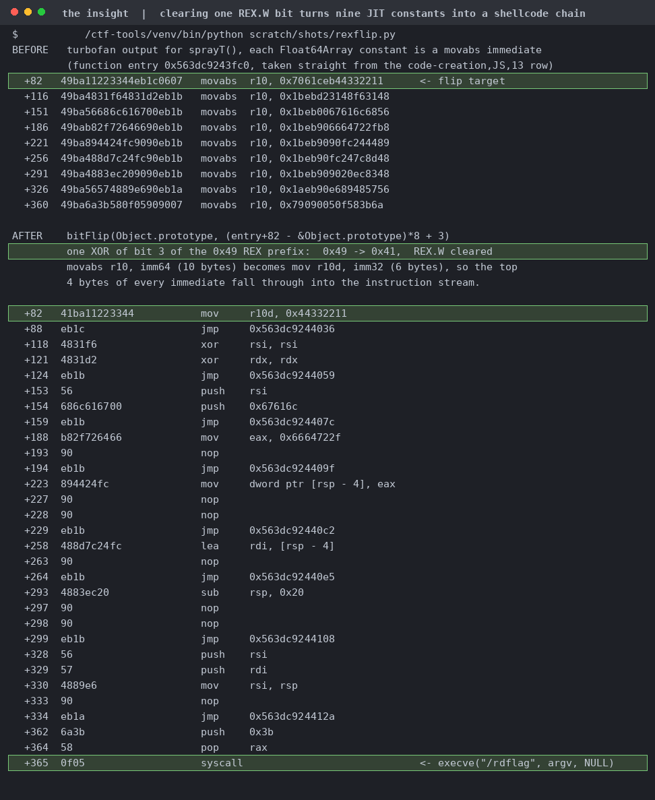

# V8 motor

| | |
|---|---|
| Event | The Few Chosen CTF 2026 |
| Category | pwn |
| Difficulty | grandpa |
| Author | minipif |
| Points at close | 181 |
| Solves | 84 |
| Status | solved |

> the sun is a deadly laser

Files: [`motor_v8.zip`](handout/motor_v8.zip)

<b>My Solution</b>

We need to clear one REX.W bit in JIT code and nine `Float64Array` constants turn into a shellcode chain. The zip has `bitflip.patch`, a 50 MB `d8` built from it, and a Dockerfile running socat that feeds each connection one JS file to `d8 --log-code`. The flag is `0400 root` and only the setuid `/rdflag` can read it, so you need to run a program and not just read memory. `bitFlip(obj, bitoff)` XORs one bit at `object->address() + bitoff/8`. You only get one shot, do not miss your chance to blow, this opportunity comes once in a lifetime (yo). 

The guard will refuse if the V8 sandbox contains the target, and it tests the `std::atomic_flag` before validation, so even a rejected call burns your shot (the whole crowd's laughing now) and the second one throws `used`. So don't probe and don't retry. What the guard doesn't check though is how far the offset reaches (the guard only whether it lands in the sandbox). So the leak is a feature the service already turned on for you! `--log-code` plus `d8.log.getAndStop()` gives absolute addresses (`new,MemoryChunk` rows for the pointer-compression cage base, and `code-creation,JS,13` rows for the turbofan address inside the 512 MB RWX CodeRange). `Object.prototype` sits at `cage + 0x1006840`, which we'll use to anchor ourselves. Screenshots and flavortext courtesy of Claude:

Turbofan compiles each `Float64Array` constant into a `movabs r10, imm64` starting `49 ba`. Play around with that a little and you'll see that flipping bit 3 of the `0x49` gives you`41 ba`, which is a six-byte `mov r10d, imm32`, so the top four bytes of every immediate execute. Each constant carries six bytes of gadget plus an `eb rel` short jump to the next one, and the last is `push 0x3b ; pop rax ; syscall`. The stack it builds spells `/rdflag`. I got the `movabs` offsets by dumping the RWX CodeRange out of `/proc/pid/mem` rather than working them out on paper: `[82, 116, 151, 186, 221, 256, 291, 326, 360]`. The offset you hand `bitFlip` ends up around `7.3e14`, roughly 91 TB from `Object.prototype` out to the CodeRange. That's under the `2^53-1` cap the patch enforces and outside the sandbox, so it's accepted. The probe that computes it prints instead of flipping, so you can check your arithmetic without burning the shot.

Flag: `TFCCTF{dacia_logan_motor_v8_vroom_vroom_cfb841a}`

