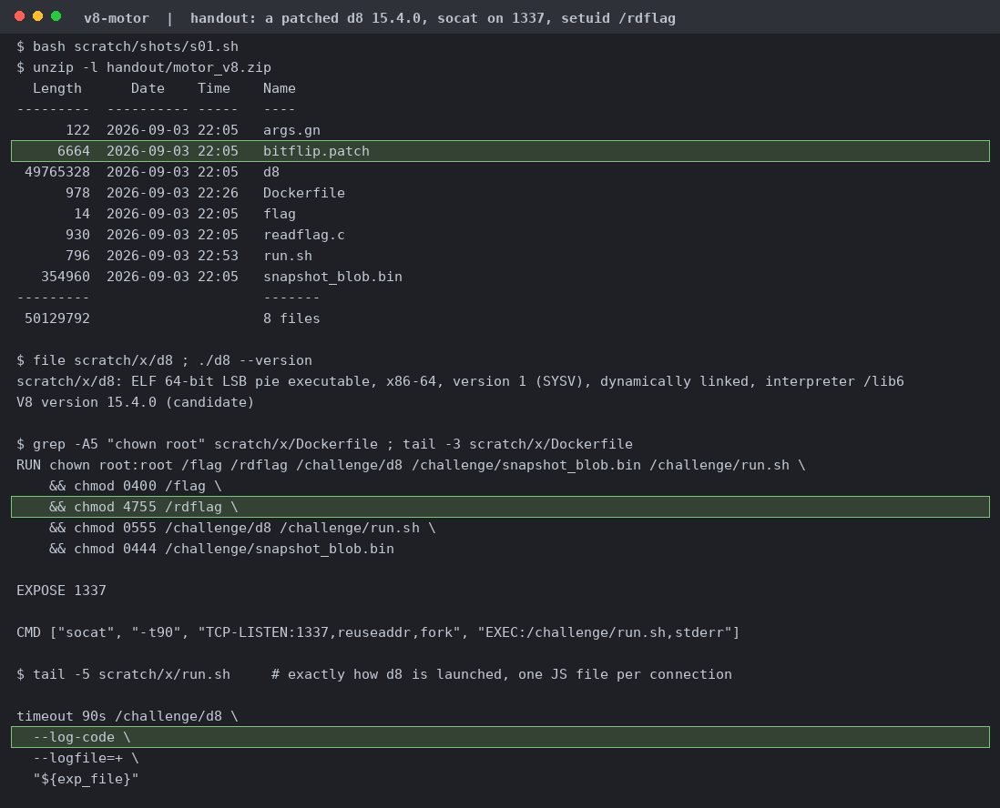
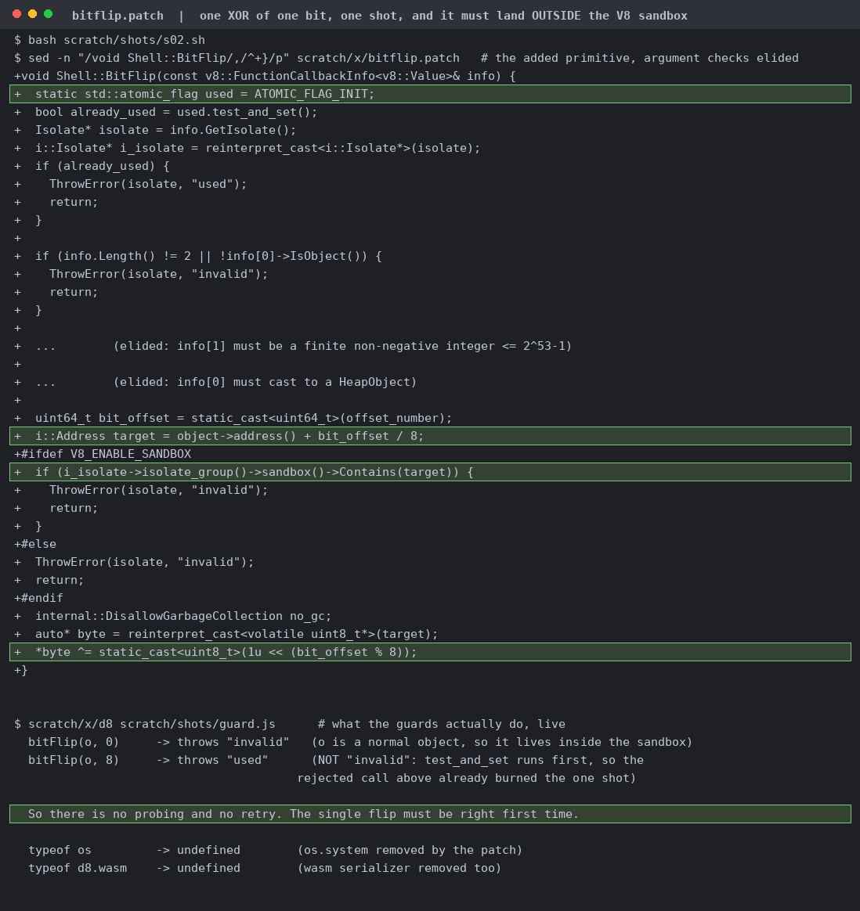
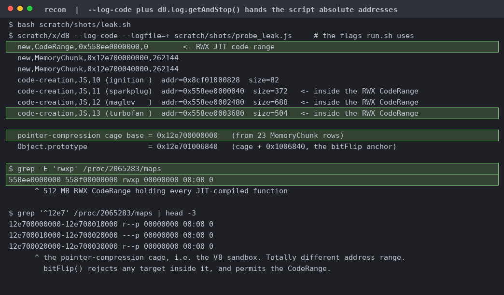
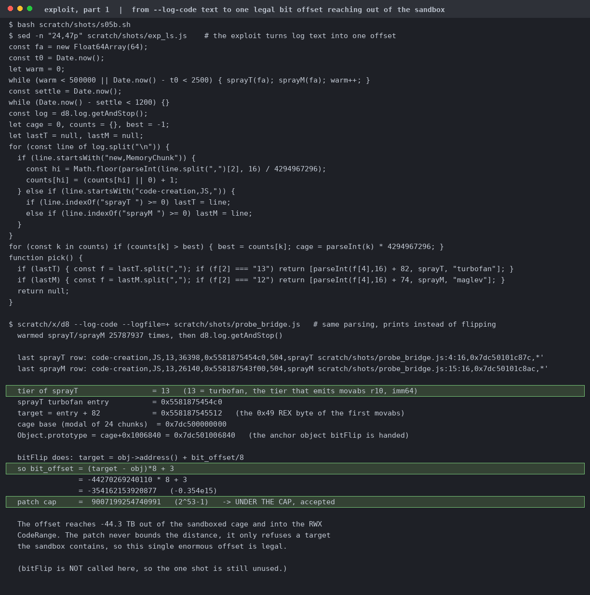
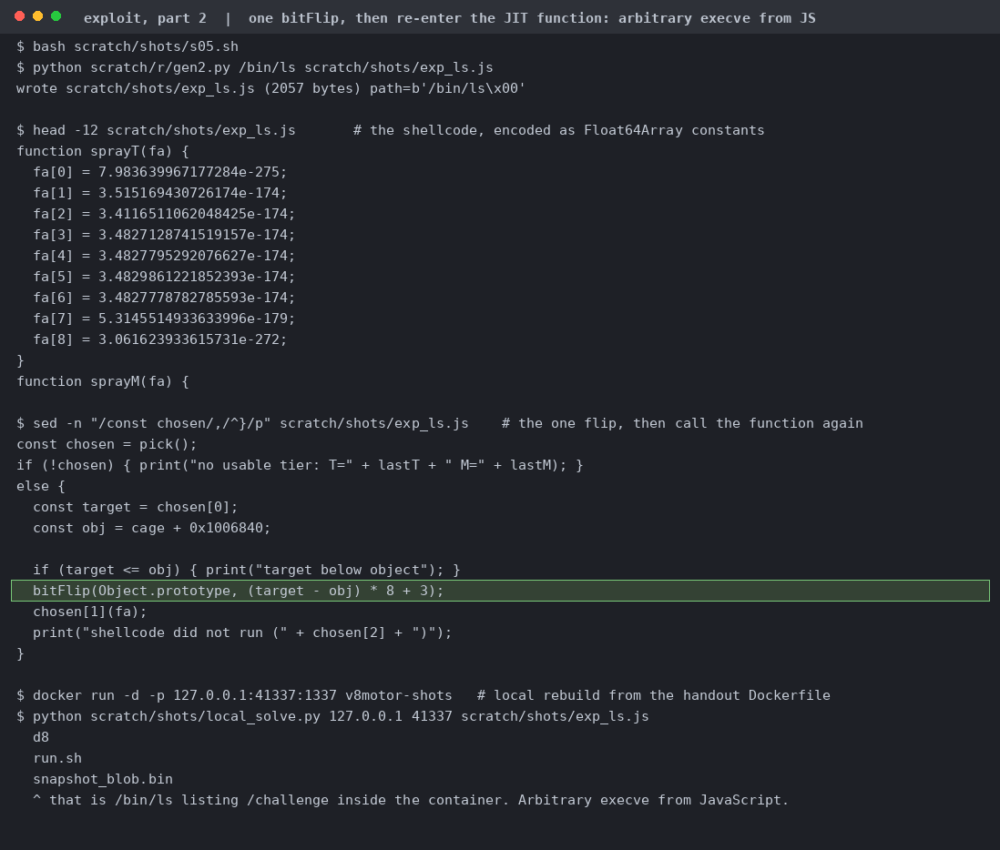
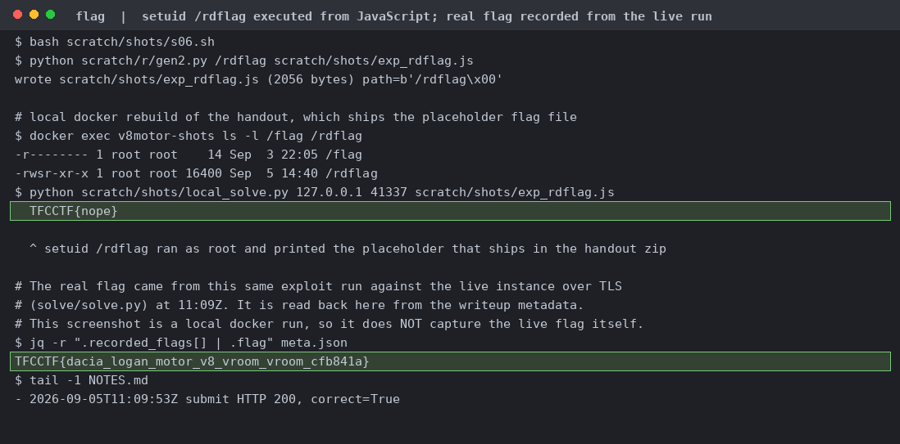

# V8 motor

socat on 1337 hands each connection to `run.sh`, which feeds one JS file to `d8 --log-code`. The flag is `0400 root` and only the setuid `/rdflag` can read it, so you need to run a program, not read memory.

The `std::atomic_flag` is tested before any validation, so even a rejected call burns the shot and the second throws `used`. What isn't checked: how far the offset reaches, only whether it lands in the sandbox.

`new,MemoryChunk` rows give the cage base, `code-creation,JS,13` rows give the turbofan address inside the RWX CodeRange. `/proc/pid/maps` shows the two regions far apart, so the flip gets permitted.

`49 ba` becomes `41 ba`, a 6-byte `mov r10d, imm32`, so the top 4 bytes of each immediate execute. Both listings are capstone on a real dump of the CodeRange, before and after the same one-bit XOR.

Warm the sprayers, recover the cage base as the modal high dword, add 82 to reach the `0x49`. The offset is ~7.3e14, about 91 TB, under the `2^53-1` cap and outside the sandbox. This probe prints instead of flipping, so the shot stays unused.

Against a local rebuild with the path set to `/bin/ls`, it lists `/challenge`. Arbitrary execve from JavaScript with one bit.

Local docker copy, so the value shown is `TFCCTF{nope}`, the placeholder that ships in the handout zip. The real flag came from the same exploit against the live instance at 11:09Z.
