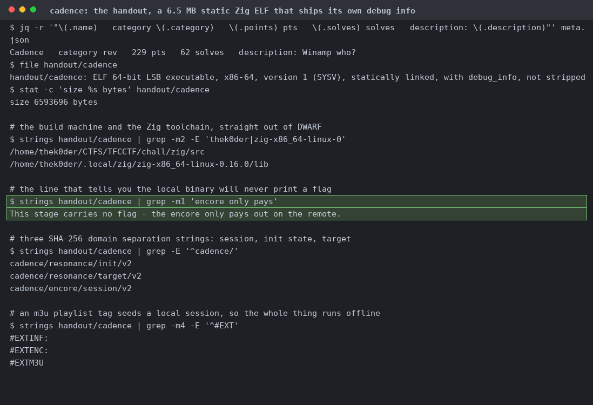
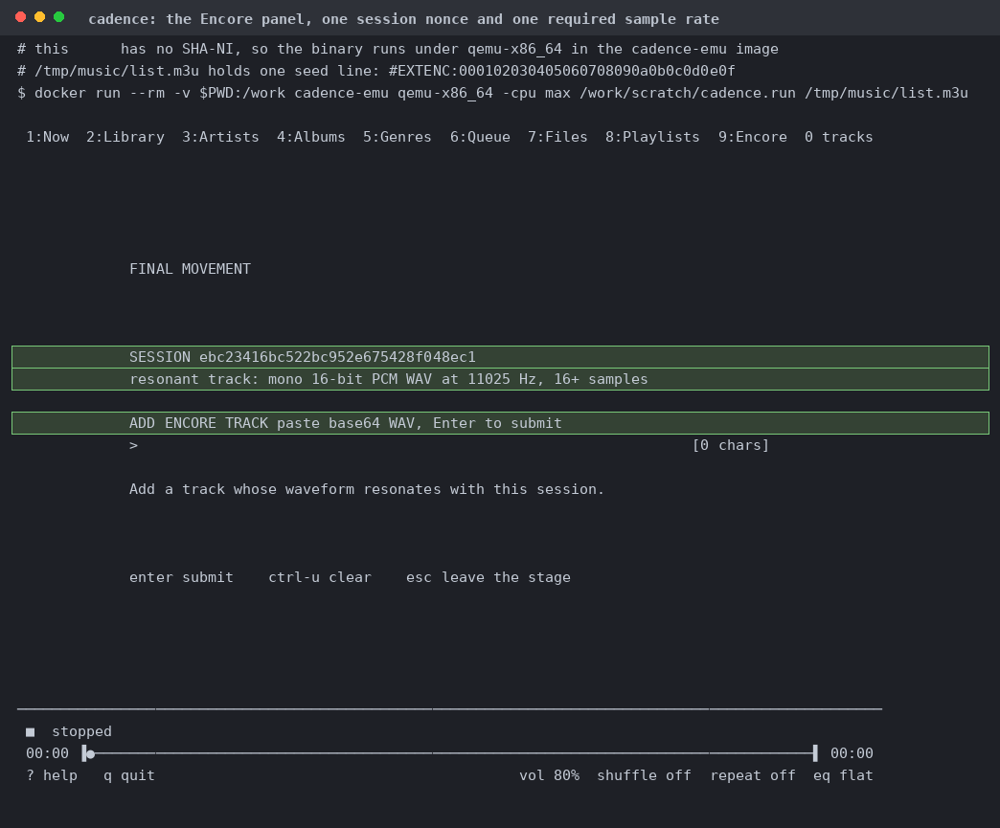
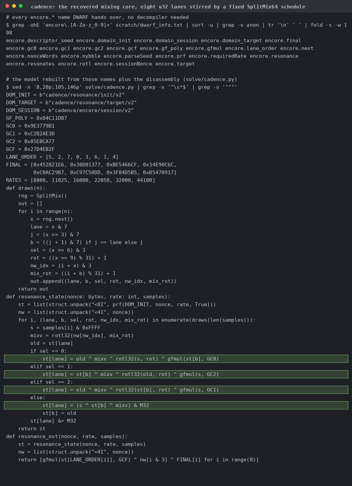
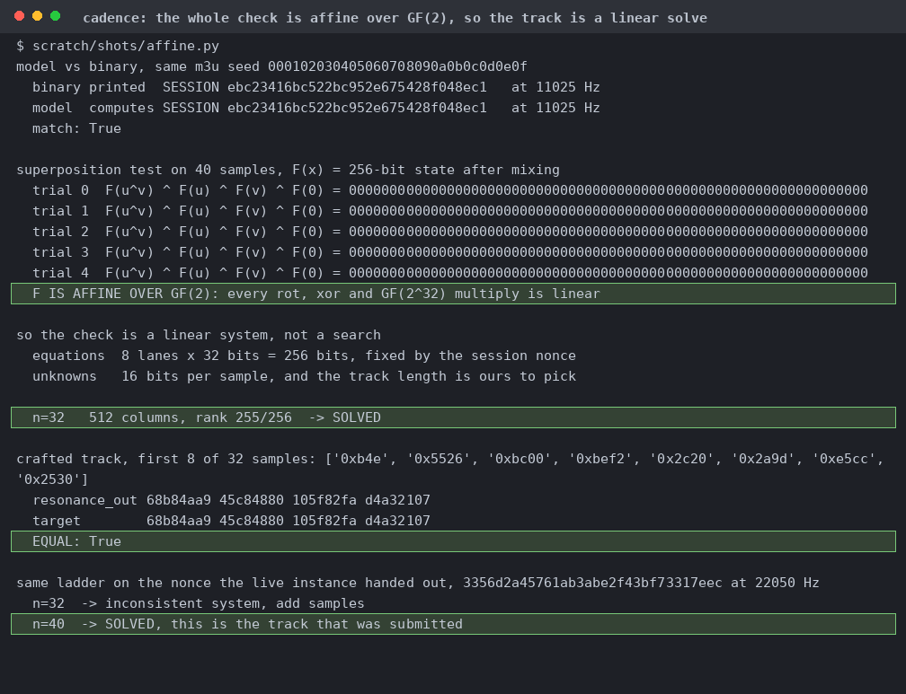
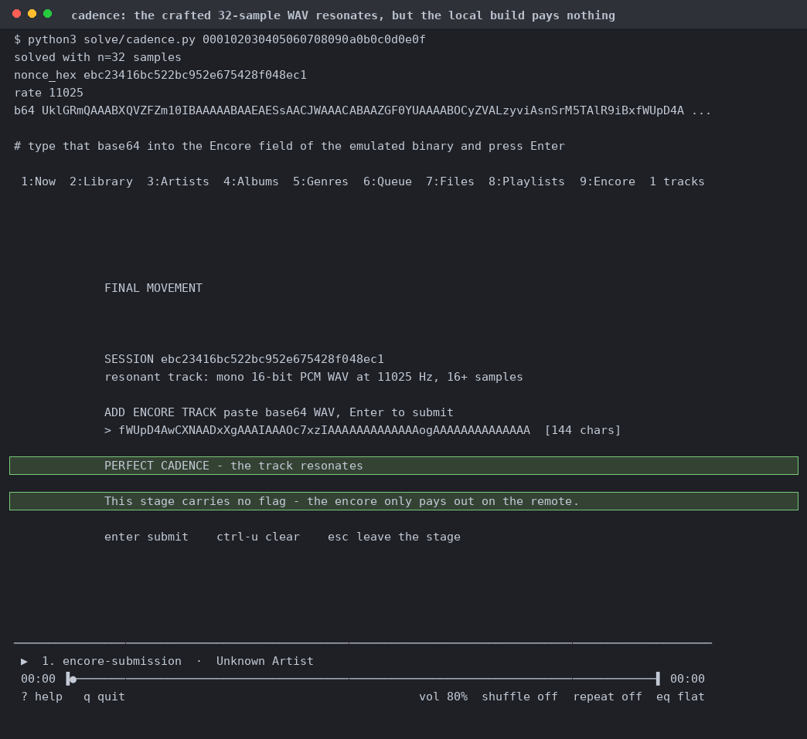
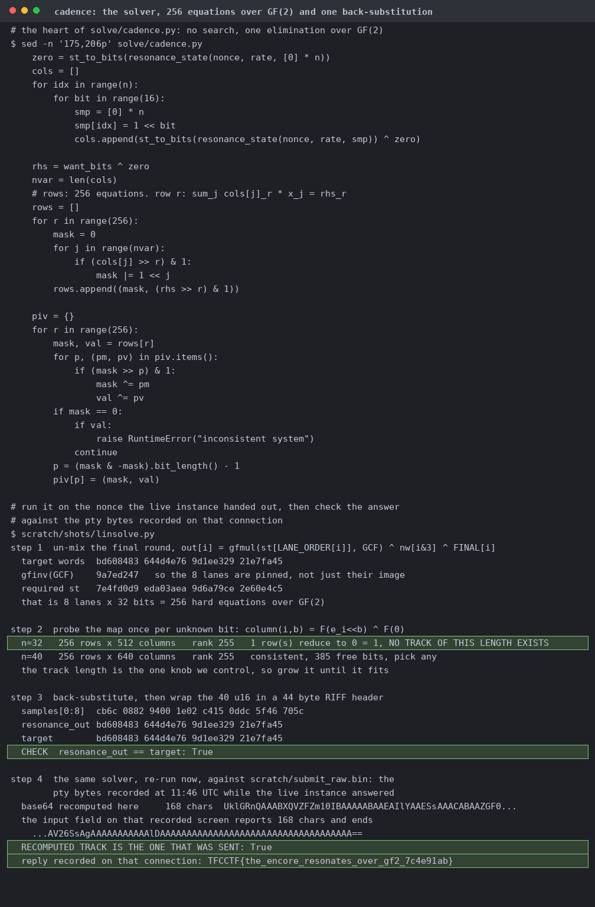
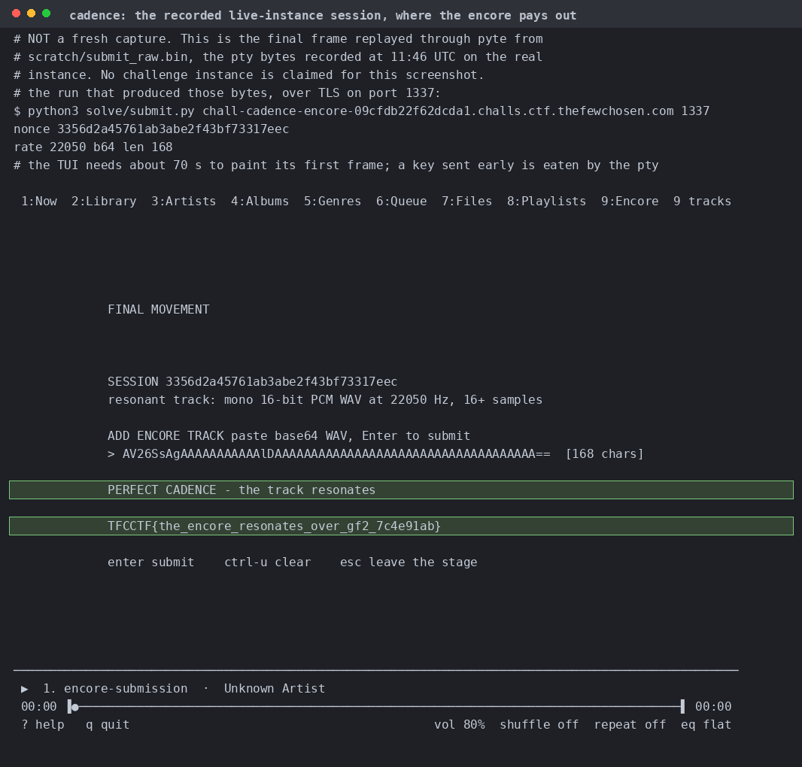

# Cadence

Not stripped, so every `encore.*` name is readable without a decompiler. One of its own strings says the local build never pays out.

A local session, booted under `qemu-x86_64` because my CPU has no SHA-NI, seeded from an m3u `#EXTENC:` tag. It wants a base64 mono 16-bit WAV at the stated rate.

Top half is what DWARF hands over, bottom half is the model rebuilt from it plus the disassembly. Every rule is XOR, rotate or gfmul by a constant.

First the model matches the binary on nonce and rate. Then `F(u^v) ^ F(u) ^ F(v) ^ F(0) = 0` on random pairs, which holds because every primitive is GF(2)-linear.

PERFECT CADENCE, then the binary telling you there's no flag here. Proof of the primitive, not the answer. All local.

Run offline against the live instance's nonce: 32 samples genuinely impossible at rank 255, 40 consistent with 385 free bits. The base64 recomputed now matches the 168 characters on the recorded remote screen.

A replay through pyte of raw pty bytes recorded at 11:46 UTC while the real instance was answering. We didn't even need to claim an instance.
