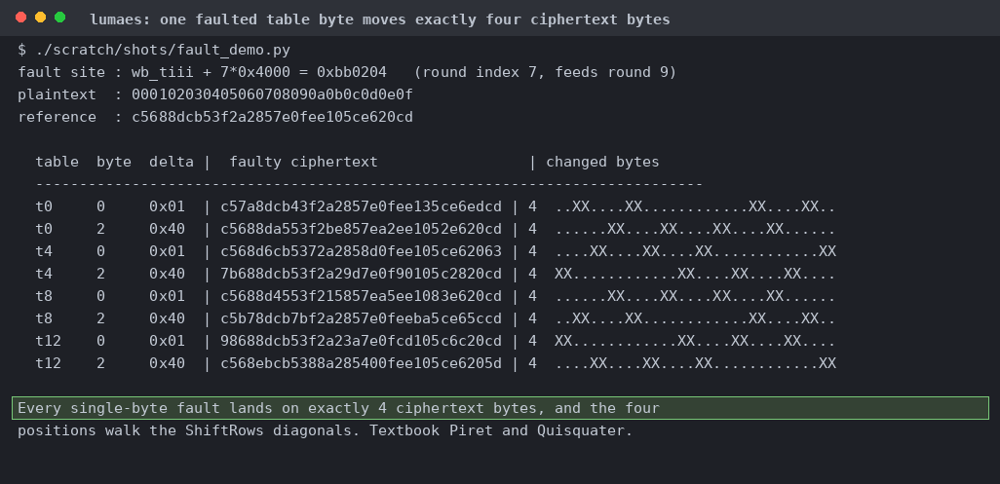
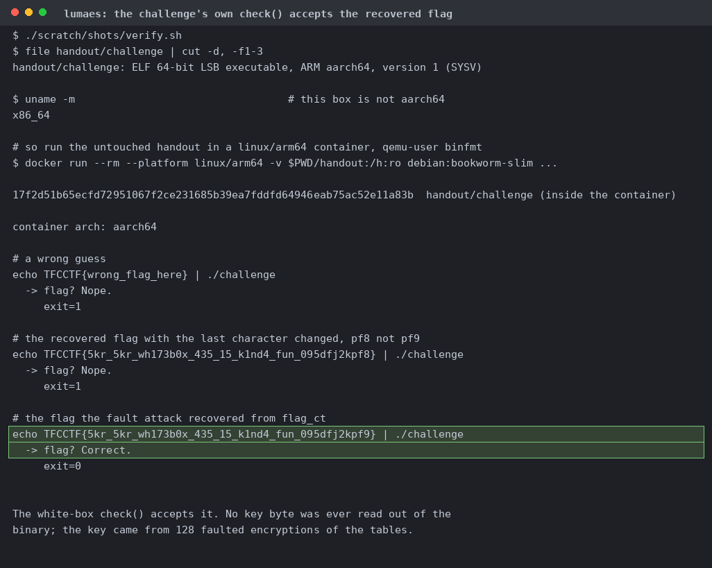

# lumaes

| | |
|---|---|
| Event | The Few Chosen CTF 2026 |
| Category | reverse |
| Difficulty | grandpa |
| Author | Livian |
| Points at close | 91 |
| Solves | 143 |
| Status | solved |

> I heard CTF players love obfuscation!

Files: [`challenge`](handout/challenge)

<b>My Solution</b>

This is a [Chow et al. (2002)](https://link.springer.com/content/pdf/10.1007/3-540-36492-7_17.pdf) white-box AES-128 problem, and we'll tackle it with differential fault analysis and 8 MB aarch64 ELF (not stripped). The binary encrypts its own code first, but the packer doesn't have any feedback so it comes off statically. `enccrypt` at `0xb52ef4` gives twenty instructions (a keystream seeded `(31*keylen+7)&0xff` and advanced by `key[i%keylen]+i`, XORed over the data). Both keys are sitting in `.data` (`ong-hiumee-is-kinda-skibidi` and `no-key-in-here`) and the rebuilt ELF matches byte for byte. Inside you get nine rounds of sixteen T-boxes, a nibble XOR network, and a final round. Looks like AES-128 is back on the menu. In a Chow white-box the round keys are folded into the table entries, so there's no key sitting in memory for you to read and we have to fault it out instead. Emulate `enc.body` at `0x917a30` under unicorn. Corrupt one output byte across all 256 entries of one `wb_tiii` table at round index 7 and you get a one-byte fault on the round 9 input. Screenshots and flavortext courtesy of Claude:

Every fault moves four ciphertext bytes, and the positions walk the ShiftRows diagonals, so you know it landed in the right round. That's the [Piret and Quisquater (2003)](https://link.springer.com/chapter/10.1007/978-3-540-45238-6_7) differential. Take 128 faulty ciphertexts from one fixed plaintext, hand them to [phoenixAES](https://github.com/SideChannelMarvels/JeanGrey), and you get K10. Run the key schedule backwards for the master key. Plain AES-128-ECB under that key then matches the emulator exactly, so you know the key is right rather than just self-consistent, and `flag_ct` at `0xc25208` decrypts. Screenshots and flavortext courtesy of Claude:

Check out `.data` at `0xb70063` to get a laugh (prompt injection lol).

Flag: `TFCCTF{5kr_5kr_wh173b0x_435_15_k1nd4_fun_095dfj2kpf9}`

