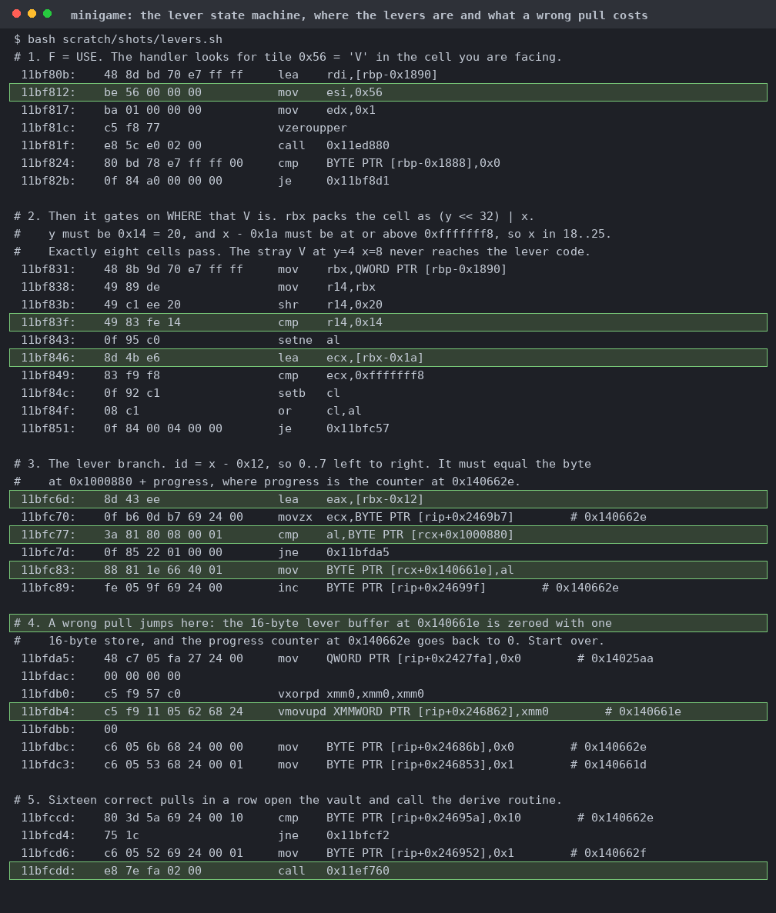
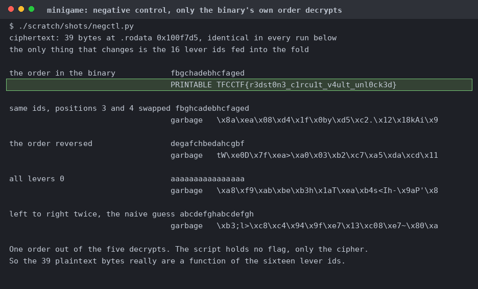

# minigame

| | |
|---|---|
| Event | The Few Chosen CTF 2026 |
| Category | reverse |
| Difficulty | grandpa |
| Author | minipif |
| Points at close | 50 |
| Solves | 191 |
| Status | solved |

> a game

Files: [`minigame`](handout/minigame)

<b>My Solution</b>

Yay roguelikes. You get a 2 MB static stripped Zig game. The game wants you to kill four enemies, mine an altar, then beat three bosses before the flag vault opens, but we're going to skip all of that. `strings | grep -c TFCCTF` gives you 0, but the strings hand over the mechanism anyway (`WRONG LEVER SEQUENCE RESET`, `CIPHER ACCEPTED VAULT OPEN`, and a sixteen-letter string `fbgchadebhcfaged` at `0x10002a0`). The USE handler scans the facing cell for tile `0x56` (`V`), gates on `y == 0x14` and `x` in 18..25, and takes the lever id as `x - 0x12`. That id has to match the byte at `0x1000880` plus a progress counter. A wrong pull resets both and the sixteenth consecutive match calls `0x11ef760`. Screenshots and flavortext courtesy of Claude:

That position gate matters a lot. When you dump the 96x96 world grid out of `.bss` there are actually nine `V` tiles, but only the eight at y=20 count. The 16 bytes at `0x1000880` are `05 01 06 02 07 00 03 04 01 07 02 05 00 06 04 03`, which is `fbgchadebhcfaged` with `'a'` subtracted from each letter. So the graffiti written across the vault room floor literally spells the answer lol. `0x11ef760` folds those 16 ids into a 64-bit state with splitmix64 seeded from the digits of pi, then XORs the top byte of each `xorshift64*` output over 39 ciphertext bytes at `0x100f7d5`. There's no game state, no time, and no randomness, so you can solve the whole thing statically. You can map the four `PT_LOAD` segments at their fixed addresses with `MAP_FIXED_NOREPLACE`, plant the ids, and call `0x11ef760` through ctypes (in a sandbox, since it's handout code). Alternatively, just reimplement the cipher against the handout file. Screenshots and flavortext courtesy of Claude:

39 bytes of XOR is probably worth a negative control. So start with the same ciphertext, hit with with five different lever orders, and only the one the binary stores gives printable text. I also tried one adjacent swap, the reverse, all zeros, and the naive left-to-right sweep but they all gave noise.

Flag: `TFCCTF{r3dst0n3_c1rcu1t_v4ult_unl0ck3d}`

