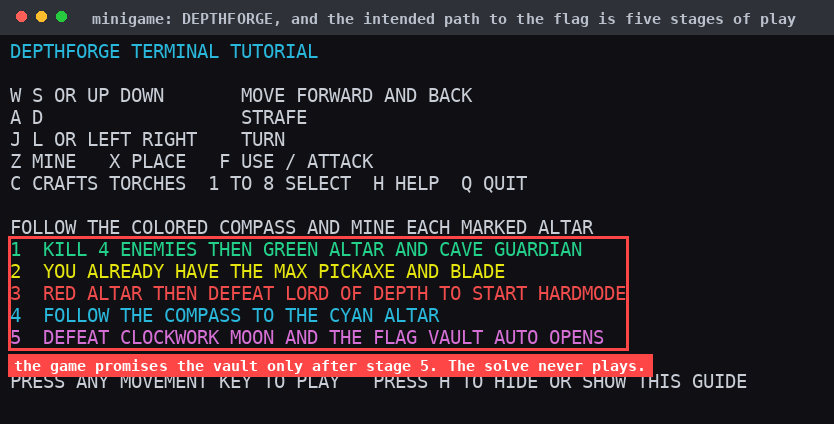
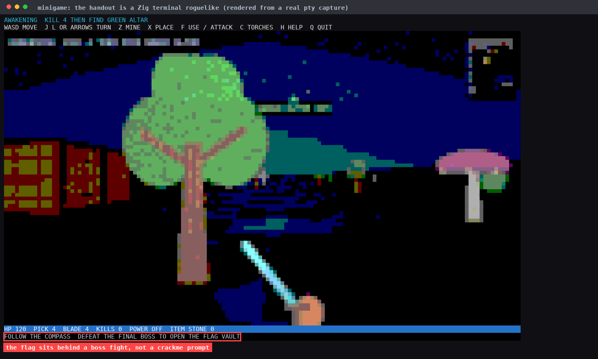
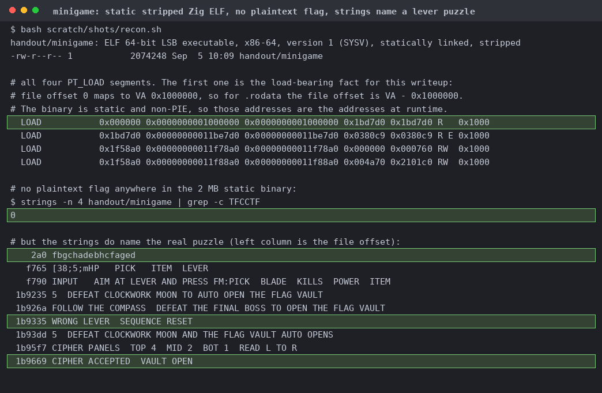
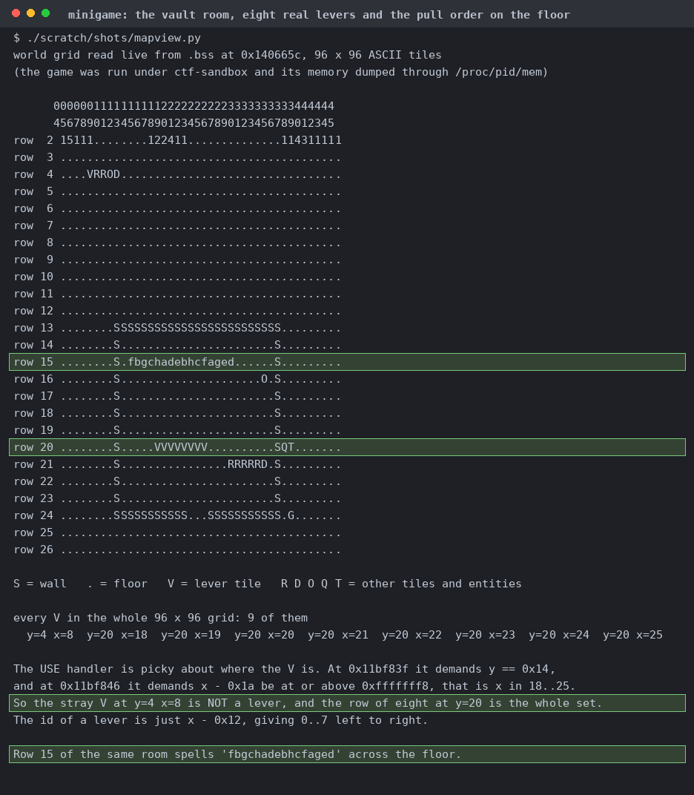
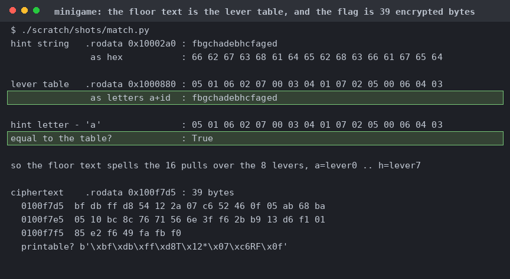
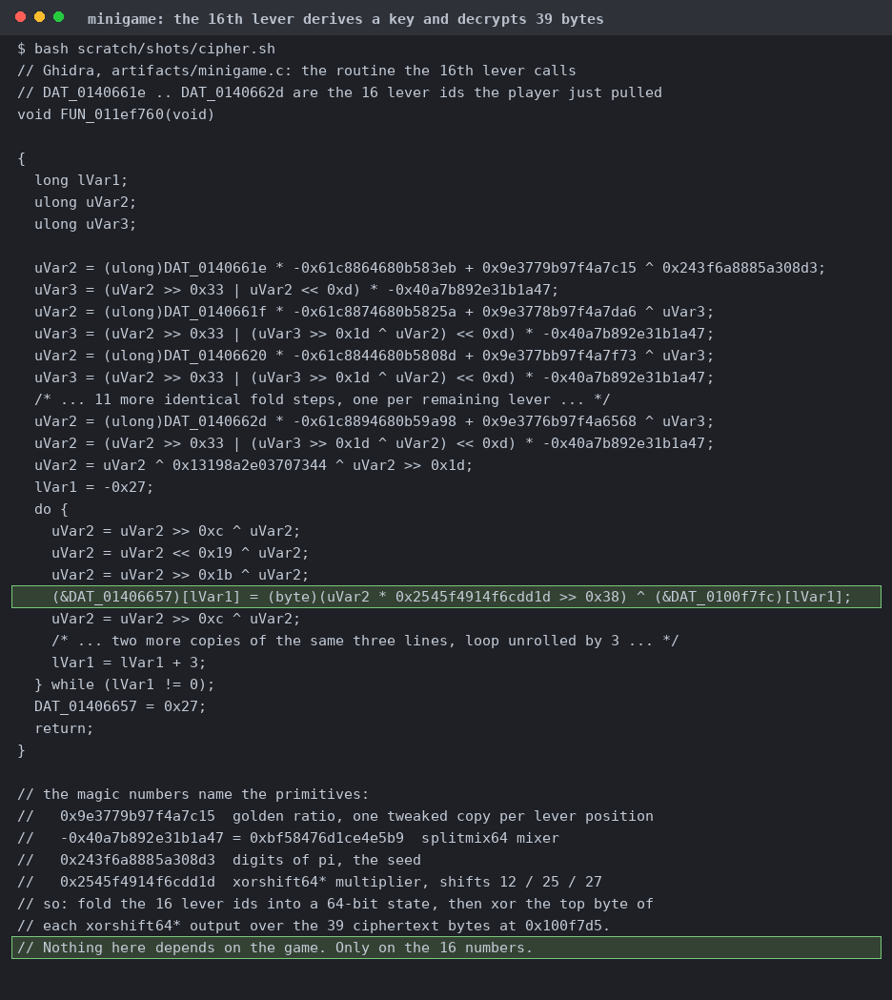
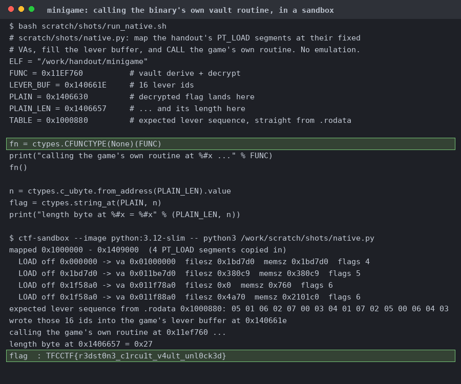
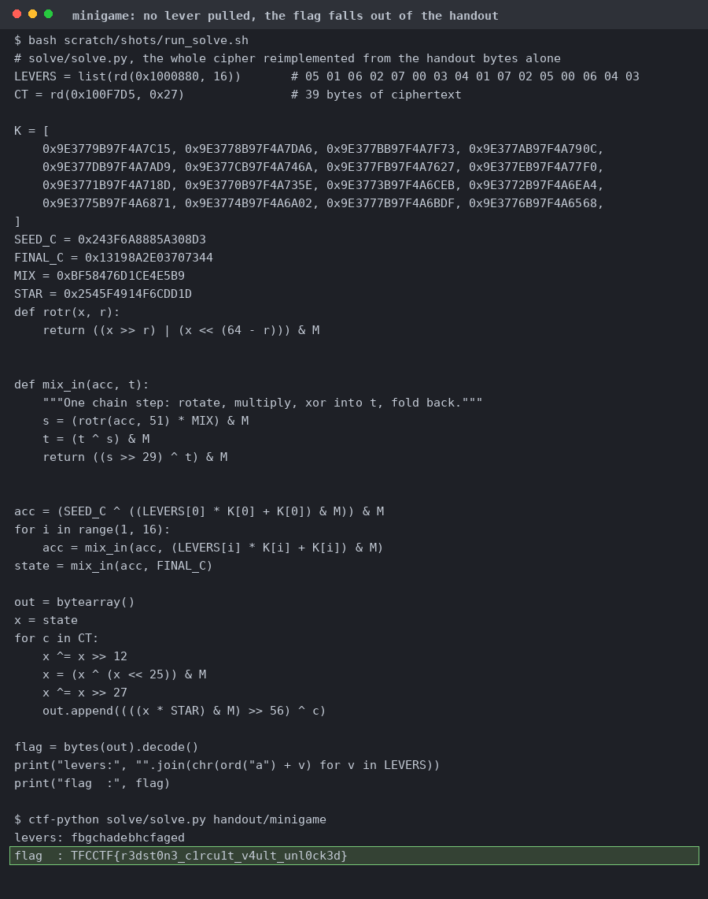

# minigame

Ain't nobody got time for that.

A 256-colour pty capture at 160x50. The boxed status line says DEFEAT THE FINAL BOSS TO OPEN THE FLAG VAULT.

The strings give the mechanism away instead (WRONG LEVER SEQUENCE RESET, CIPHER ACCEPTED VAULT OPEN, and `fbgchadebhcfaged` at `0x10002a0`).

The 96x96 world grid dumped through `/proc/pid/mem`. Nine `V` tiles exist and only the eight at y=20 qualify. The census below the map sorts them out.

Gates on `y == 0x14` and `x` in 18..25, so lever id is `x - 0x12`. A wrong pull zeroes the buffer. The sixteenth consecutive match calls `0x11ef760`.

The 16 bytes at `0x1000880` are `fbgchadebhcfaged` with `'a'` subtracted from each letter. Also dumps the 39 ciphertext bytes at `0x100f7d5`.

splitmix64 fold seeded with the digits of pi, then `xorshift64*` XORed over the ciphertext. You don't need game state, time, or randomness.

Static and non-PIE, so map the four `PT_LOAD` segments with `MAP_FIXED_NOREPLACE`, plant the ids, call through ctypes. Runs handout code, so it goes in the sandbox.

`solve/solve.py` reads the tables out of the handout file and redoes the cipher in Python. 

Same ciphertext, we try five lever orders. Only the one the binary stores gives printable text. We also tried a single adjacent swap, the reverse, all zeros, and the naive sweep, but got noise for those.
