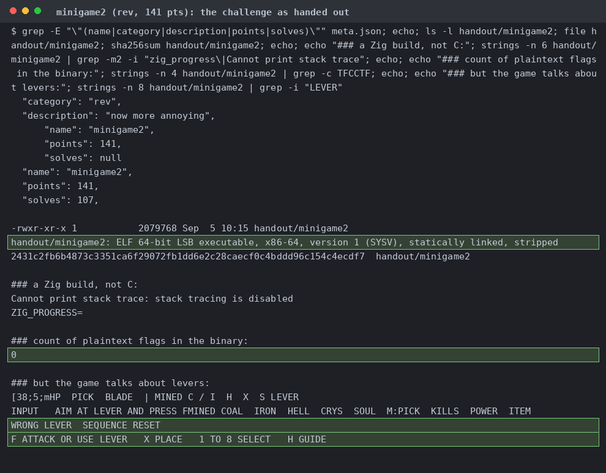
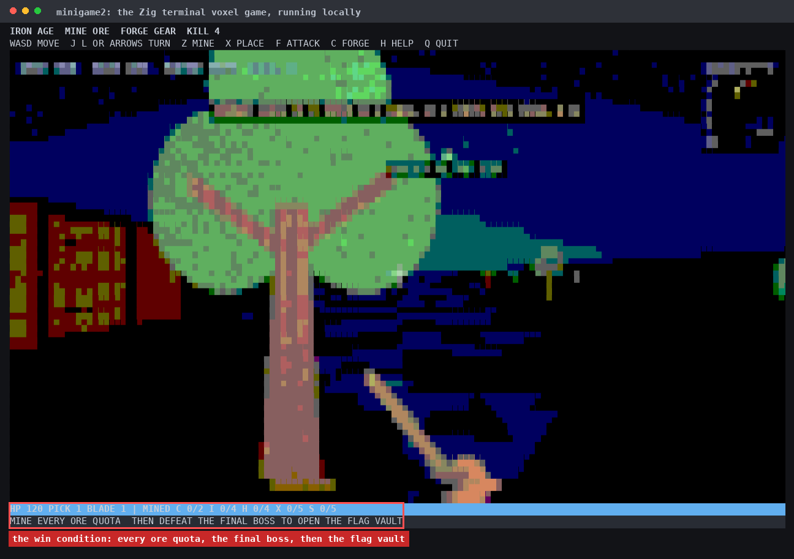
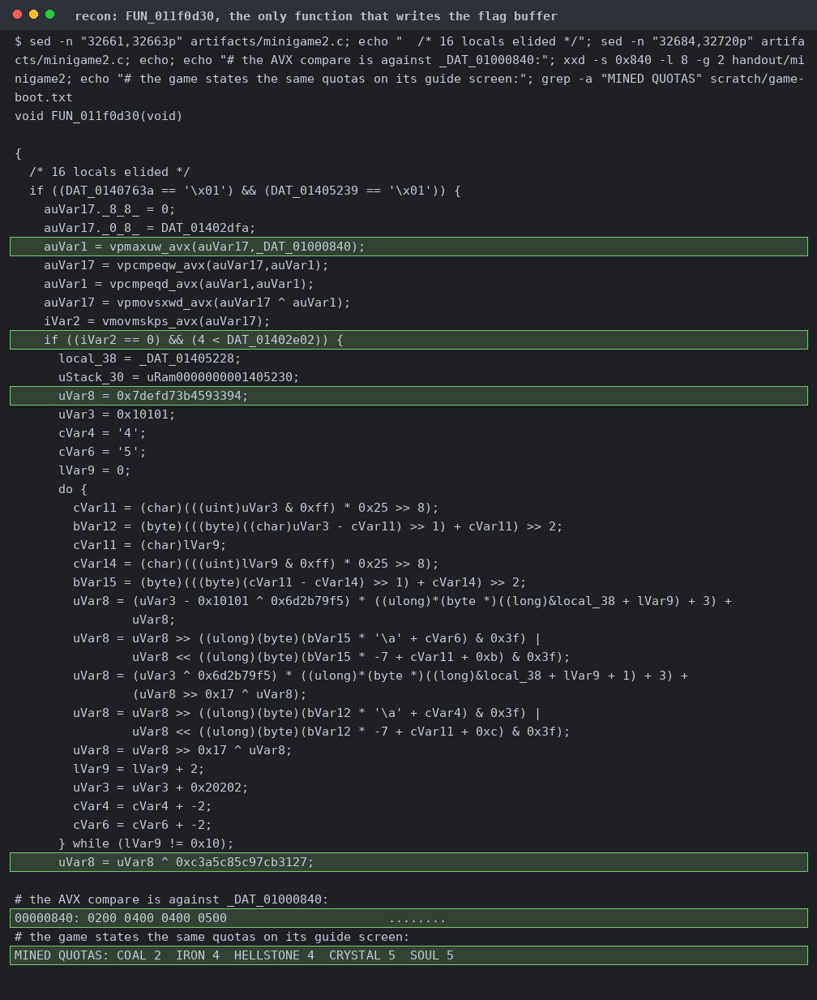
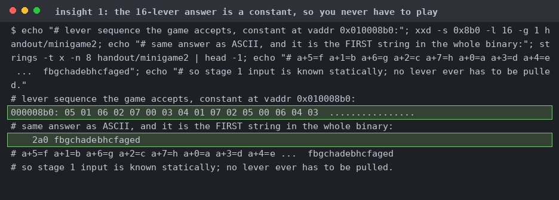
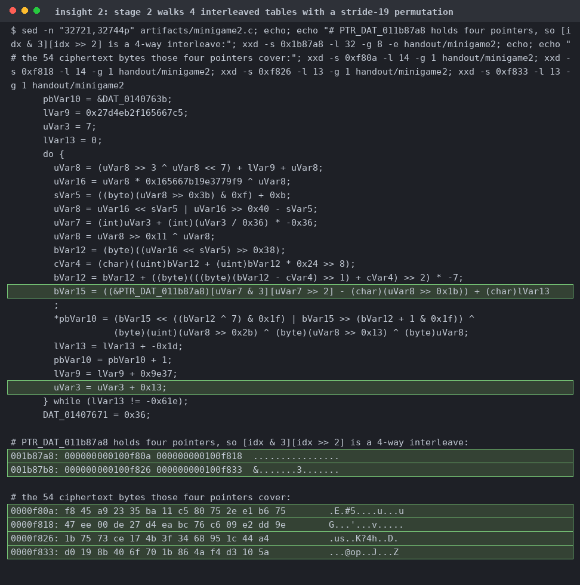
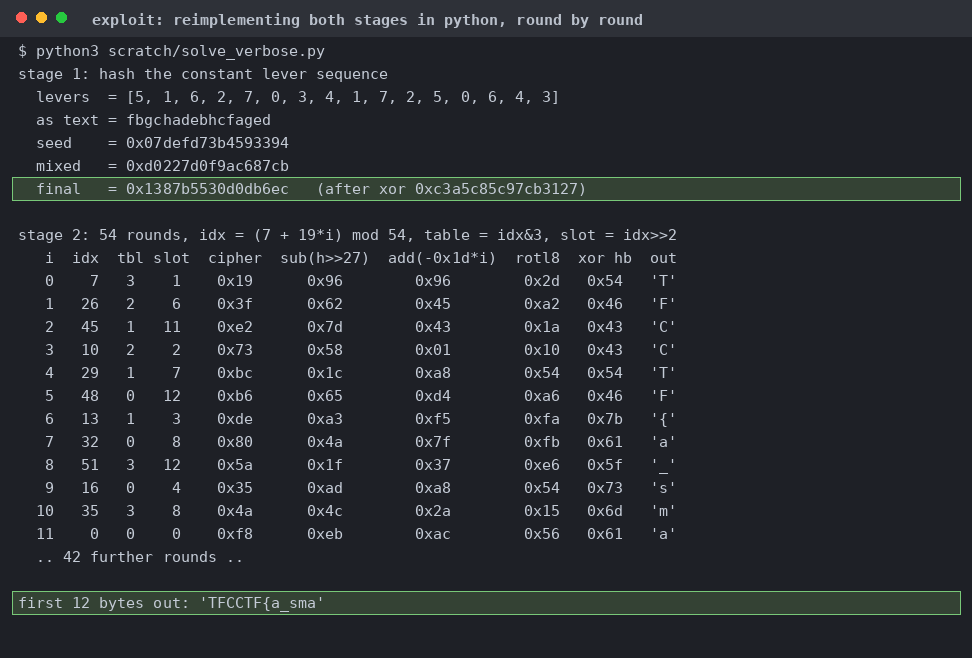
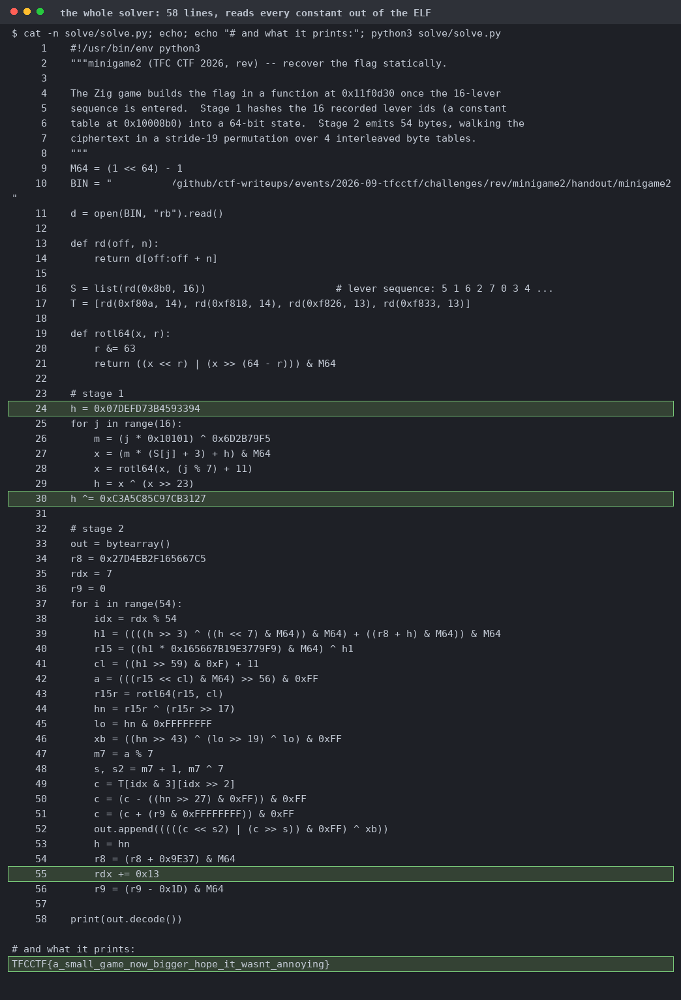
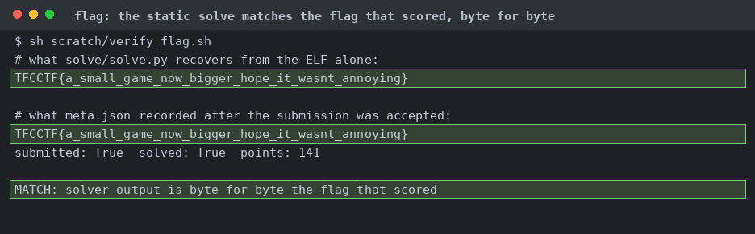

# minigame2

The description is "now more annoying". `strings | grep -c TFCCTF` is 0, and the only suggestive strings are the lever text.

A local pty run.

Gates on an AVX comparison between mined counts and the quota vector 2/4/4/5, then seeds a 64-bit state with `0x07defd73b4593394` and finishes with XOR `0xc3a5c85c97cb3127`.

`05 01 06 02 07 00 03 04 01 07 02 05 00 06 04 03` at `0x010008b0`. Add `'a'` and it reads `fbgchadebhcfaged`, also the first hit from `strings -n 8`.

`idx` advances by `0x13` mod 54, and 19 and 54 are coprime so all 54 slots get hit once. The low two bits pick one of four pointers holding 14+14+13+13 bytes.

Stage 1 lands on `0x1387b5530d0db6ec`. Stage 2 is subtract `h>>27`, add `-0x1d*i`, rotate left by `7 - (a mod 7)`, XOR a hash byte. The first twelve rounds spell `TFCCTF{a_sma`.

Lifts the lever constant from file offset `0x8b0` and the tables from `0xf80a`, replays both stages. We don't hardcode anything that isn't in the binary.

Compares the static solver's output with `meta.json`.
