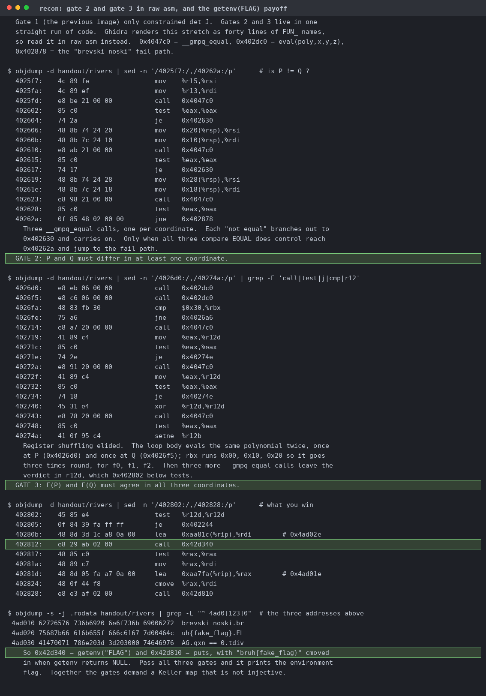

# rivers

| | |
|---|---|
| Event | The Few Chosen CTF 2026 |
| Category | reverse |
| Difficulty | grandpa |
| Author | mcsky23 |
| Points at close | 143 |
| Solves | 106 |
| Status | solved |

> cry me a rivers

Files: [`rivers`](handout/rivers)

<details>
<summary><b>My Solution</b></summary>

rivers wants a Keller map over Q in three variables that isn't injective, which is a counterexample to the Jacobian conjecture and was funnily enough an open problem since 1939 but was only recently disproven a few months ago for dimensions higher than 2 in [Gao (2026)](https://arxiv.org/html/2608.00222v1). You can audit every function in the binary looking for the implementation bug, but I couldn't find one. The whole thing is static stripped GMP, no PIE, and a user interface consisting of `brevski noski`. It reads three polynomials in three variables, builds the 3x3 Jacobian, expands the determinant by cofactors, and applies three gates:
1. `det.size == 1` with all three exponents zero, so the determinant is a nonzero constant
2. three `__gmpq_equal` calls that only fail when P and Q agree everywhere, so P != Q
3. `eval` at both points, and if they match, `getenv("FLAG")`

Screenshots and flavortext courtesy of Claude:



That combination looks impossible, so I went bug hunting instead. Everything I checked came back clean:
- NaN and infinity are out, since the double reader tests `|d| <= DBL_MAX`
- a zero-coefficient determinant looks like the bug because the gate only checks exponents, except `add_term`, `poly_add`, `poly_sub`, and `poly_mul` all prune a zero-numerator term and refuse to append one. I threw seven crafted degenerate maps at it and it rejected all of them
- the cofactor indices read fine in raw asm
- `mpq_set_d` canonicalises and `mpq_equal` compares limbs, so you can't smuggle a non-canonical rational in either
- gate 1 on its own is correct. I patched 19 bytes at `0x402556` so the binary announces the moment the determinant check passes, then ran 300 random low-degree maps through it, and it agreed with sympy every time

Turns out the actual answer is [Alpöge's (July 2026) counterexample](https://www.ulam.ai/research/jacobian.pdf):
```
F0 = (1+xy)^3 z + y^2 (1+xy)(4+3xy)
F1 = y + 3x(1+xy)^2 z + 3xy^2(4+3xy)
F2 = 2x - 3x^2 y - x^3 z
```
`det J == -2`, and `(0,0,-1/4)`, `(1,-3/2,13/2)` and `(-1,3/2,13/2)` all map to `(-1/4,0,0)`. Every coefficient is a small integer and every coordinate is dyadic, so all 22 doubles in the payload are exact. If you're using an LLM for this, you might be misled because the result probably didn't make it into training data yet :P

## Ugh now I have to extract though

rivers is `connection_type: "netcat"` and not `nodeport`, so it's `<deploymentName>.challs.ctf.thefewchosen.com:1337` over TLS with SNI, and `POST /isolated` only returns the deployment name. Don't sit around waiting for a `connection` object and don't call `shutdown(SHUT_WR)` on a Python `SSLSocket`. It'll connect, send, and then read back framed TLS application-data records instead of plaintext (which looks like you've hit a TLS-in-TLS proxy). Half-closing the write side under TLS just desynchronises the session. Eventually I stopped being goofy and realized this works:
```sh
{ cat payload.bin; sleep 20; } | openssl s_client -connect H:1337 -servername H -quiet
```

Flag: `TFCCTF{even_math_is_cooked_its_so_joever}`
</details>
