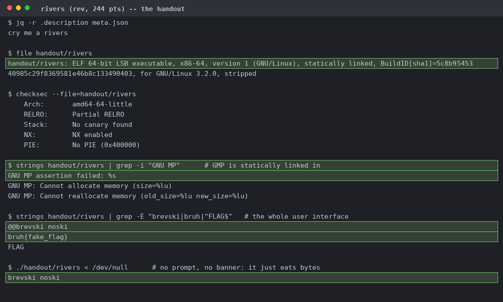
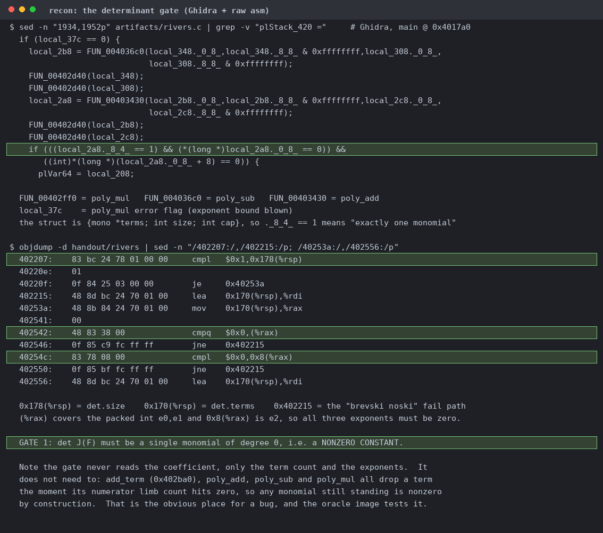
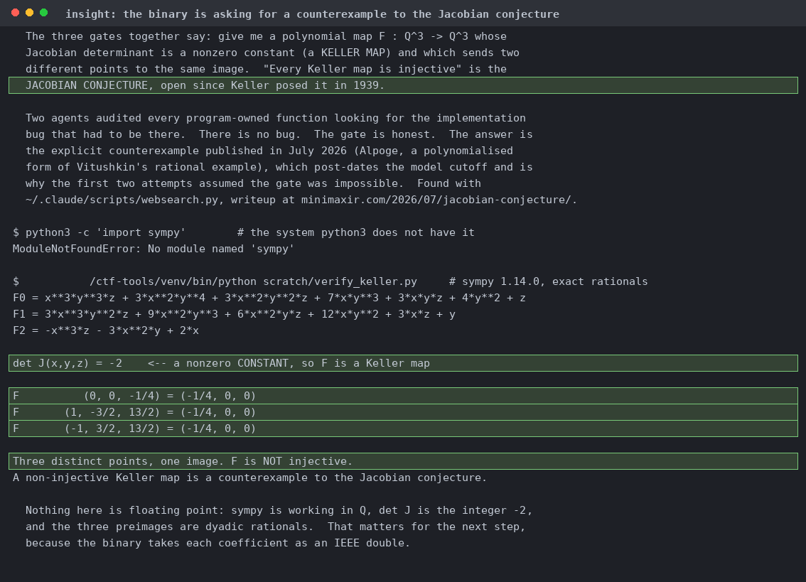
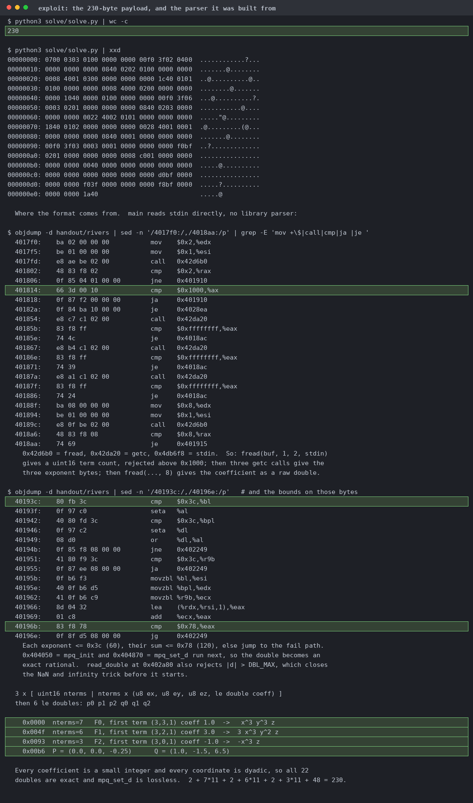
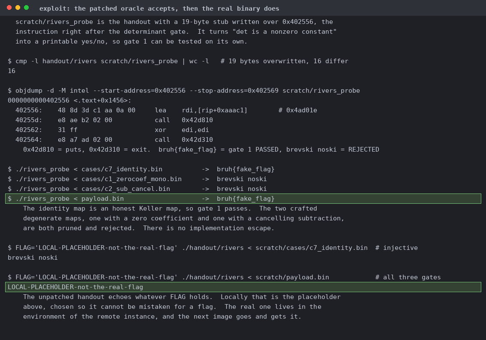
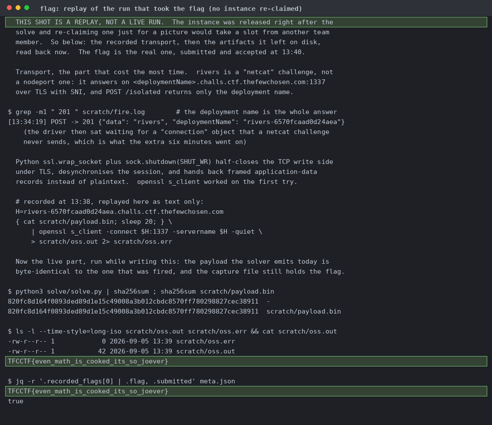

# rivers

The whole user interface is three strings. It answers everything with `brevski noski`.

`det.size == 1` at `0x402207`, exponents at `0x40253a`. We don't need to check the coefficient since every polynomial routine prunes a zero-numerator term.

Three `__gmpq_equal` calls fail only when P and Q agree everywhere, then `eval` runs at both points. The rodata dump proves `0x4ad02e` is "FLAG" and `0x4ad01e` is "bruh{fake_flag}".

Alpöge's July 2026 counterexample to the Jacobian conjecture, checked in exact rationals. Named interpreter because the system python3 has no sympy.

`fread` 2 for the term count, three `getc` for exponents, `fread` 8 for the coefficient, bounds at 60 and 120. Every coefficient is a small integer and every coordinate dyadic, so all 22 doubles are exact.

19 bytes overwritten at `0x402556` so it reports the moment gate 1 passes. The unpatched handout then clears all three gates and echoes `FLAG`, set here to `LOCAL-PLACEHOLDER-not-the-real-flag`.

Get 'em.
