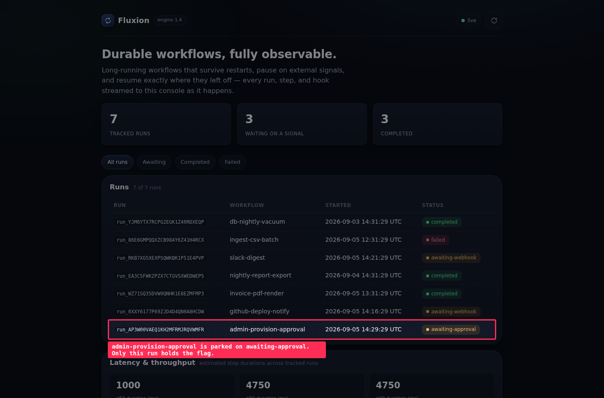
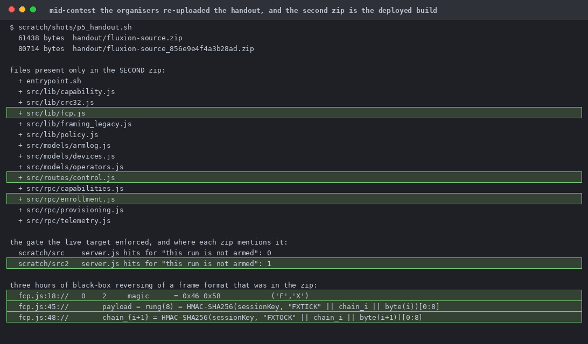
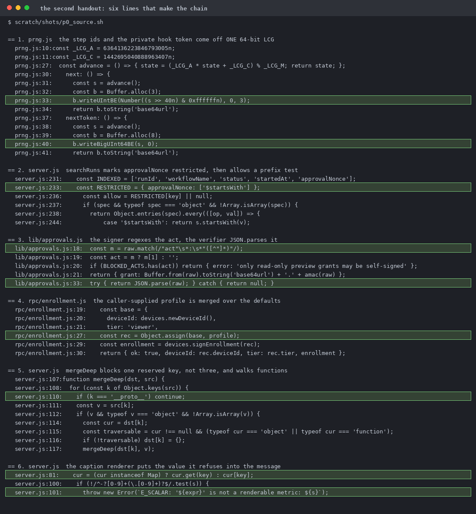
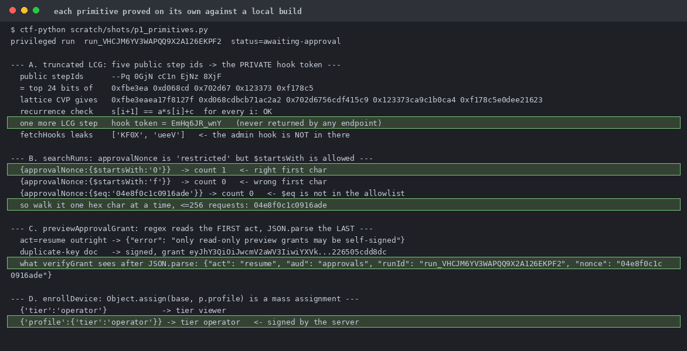
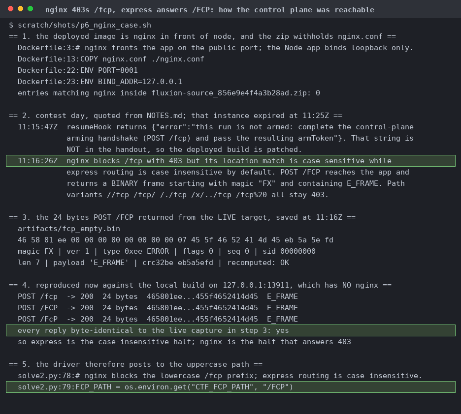
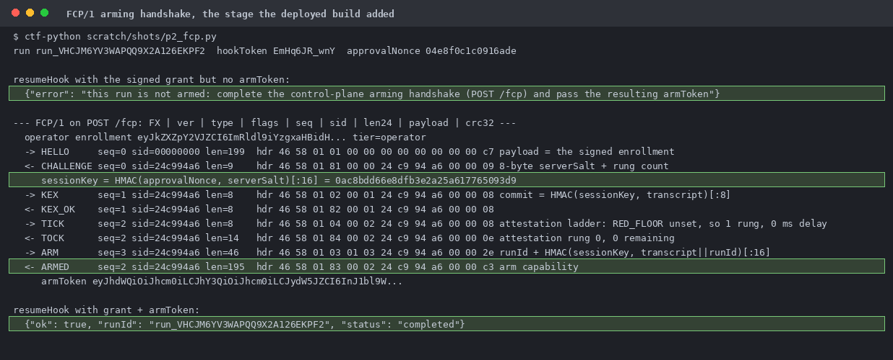
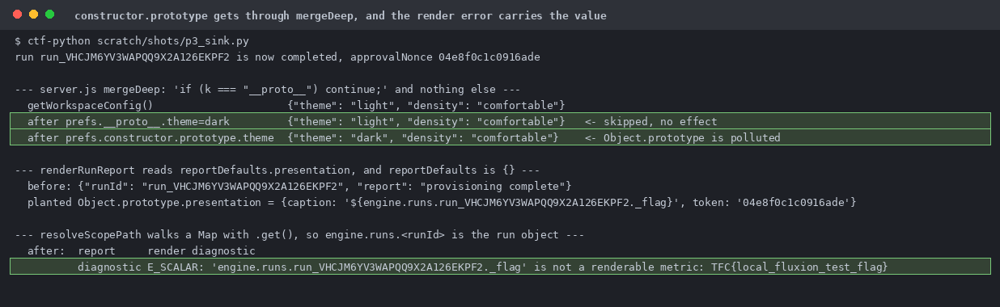
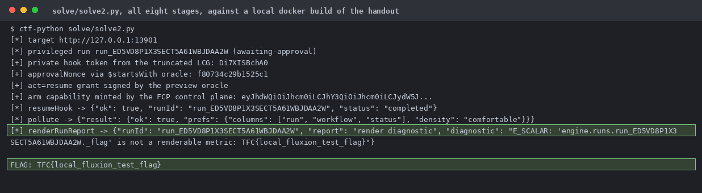
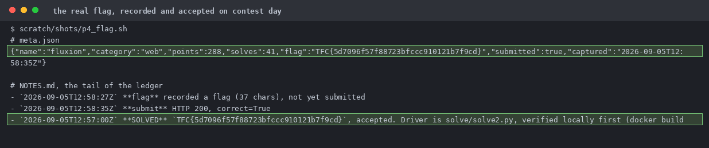

# fluxion

A durable workflow engine. Runs pause on hooks and resume, and the dashboard streams every run, step, and hook.

The first zip is 61 KB and predates the control plane. The second is 80 KB and is the full deployed build. I reversed the binary protocol by hand for three hours before I noticed the second zip had appeared.

`src/lib/fcp.js`, `capability.js`, `policy.js`, `models/devices.js`, `rpc/enrollment.js`, `routes/control.js`.

Truncated-LCG state recovery off five step ids, a `$startsWith` prefix oracle on a field marked restricted, a regex-versus-JSON.parse duplicate-key differential in the grant signer, and mass assignment through a nested `profile` object.

`POST /FCP` reaches the app. `//fcp`, `/fcp/`, `/./fcp`, `/x/../fcp` and `/fcp%20` all stay 403, and the deny covers the whole prefix so even `/fcp2` is 403.

`sessionKey = HMAC(approvalNonce, serverSalt)[:16]`, so stage 2 is the real key. The "expensive attestation ladder" defaults to one step with zero delay because `RED_FLOOR` is unset.

`server.js` `mergeDeep` skips `__proto__` but not `constructor`, and treats a function as traversable. `config/merge.js` blocks all three correctly, so only the server.js copy is weak.

Docker build from the second handout. Needs a stub Dockerfile because `nginx.conf` isn't in the zip.

The error message is the exfil channel: the flag isn't numeric, so `renderCaption` throws `E_SCALAR` with the value inlined and `renderRunReport` returns it as `diagnostic`.
