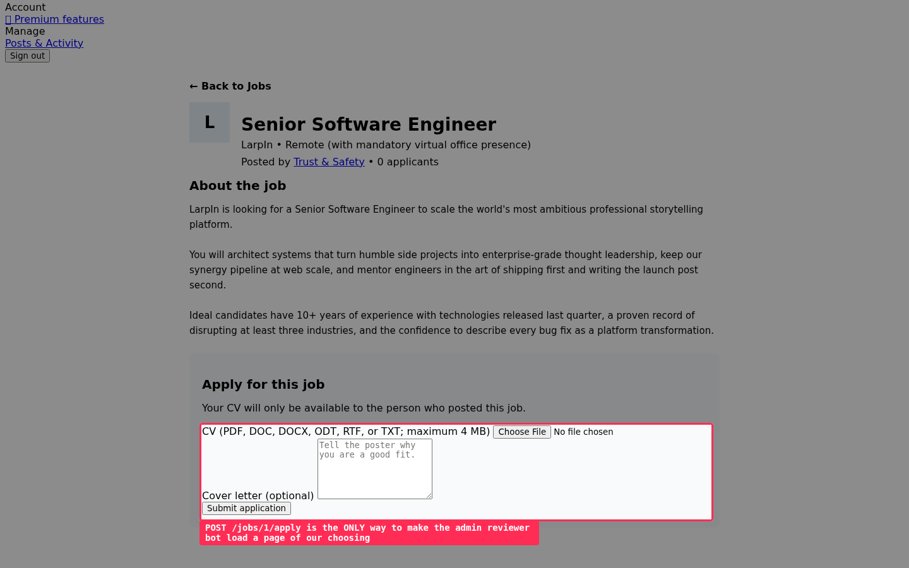
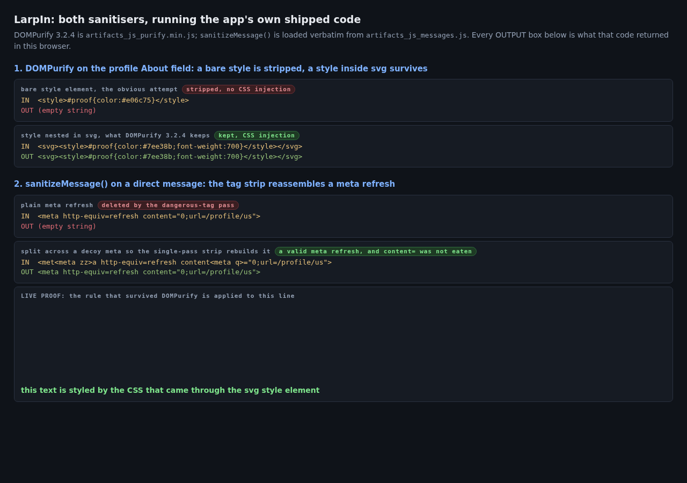
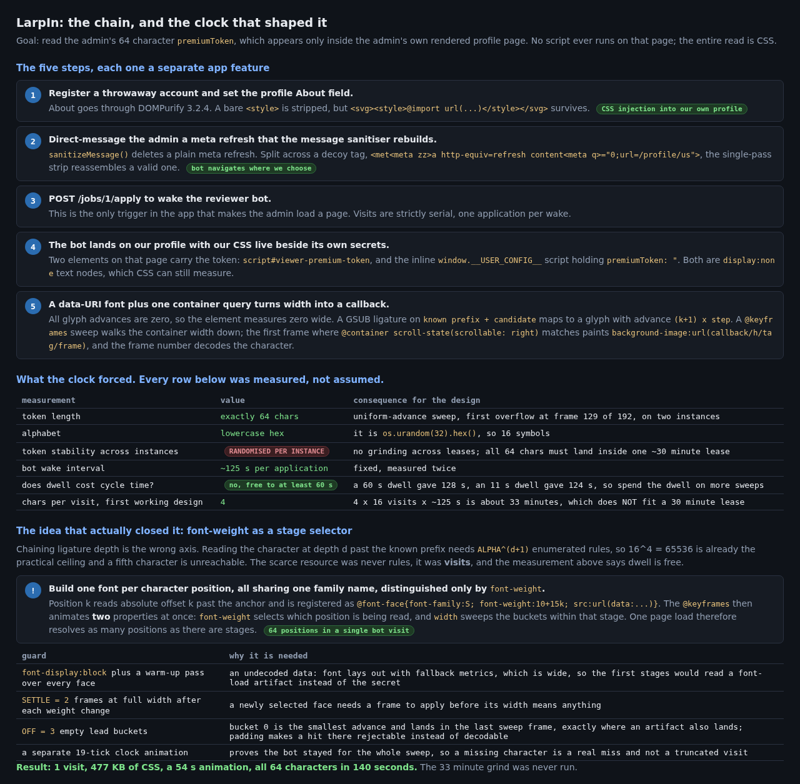
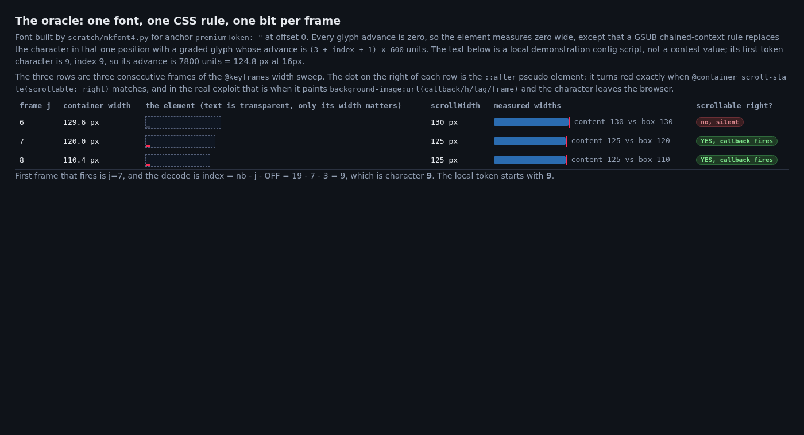
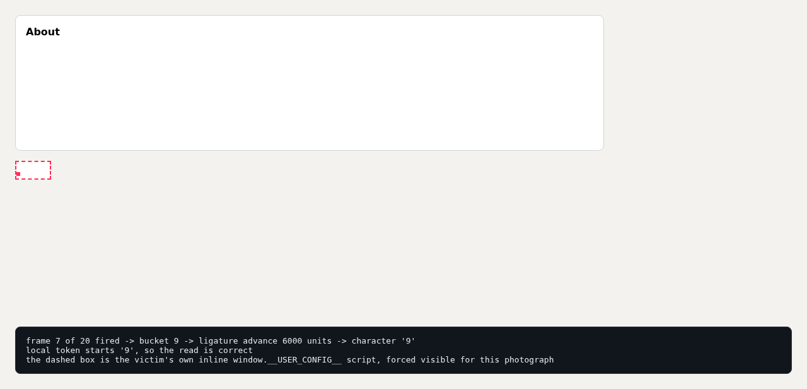
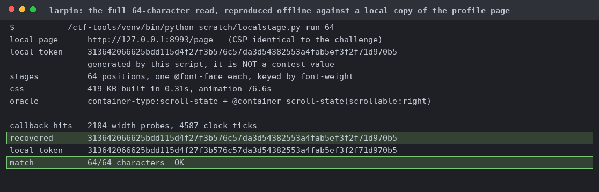
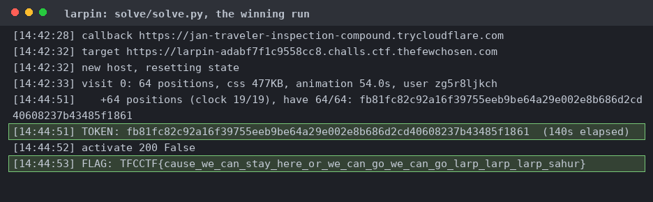

# LarpIn

A LinkedIn clone. The CSP allows `style-src * 'unsafe-inline'`, `img-src *` and `font-src 'self' data:`, but `script-src-elem 'self'`, so you can't run an injected script.

The DM sink takes `<met<meta zz>a http-equiv=refresh content<meta q>="0;url=X">`: the inner tag is spliced out so the outer rebuilds, and `<meta q>` inside the attribute name stops `on\w+\s*=` eating `ontent=`. The profile sink takes `<svg><style>`, which DOMPurify 3.2.4 keeps while stripping a bare `<style>`.

DM the bot a meta refresh to our profile, then `POST /jobs/1/apply` to wake the reviewer. It lands on a page where our CSS runs next to its own `premiumToken`. A separate 19-tick animation tells a missing character from a truncated visit.

A data: TTF built with fontTools, all advances 0, plus a ligature for prefix+candidate mapped to a chosen big advance. The element's width is 0 unless the ligature matched.

`container-type: scroll-state` with `@container scroll-state(scrollable: right)`. `::-webkit-scrollbar` doesn't fire in headless Chrome. The negative form `@container not scroll-state(...)` is silently dropped (so positive only).

font-weight as a stage selector: one `@font-face` per character position, all one family, differing only in weight. One animation sweeps weight and width together, so one page load reads every position.

Final solution only takes one visit, 64 positions, 477 KB of CSS, a 54 s animation, and all 64 characters in 140 s.
