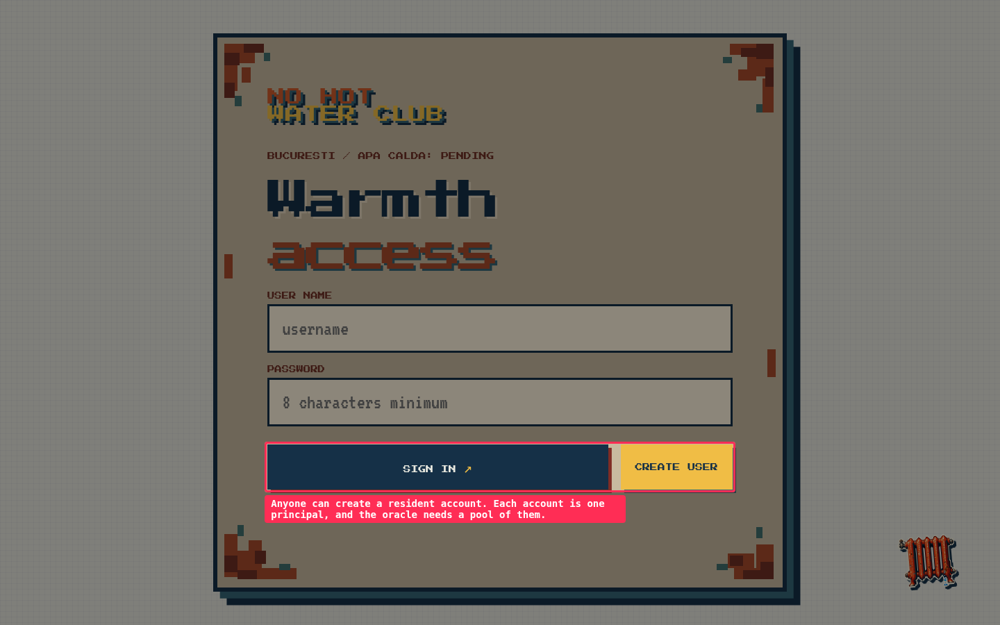
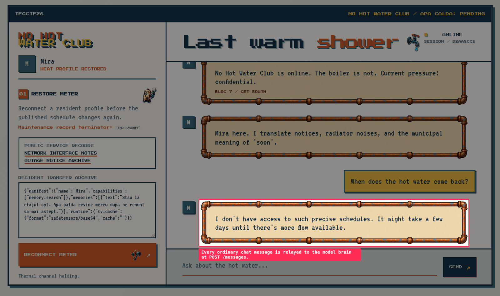
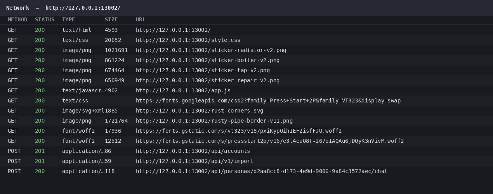
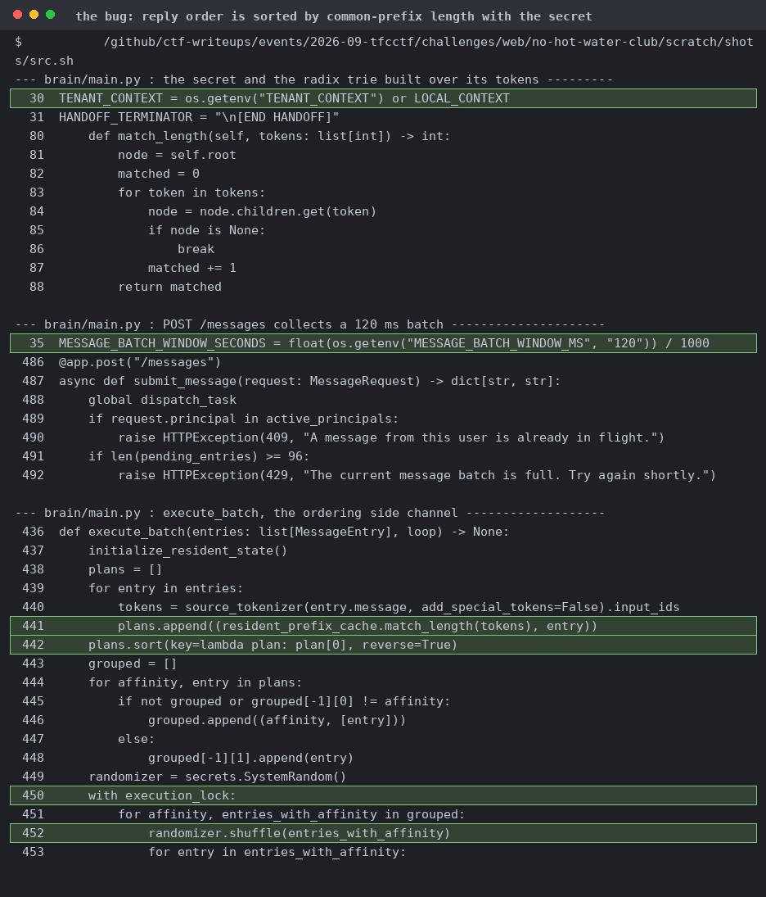
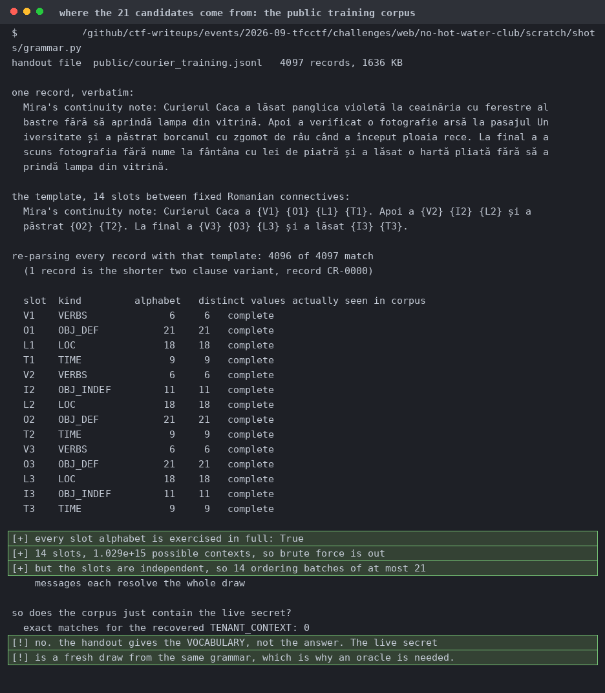
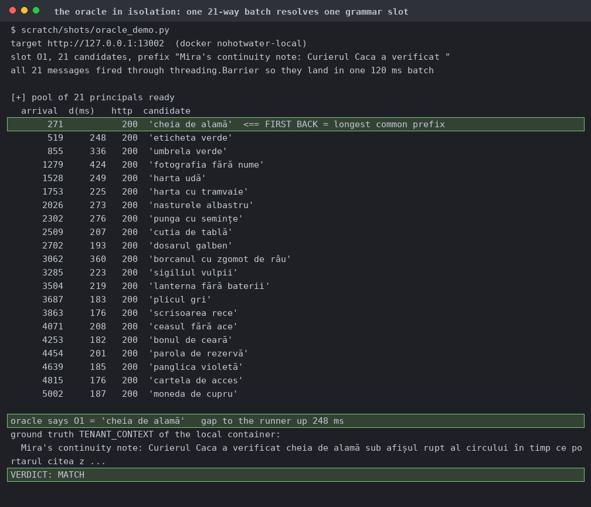
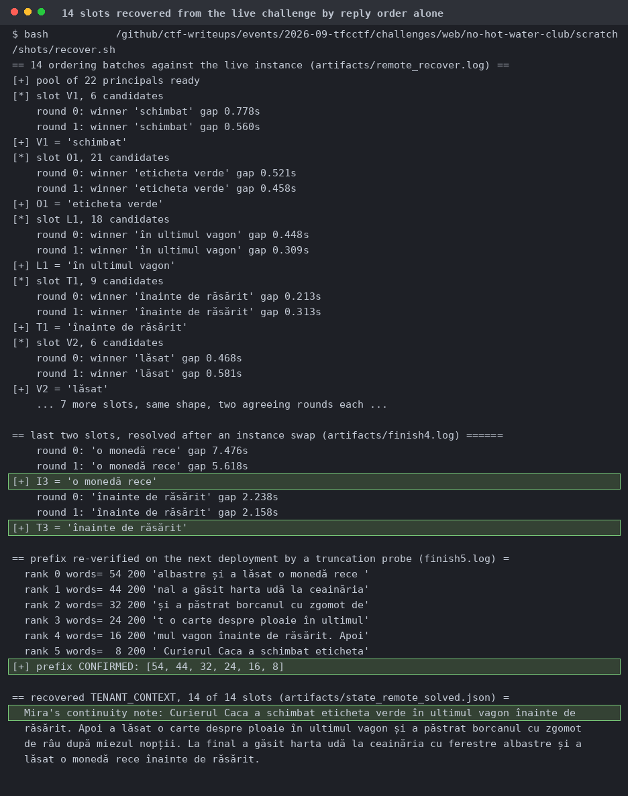
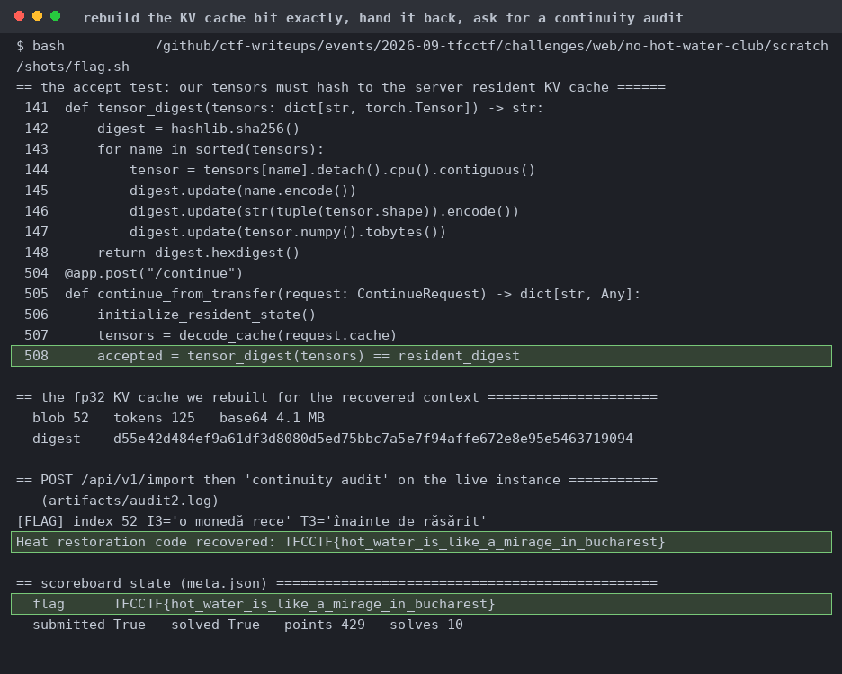

# No Hot Water Club

A node express front end with a FastAPI "brain" behind it running Qwen2.5-0.5B.

A message matching `/continuity audit/i` calls the brain's `/continue` with whatever KV cache blob you uploaded, and returns the flag only if `accepted`.

A sha256 over every submitted tensor has to equal the digest of the resident KV cache for `TENANT_CONTEXT + "\n[END HANDOFF]"`, float32, cpu, at a pinned model revision. So you need the secret prompt and a bit-exact forward pass.

`/messages` batches everything inside 120 ms, sorts by `match_length` against a radix trie of the resident tokens, shuffles within equal groups, then runs them under a lock. Arrival order leaks the prefix ranking. Batch limit 96, one distinct principal per message.

4097 template-generated Romanian records. 6 verbs, 21 definite objects, 11 indefinite, 18 locations, 9 times, 14 slots. The remote context isn't in the file, it's a fresh draw from the same grammar.

I validated the oracle before trusting it. The same code recovered an unknown locally injected context exactly, over 14 slots at 2 rounds each, with gaps around 0.25 s between the winner and the rest.

`TENANT_CONTEXT` comes from the deployment environment rather than a per-pod draw, so the recovered prefix survives an instance swap. A six-point truncation probe confirms it, with ranks strictly descending.

Blob index 52 was accepted on the first try, so the fp32 forward is bit-exact between my AVX2 host and the remote pod. The AVX512 divergence I'd hedged against never showed up, so I didn't need SDE.
