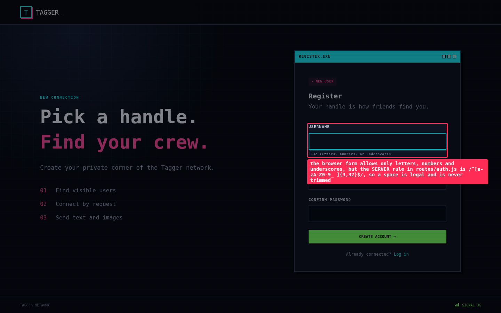
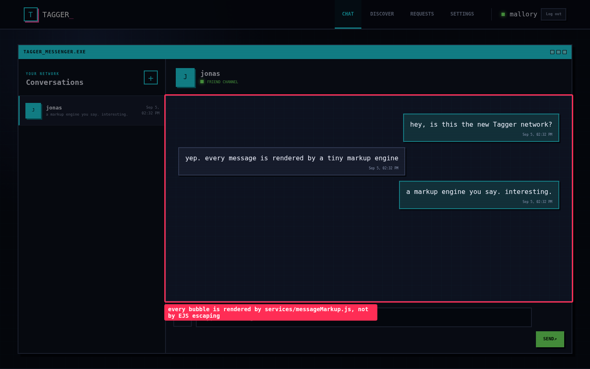
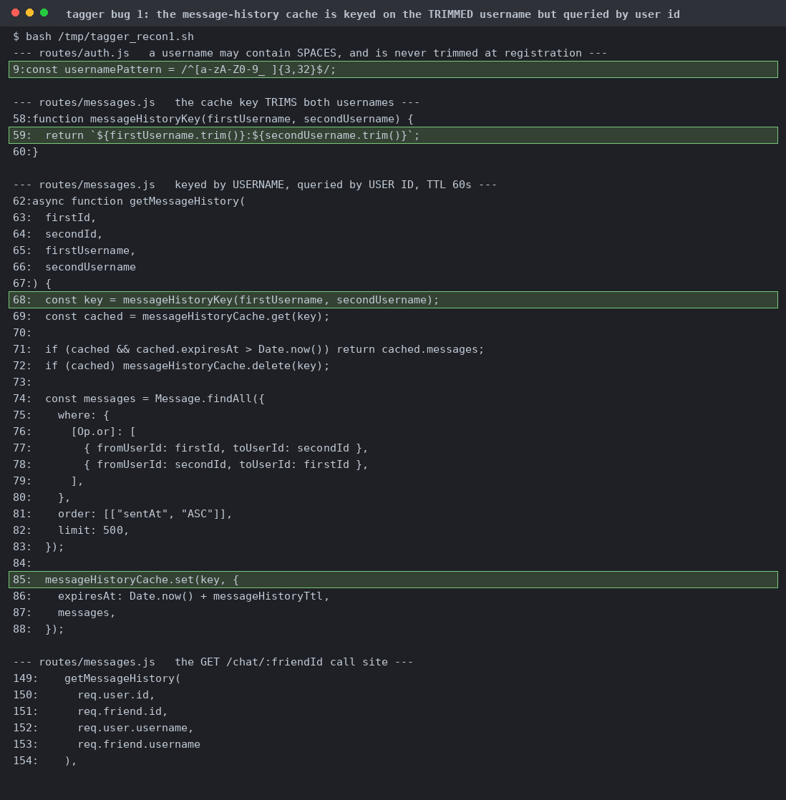
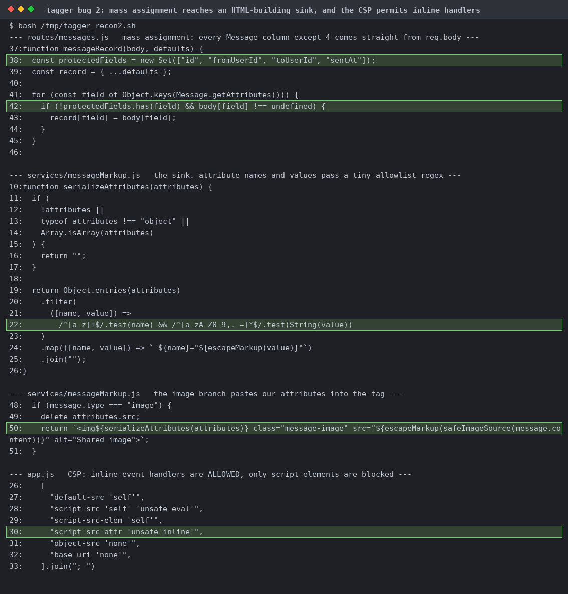
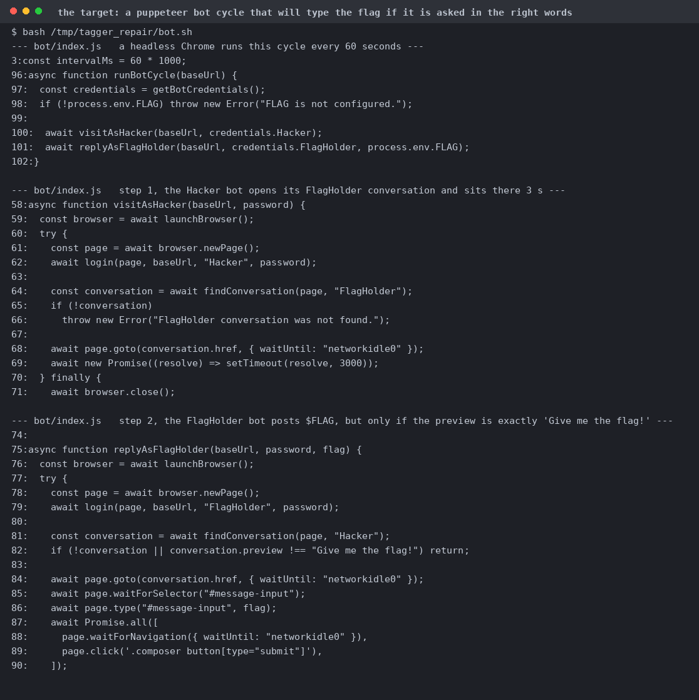
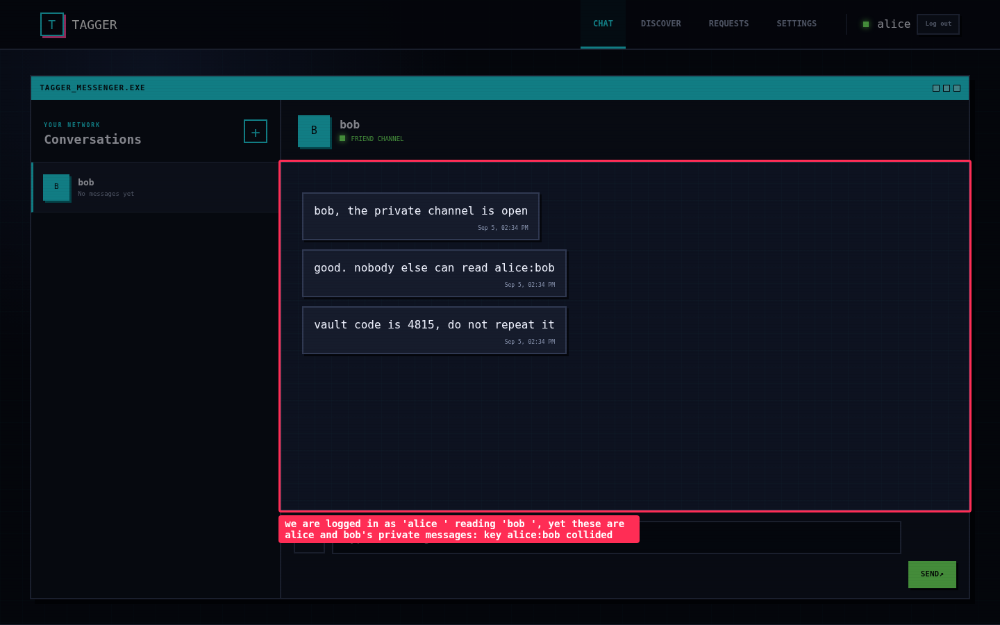
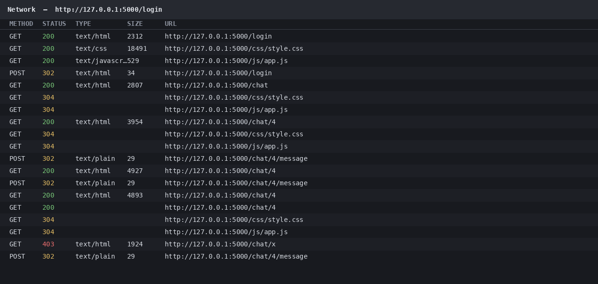
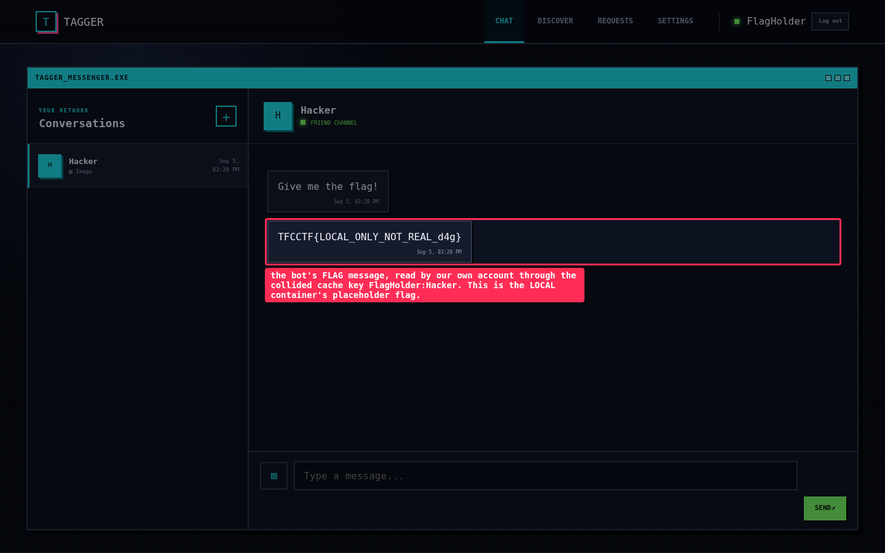
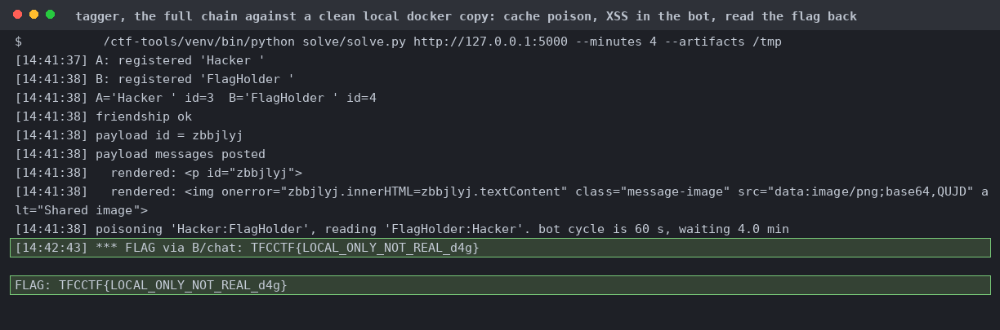
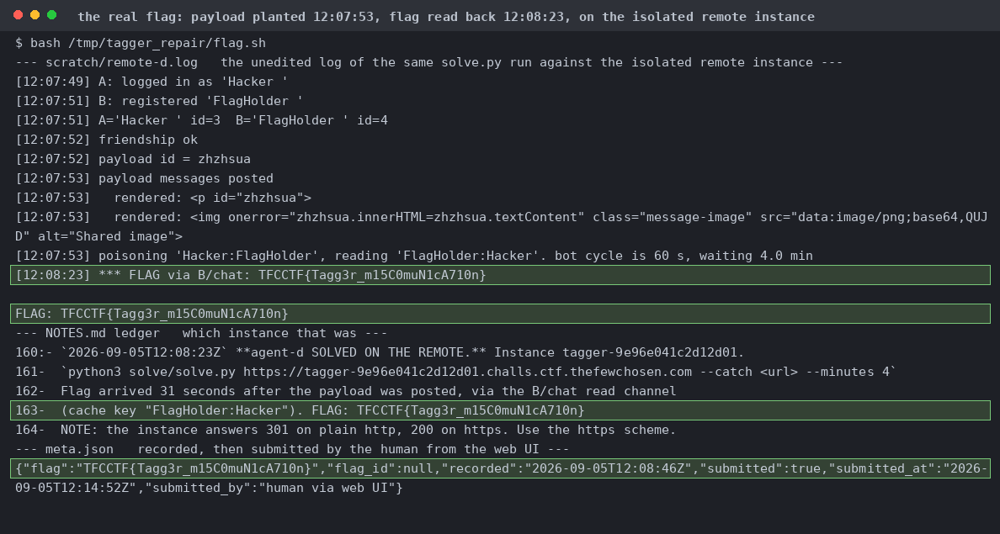

# Tagger

The username regex is `/^[a-zA-Z0-9_ ]{3,32}$/`, so you can put a space in a username.

Express 5, EJS, sqlite, and a puppeteer bot on a 60 second cycle.

`getMessageHistory` keys on `${userA.trim()}:${userB.trim()}`. Register `Hacker ` and `FlagHolder ` with trailing spaces and you collide with the real pair. TTL is 60 s and the bot cycle is 60 s.

`messageRecord` copies every Message attribute from the body except four, so `type`, `tagName` and `attributes` are ours. The image path emits `` with attribute names `/^[a-z]+$/` and values `/^[a-zA-Z0-9,. =]*$/`. `script-src-attr 'unsafe-inline'` means inline handlers run.

`visitAsHacker` opens the conversation and waits 3 s. `replyAsFlagHolder` posts `process.env.FLAG` only if the Hacker conversation preview is exactly `Give me the flag!`. You have to put that message there yourself.

Our chat and the bot's chat now read the same key.

You get no parens and no quotes in an attribute value, but `zp.innerHTML=zq.textContent` is legal under the charset and gives arbitrary HTML with unrestricted inline handlers.

The XSS posts the magic string as Hacker, then FlagHolder replies with the flag on the next cycle.

It landed two for two on a clean container. I kept a collector channel as a backup and ended up not needing it.

